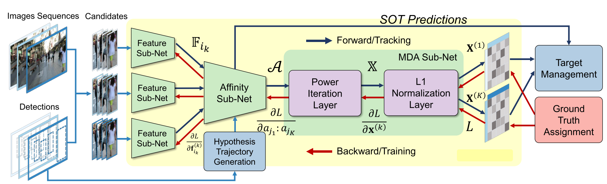
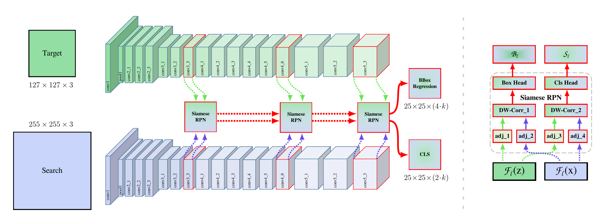

# FAMNet: Joint Learning of Feature, Affinity and Multi-dimensional Assignment for Online Multiple Object Tracking.  ICCV 2019

这篇文章对MOT问题直接使用网络做端到端建模，摒弃了以往MOT系统中复杂的各种部件，而是把所有需要的东西全部放在网络中进行训练。

凌海滨组也是个做跟踪很长时间的组了，据他自己说已经做了十年目标跟踪，积累比较雄厚。

In this paper, they present an end-to-end model, named FAMNet, where Feature extraction, Affinity estimation and Multi-dimensional assignment are refined in a single network.

In particular, feature sub-network is used to extract features for candidates on each frame, after which an affinity sub-network estimates the higher-order affinity for all association hypothesis. With the affinity, the MDA sub-network is to optimize globally and obtain the optimal assignments.

# SiamRPN++ CVPR2019 oral

SiamRPN++这篇主要是解决了使用在Siamese based tracker中使用深网络的问题。在此之前Siamese based tracker多用AlexNet的前几层做Siamese的特征提取器phi，如果使用ResNet等现代深网络不但无法提升性能，反而性能下降。作者发现这主要是由于卷积过程中padding导致的spatial bias引起，并且通过改变训练时正样本的采样策略来解决了这一问题。

The most important finding of this work is that the performance of the Siamese network based tracking algorithm can be significantly boosted if it is armed with much deeper networks.

However, simply training a Siamese tracker by directly using deeper networks like ResNet does not obtain the expected performance improvement. They think the core reason comes from **the destroy of the strict tracslation invariance.**

Since the target may appear at any position in the search region, the learned feature representation for the target template should stay spatial invariant, among modern deep architectures, only the zero-padding variant of AlexNet satisfies this spatial invariance restriction.

Strict translation invariance only exists in **no padding network** such as modified AlexNet. However, if the employed networks are replaced by modern networks like ResNet or MobileNet, padding is inevitable to make the network going deeper, which destroys the strict translation invariance restriction.

Modern CNNs like Res-Net usually have a stride of 32, however, in visual tracking, a smaller strade (4 in SiamMOT and 8 in SiamFC) is used to improve the accuracy of locating objects.

**Using the pretrained ResNet in SiamRPN++ to replace the backbone of SiamMOT, maybe we can achieve a higher score.**

# Excerpt

Non-trivial 非平凡的；有意义的