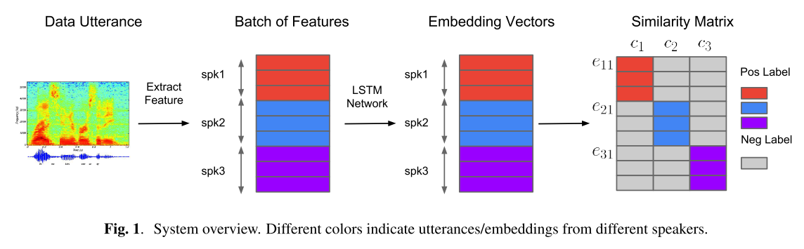
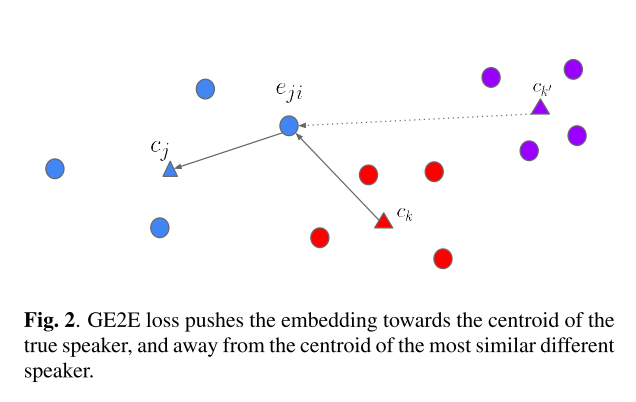
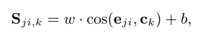
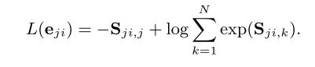
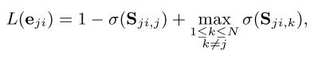
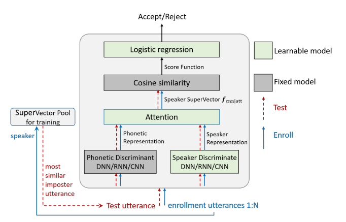

这周读了两篇老板发给我的论文，都是关于Speaker Verification（SV）的。

Speaker Verification可以分为text-dependent speaker verification (TD-SV) and text-independent speaker verification (TI-SV)两种，主要区别是时候依据特定唤醒词识别Speaker。比如苹果的“Hey Siri”和微软的“Hi Cortana”

# GE2E

Wan, L., Wang, Q., Papir, A., & Moreno, I. L. (2018). Generalized end-to-end loss for speaker verification. *ICASSP, IEEE International Conference on Acoustics, Speech and Signal Processing - Proceedings*, *2018*–*April*, 4879–4883. https://doi.org/10.1109/ICASSP.2018.8462665

第一篇是谷歌出品，文章发表在ICASSP2018，他们提出了一种新的Loss来端到端训练SV网络，可以使用与TD-SV和TI-SV上。在TD-SV任务测试时，使用的是他们的“Hey Google”唤醒词。本文中，训练时使用的是从N个Speaker采集的语音，每个Speaker有M段Utterance。

上图是SV系统的整体结构，输入是一段语音通过DNN抽取出特征，这些特征称为D-vectors。接着把特征送入LSTM网络，得到Embedding Vectors。最后根据这些Embedding Vectors得到Similarity Matrix。整个过程和Re-ID很类似。

上图表现了GE2Eloss的整体思路，看上有点像Triplet loss。在训练过程中把最接近的同类样本拉向centroid，把最相似度最高的不同样本推远。具体实现是由以下两种Loss Function实现的。

首先定义一个Sijk，表示的是centroid（ck，k代表的是第k个speaker）可以理解为模板，与需要比较的embedding vector（eij，i代表的是第i个speaker，j代表的是这个speaker的第j段语音）的Similarity Matrix。其中w与b是可以学习的参数。

第一种loss称为softmax loss，其作用是把某一个centroid同一Speaker的其他embedding vectors都拉向这个centroid，然后把这些embedding vectors都推离其他centroids。第二种loss称为contrast loss，其作用是把某一个centroid同一Speaker的其他embedding vectors都拉向这个centroid，然后把这些embedding vectors都推离与他们最近的虚假centroids。

作者在实验阶段发现contrast loss对于TD-SV任务更好，softmax loss对于TI-SV任务稍好一点。

# End-to-end attention based text-dependent speaker verification.

Zhang, S. X., Chen, Z., Zhao, Y., Li, J., & Gong, Y. (2017). End-to-end attention based text-dependent speaker verification. *2016 IEEE Workshop on Spoken Language Technology, SLT 2016 - Proceedings*, 171–178. https://doi.org/10.1109/SLT.2016.7846261

这一篇是微软的，主要用于“Hey Cortana”的TD-SV识别。这一篇文章作者所说的创新点是提出了一个end to end训练的加入了attention机制的SV网络。

上图是系统的整体架构，绿框中的是训练阶段可以学习的模块。所有灰色和绿色的模块在enrollment和verification阶段都是固定参数的。

其中attention机制是用在了从frame-level speaker representation产生utterance-level feature时。以往的话是使用frame-level speaker representation直接求平均得到utterance-level feature。

