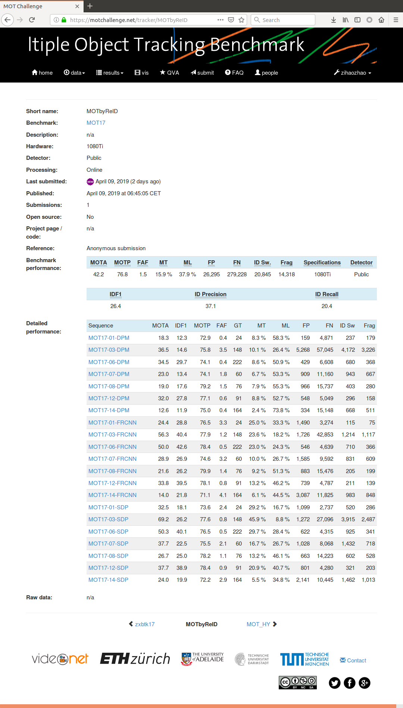
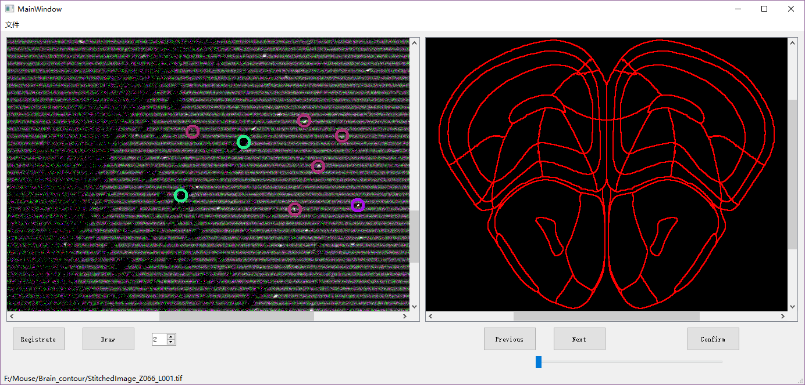
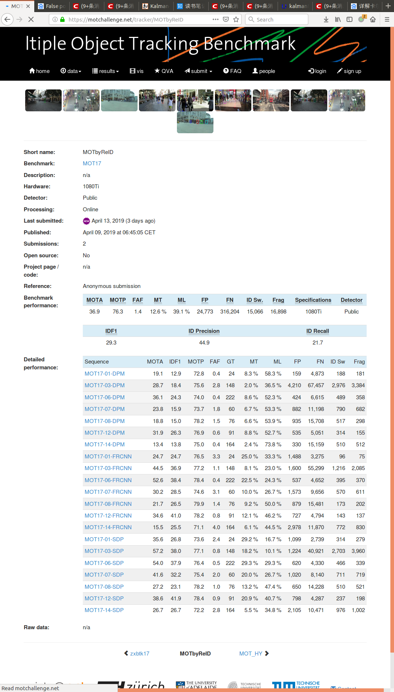
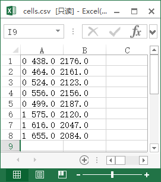

# 1. 项目

### 已完成的功能

### 1. 打点

上图是目前实现的打点功能，在进入Draw模式后，可以在图片上进行点击，点击后照片上就会用如图所示的蓝色圆圈圈出点击的位置，同时该位置会被写入数据库，进行存储。

### 2. 分组打点

进一步实现分组打点的功能，在图片下方有一个SpinBox，可以通过选择数字，来进行分组打点，SpinBox内的数字即为当前打点的组号。并且自动给每组点分配一个特定颜色，在图中显示。

### 3. 导出打点文件

增加Export按钮，点击即可导出目前打的点，导出为csv。

导出的文件如下所示，第一栏为打点的组别，第二栏为x坐标，第三栏为y坐标，该坐标为tif图像中的实际位置。

### 目前存在的问题

​	但目前Tif文件的显示问题还未解决，显示时会产生彩色噪点。待后续解决。

​	Tif文件显示不全，只能显示一半左右，待解决。

# 2.MOT实验

基于上周的思路继续进行实验。

总结一下主要是几个部分：

1. 增加了lost区，即将所有丢失的目标相关信息以及其ReID特征保存起来。Lost区最大存储100个目标，先进先出。
2. 当新旧帧对比进行匹配时，若ID冲突，将较低置信度的目标在lost区进行二次匹配，匹配失败再设为新ID。
3. 加入位置假设，即两帧之间目标偏移不会大于search_rigion个身位，search_rigion设为1。
4. 加入pedestrain verification机制，去除冗余框。（**失败**）
5. 匹配成功时，（过去特征+0.35×现在特征）/1.35，记忆历史特征。
6. 加入卡尔曼状滤波，对轨迹进行预测。（还未完善）
7. 很快lost的newid从lost区域中剔除。

最终在训练集上达到MOTA45.6。(算法未使用MOT训练集进行训练，只用了ReID数据集)

若不使用DPM检测器，只使用FRCNN与SDP可达到MOTA55.0。

提交后MOTA只有43.6，初步判定是FP太多，卡尔曼滤波进行预测需要着重研究。

目标检测结果的冗余框太多，极易误导跟踪算法，从而产生大量IDswitch

以下为实验过程中的零散记录，可忽略。

#### 43.4(52.2)

有lost区设置，lost区缓存行人数量为一百人

#### 

#### 43.7(52.5) 

在ID冲突时，进入lost区选择目标，先使用位置偏移进行约束，过滤出一个身位附近的。确保遮挡后找回目标的效果

#### 44.3(53.7) 

在第一次判断q<17前先删去位置在一个身位以外的框，假设两帧之间位置偏移不会超过一个身位。(q全为17)

#### 44.7(54.2)

（过去特征+0.35×现在特征）/1.35

first_search_rigion = 1
second_search_rigion = 1.5
history_factor = 0.35

1,1,0.35 44.8 54.2

1,1,0.5 44.9 54.3

1,1,0.8 44.9 54.4

1,1,1 44.9 54.4

1,1,1.2 44.9 54.4

1,1,2 44.8 54.3

1,1.5,144.8 54.3

加入pedestrain_varify机制，但MOTA反而降低，因为FN减少。

可以增加补全机制，ID恢复后，以前帧的目标框增加（batch）。

Second_Search_Rigion设为3时，MOTA变差。

history_factor设为0.35比设为0效果好。

ID不为新ID的唯一两种情况，在上一帧找到对应目标，或在lost区找到对应目标。

把行人框的输入进行拼接，一次输出多个向量。

0,4,5,5.5

MOT17-02-DPM
 IDF1  IDP  IDR| Rcll  Prcn   FAR|   GT  MT   PT   ML|    FP    FN   IDs    FM|  MOTA  MOTP MOTAL 
 11.7 32.6  7.1| 18.9  86.5  0.92|   62   4   14   44|   550 15063   379   296|  13.9  75.1  16.0 

MOT17-02-DPM
 IDF1  IDP  IDR| Rcll  Prcn   FAR|   GT  MT   PT   ML|    FP    FN   IDs    FM|  MOTA  MOTP MOTAL 
 12.3 34.9  7.5| 18.5  86.3  0.91|   62   3   15   44|   545 15136   354   307|  13.7  75.1  15.6 

MOT17-02-DPM
 IDF1  IDP  IDR| Rcll  Prcn   FAR|   GT  MT   PT   ML|    FP    FN   IDs    FM|  MOTA  MOTP MOTAL 
 12.3 34.2  7.5| 18.9  86.5  0.92|   62   4   14   44|   549 15063   360   297|  14.0  75.1  16.0 

MOT17-02-DPM
 IDF1  IDP  IDR| Rcll  Prcn   FAR|   GT  MT   PT   ML|    FP    FN   IDs    FM|  MOTA  MOTP MOTAL 
 12.3 34.2  7.5| 18.9  86.5  0.92|   62   4   14   44|   549 15062   361   298|  14.0  75.1  16.0 

MOT17-04-DPM
 IDF1  IDP  IDR| Rcll  Prcn   FAR|   GT  MT   PT   ML|    FP    FN   IDs    FM|  MOTA  MOTP MOTAL 
 19.5 30.5 14.3| 40.4  85.9  3.00|   83   6   33   34|  3150 28339  1679  1200|  30.3  78.1  33.8 

MOT17-04-DPM
 IDF1  IDP  IDR| Rcll  Prcn   FAR|   GT  MT   PT   ML|    FP    FN   IDs    FM|  MOTA  MOTP MOTAL 
 16.0 29.3 11.0| 31.7  84.1  2.72|   83   3   29   41|  2856 32469  1441  1397|  22.7  77.9  25.7 

MOT17-04-DPM
 IDF1  IDP  IDR| Rcll  Prcn   FAR|   GT  MT   PT   ML|    FP    FN   IDs    FM|  MOTA  MOTP MOTAL 
 18.9 31.0 13.6| 37.5  85.4  2.90|   83   3   34   36|  3042 29712  1515  1374|  27.9  78.2  31.1 

MOT17-04-DPM
 IDF1  IDP  IDR| Rcll  Prcn   FAR|   GT  MT   PT   ML|    FP    FN   IDs    FM|  MOTA  MOTP MOTAL 
 19.6 31.3 14.3| 39.2  85.7  2.96|   83   4   34   35|  3105 28903  1483  1300|  29.6  78.3  32.7 

MOT17-05-DPM
 IDF1  IDP  IDR| Rcll  Prcn   FAR|   GT  MT   PT   ML|    FP    FN   IDs    FM|  MOTA  MOTP MOTAL 
 17.7 30.5 12.5| 35.5  86.8  0.44|  133   6   63   64|   372  4463   476   212|  23.2  75.9  30.1 

MOT17-05-DPM
 IDF1  IDP  IDR| Rcll  Prcn   FAR|   GT  MT   PT   ML|    FP    FN   IDs    FM|  MOTA  MOTP MOTAL 
 18.1 31.3 12.7| 35.3  87.1  0.43|  133   6   62   65|   362  4472   453   214|  23.6  76.1  30.1 

MOT17-05-DPM
 IDF1  IDP  IDR| Rcll  Prcn   FAR|   GT  MT   PT   ML|    FP    FN   IDs    FM|  MOTA  MOTP MOTAL 
 18.0 31.1 12.7| 35.4  86.9  0.44|  133   6   63   64|   369  4466   450   214|  23.6  76.1  30.1 

MOT17-05-DPM
 IDF1  IDP  IDR| Rcll  Prcn   FAR|   GT  MT   PT   ML|    FP    FN   IDs    FM|  MOTA  MOTP MOTAL 
 18.0 31.1 12.7| 35.5  86.9  0.44|  133   6   63   64|   370  4464   451   213|  23.6  76.1  30.1 

MOT17-09-DPM
 IDF1  IDP  IDR| Rcll  Prcn   FAR|   GT  MT   PT   ML|    FP    FN   IDs    FM|  MOTA  MOTP MOTAL 
 22.9 28.9 19.0| 56.7  86.2  0.92|   26   2   19    5|   485  2304   339   209|  41.3  73.3  47.6 

MOT17-09-DPM
 IDF1  IDP  IDR| Rcll  Prcn   FAR|   GT  MT   PT   ML|    FP    FN   IDs    FM|  MOTA  MOTP MOTAL 
 27.7 35.0 22.9| 56.2  85.8  0.94|   26   3   18    5|   495  2332   299   205|  41.3  73.5  46.9 

MOT17-09-DPM
 IDF1  IDP  IDR| Rcll  Prcn   FAR|   GT  MT   PT   ML|    FP    FN   IDs    FM|  MOTA  MOTP MOTAL 
 28.6 36.1 23.7| 56.5  85.8  0.95|   26   3   18    5|   497  2316   293   198|  41.7  73.5  47.1 

MOT17-09-DPM
 IDF1  IDP  IDR| Rcll  Prcn   FAR|   GT  MT   PT   ML|    FP    FN   IDs    FM|  MOTA  MOTP MOTAL 
 28.6 36.1 23.7| 56.5  85.8  0.95|   26   3   18    5|   497  2316   293   198|  41.7  73.5  47.1 

MOT17-10-DPM
 IDF1  IDP  IDR| Rcll  Prcn   FAR|   GT  MT   PT   ML|    FP    FN   IDs    FM|  MOTA  MOTP MOTAL 
 12.9 22.4  9.1| 35.3  87.3  1.01|   57   5   18   33|   662  8303   746   482|  24.4  75.0  30.2 

MOT17-10-DPM
 IDF1  IDP  IDR| Rcll  Prcn   FAR|   GT  MT   PT   ML|    FP    FN   IDs    FM|  MOTA  MOTP MOTAL 
 12.5 22.1  8.7| 34.3  87.2  0.99|   57   3   20   33|   646  8433   676   496|  24.0  75.2  29.3 

MOT17-10-DPM
 IDF1  IDP  IDR| Rcll  Prcn   FAR|   GT  MT   PT   ML|    FP    FN   IDs    FM|  MOTA  MOTP MOTAL 
 12.9 22.6  9.1| 34.9  87.2  1.01|   57   3   20   33|   658  8352   677   486|  24.6  75.2  29.8 

MOT17-10-DPM
 IDF1  IDP  IDR| Rcll  Prcn   FAR|   GT  MT   PT   ML|    FP    FN   IDs    FM|  MOTA  MOTP MOTAL 
 13.1 22.9  9.2| 35.1  87.3  1.01|   57   4   19   33|   659  8327   679   482|  24.7  75.1  30.0 

MOT17-11-DPM
 IDF1  IDP  IDR| Rcll  Prcn   FAR|   GT  MT   PT   ML|    FP    FN   IDs    FM|  MOTA  MOTP MOTAL 
 24.5 32.7 19.6| 52.5  88.0  0.75|   75  10   24   40|   676  4478   392   149|  41.2  77.3  45.4 

MOT17-11-DPM
 IDF1  IDP  IDR| Rcll  Prcn   FAR|   GT  MT   PT   ML|    FP    FN   IDs    FM|  MOTA  MOTP MOTAL 
 25.8 34.6 20.5| 52.2  88.1  0.74|   75  10   24   40|   665  4509   285   141|  42.1  78.1  45.1 

MOT17-11-DPM
 IDF1  IDP  IDR| Rcll  Prcn   FAR|   GT  MT   PT   ML|    FP    FN   IDs    FM|  MOTA  MOTP MOTAL 
 25.9 34.7 20.7| 52.4  87.9  0.75|   75  10   24   40|   678  4489   285   142|  42.2  78.0  45.2 

MOT17-11-DPM
 IDF1  IDP  IDR| Rcll  Prcn   FAR|   GT  MT   PT   ML|    FP    FN   IDs    FM|  MOTA  MOTP MOTAL 
 26.0 34.7 20.7| 52.5  87.9  0.76|   75  10   24   40|   681  4485   286   144|  42.2  78.0  45.2 

MOT17-13-DPM
 IDF1  IDP  IDR| Rcll  Prcn   FAR|   GT  MT   PT   ML|    FP    FN   IDs    FM|  MOTA  MOTP MOTAL 
 15.1 45.9  9.0| 17.4  88.7  0.35|  110   6   27   77|   259  9615   374   273|  12.0  73.3  15.2 

MOT17-13-DPM
 IDF1  IDP  IDR| Rcll  Prcn   FAR|   GT  MT   PT   ML|    FP    FN   IDs    FM|  MOTA  MOTP MOTAL 
 12.4 42.0  7.3| 15.2  87.7  0.33|  110   4   28   78|   248  9873   390   290|   9.7  73.7  13.0 

MOT17-13-DPM
 IDF1  IDP  IDR| Rcll  Prcn   FAR|   GT  MT   PT   ML|    FP    FN   IDs    FM|  MOTA  MOTP MOTAL 
 14.9 46.5  8.9| 16.9  88.6  0.34|  110   5   28   77|   255  9669   366   290|  11.6  73.4  14.7 

MOT17-13-DPM
 IDF1  IDP  IDR| Rcll  Prcn   FAR|   GT  MT   PT   ML|    FP    FN   IDs    FM|  MOTA  MOTP MOTAL 
 15.9 48.6  9.5| 17.3  88.6  0.35|  110   6   28   76|   260  9627   362   281|  12.0  73.4  15.1 

 ********************* Your MOT17 Results *********************
 IDF1  IDP  IDR| Rcll  Prcn   FAR|   GT  MT   PT   ML|    FP    FN   IDs    FM|  MOTA  MOTP MOTAL 
 35.7 49.6 27.8| 52.1  92.9  0.84| 1638 366  686  544| 13383161433 10731  7110|  44.9  83.2  48.1 

 ********************* Your MOT17 Results *********************
 IDF1  IDP  IDR| Rcll  Prcn   FAR|   GT  MT   PT   ML|    FP    FN   IDs    FM|  MOTA  MOTP MOTAL 
 35.9 50.1 28.0| 51.9  92.9  0.84| 1638 364  688  544| 13350162052 10261  7205|  44.9  83.3  47.9 

加入pedestrain_varify机制，去掉DPM阈值机制，DPM检测结果中FP和IDs降低，FN增加，IDF1增加。**无效**

加入卡尔曼状滤波，对轨迹进行预测。

很快lost的newid从lost区域中剔除。

----------手机备忘录-------------------------

