 


# 1 HOG/SIFT特征

> Dalal, N., & Triggs, W. (2004). Histograms of Oriented Gradients for Human Detection. *2005 IEEE Computer Society Conference on Computer Vision and Pattern Recognition CVPR05*, *1*(3), 886–893. https://doi.org/10.1109/CVPR.2005.177

提出是为了解决行人检测问题，将图像转化为一种更好的轮廓特征，再使用SVM进行分类。

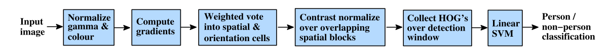

将图像使用密集网格分块（cells），局部特征（local object appearance and shape）更容易表示。

并且在局部可以进行对比度归一化，减少环境光照的影响。


**思考** 

​	用CNN只代替SVM的部分？或是代替特征提取部分？或是全部代替？

​	万能？是否有必要？效果？


# 2 频域的图像


# 3 各种矩

二阶矩抗扭斜（deskew）处理。

hu矩。

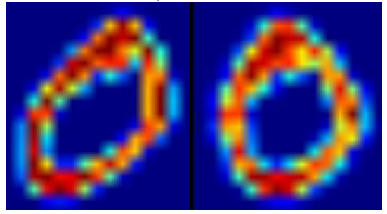


# 4.1 EM(Expectation Maximization)


# 4.2 狄利克雷过程

H  G .

 


# 4.3 HMM

隐状态.知道隐状态后,观测变为独立.

series 顺序不可改变,set 无顺序.

马尔可夫方程.

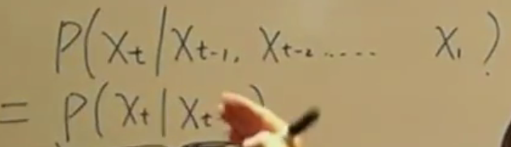

语音中应用普遍,马尔可夫模型.

转移概率(离散),发射概率(不一定离散,以语音为例).

转移矩阵  

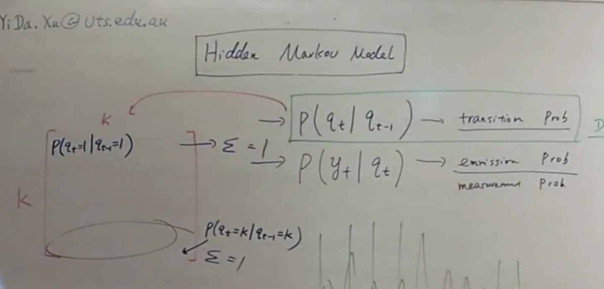

 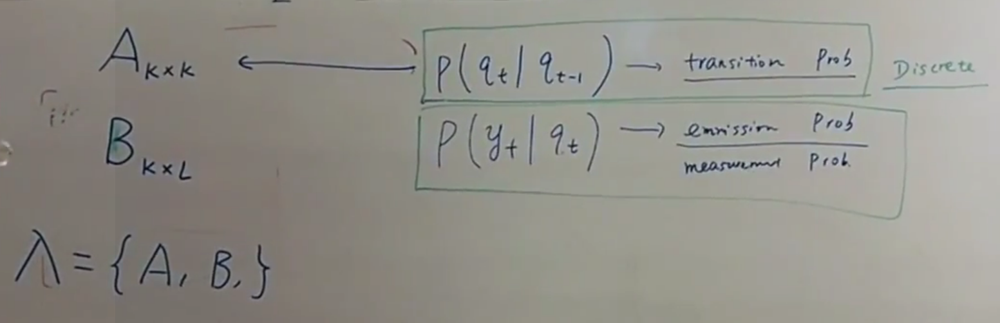

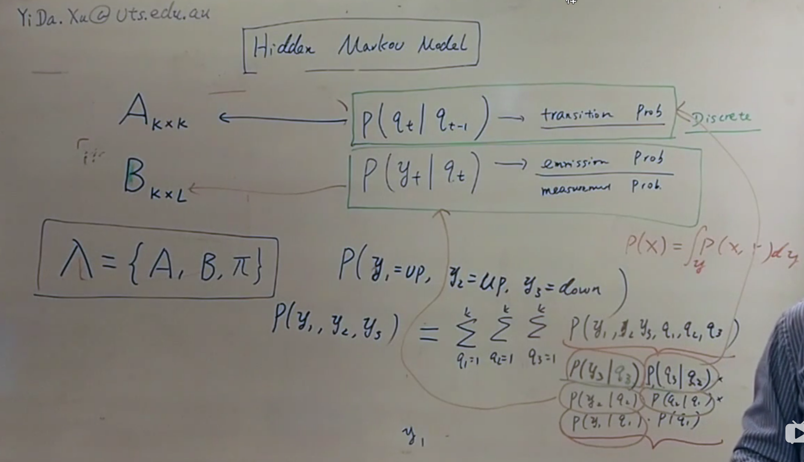

HMM可以根据历史状态，通过不断修正参数，对未来的预测也更准确

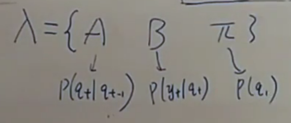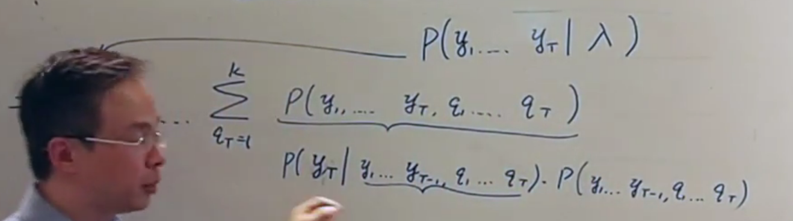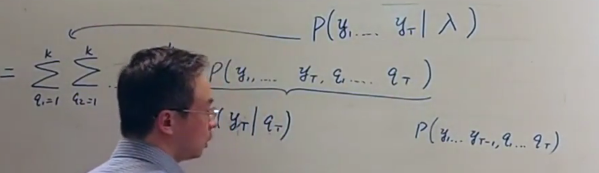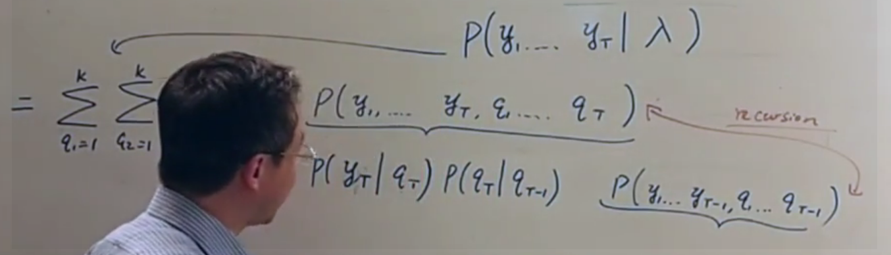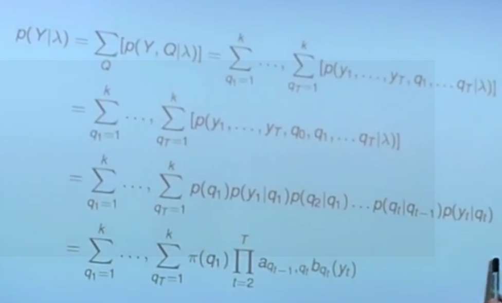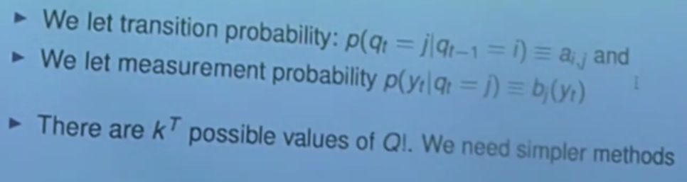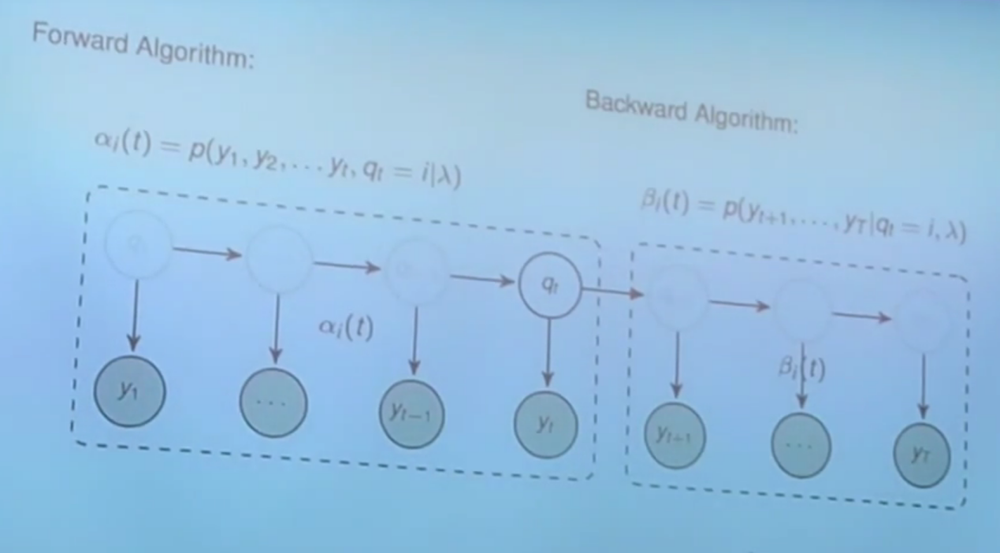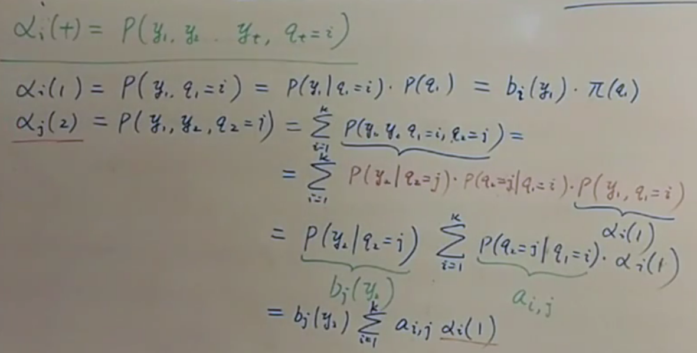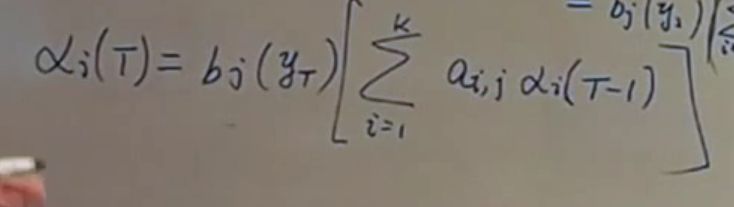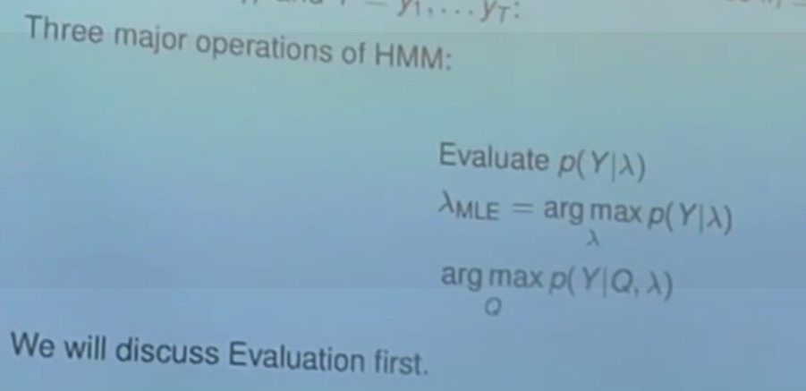


# 4.4 粒子滤波&卡尔曼滤波  

> https://www.cnblogs.com/shuaishuaidefeizhu/p/7156406.html

HMM

卡尔曼滤波

​	定位跟踪时，可以通过某种定位技术（比如位置指纹法）得到一个位置估计（观测位置），也可以根据我们的经验（运动目标常常是匀速运动的）由上一时刻的位置和速度来预测出当前位置（预测位置）。把这个观测结果和预测结果做一个加权平均作为定位结果，权值的大小取决于观测位置和预测位置的不确定性程度，在数学上可以证明在预测过程和观测过程都是线性高斯时，按照卡尔曼的方法做加权是最优的。


# 4.5 SVM


# 5 图像局部变形

基于（密集）网格划分实现


# 6.LeetCode

771.宝石与石头

104.二叉树的最大深度    DFS（深度优先搜索）  递归方法   迭代方法

9.回文数  遍历数组方法


# 7.python tips

1.遍历列表

```python
if __name__ == '__main__':
    list = ['html', 'js', 'css', 'python']
# 方法1
print '遍历列表方法1：'
for i in list:
    print ("序号：%s   值：%s" % (list.index(i) + 1, i))

print '\n遍历列表方法2：'
# 方法2
for i in range(len(list)):
    print ("序号：%s   值：%s" % (i + 1, list[i]))

# 方法3
print '\n遍历列表方法3：'
for i, val in enumerate(list):
    print ("序号：%s   值：%s" % (i + 1, val))

# 方法3
print '\n遍历列表方法3 （设置遍历开始初始位置，只改变了起始序号）：'
for i, val in enumerate(list, 2):
    print ("序号：%s   值：%s" % (i + 1, val))
```
