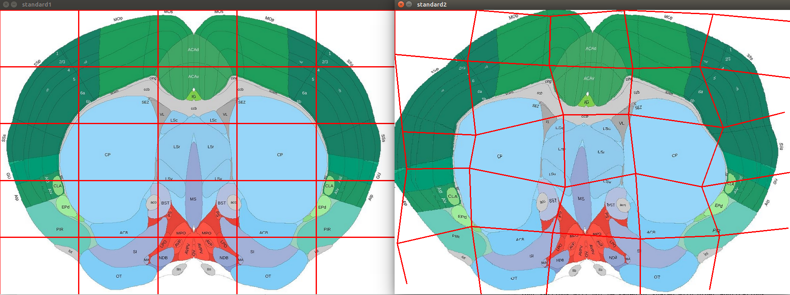
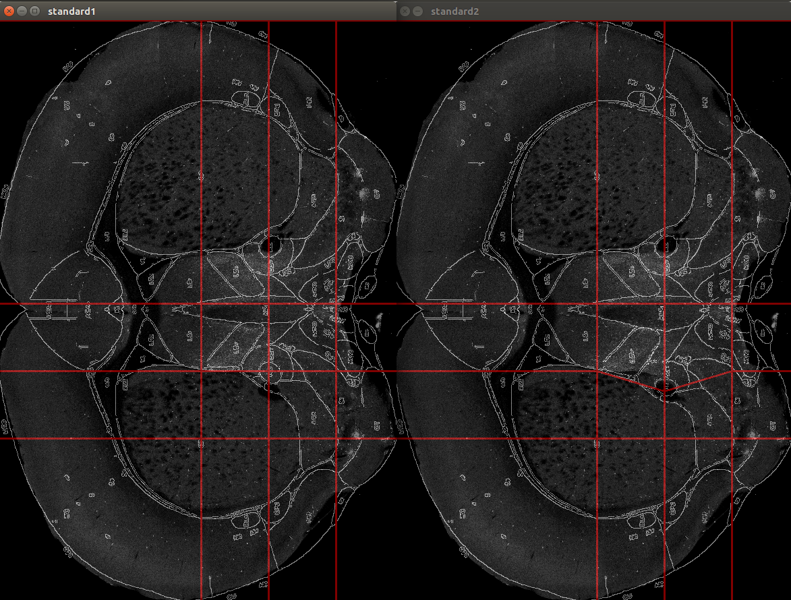
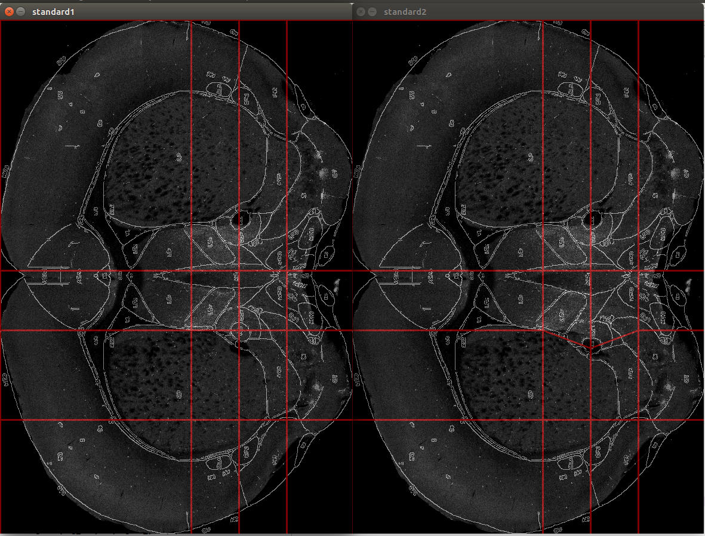

# 1.Visual Tracking

> [1]C++版ECO和VOT2018：https://zhuanlan.zhihu.com/p/44945037
>
> [2]深度学习的快速目标跟踪：https://zhuanlan.zhihu.com/p/32489557
>
> [3]视觉跟踪(Visual Tracking)论文解读之相关滤波(Correlation Filter)篇（1）数学基础：https://zhuanlan.zhihu.com/p/38253462
>
> [4]视觉跟踪(Visual Tracking)论文解读之相关滤波(Correlation Filter)篇（2）C-COT：https://zhuanlan.zhihu.com/p/38343134

视觉跟踪近年来主要分了两个方向，一个是相关滤波，一个是深度学习。其中，相关滤波方向相对来说比较难，说这个方向比较难，是因为涉及到的数学点比较多，比较杂。但是，虽然难，只要一点点分解开来，也就不难了。武功要一招一式的学，视觉跟踪也是。

## 1.1 相关滤波系列（引用）

闲话少说，这个系列预计要逐步重点解读的是这几篇文章：

- D.  S. Bolme, J. R. Beveridge, B. A. Draper, and Y. M. Lui, “Visual object  tracking using adaptive correlation filters,” in Computer Vision and  Pattern Recognition (CVPR), 2010 IEEE Conference on, pp. 2544–2550,  IEEE, 2010.

此文可以看作这个方向的开山，类似于**\*太祖***努尔哈赤，算法简称 **MOSSE**。

- J.  F. Henriques, R. Caseiro, P. Martins, and J. Batista, “Exploiting the  circulant structure of tracking-by-detection with kernels,” in European  conference on computer vision, pp. 702–715, Springer, 2012.

此文可以看作此方向之大成，类似于**\*太宗***皇太极，算法简称**CSK**。

-   J. F. Henriques, R. Caseiro, P. Martins, and J. Batista, “High-speed  tracking with kernelized correlation filters,” IEEE Transactions on  Pattern Analysis and Machine Intelligence, vol. 37, no. 3, pp.  583–596,2015.

此文和CSK很像，同一个作者，可以看作此方向之集大成者，可看成**\*圣祖***康熙爷，算法简称**KCF**。

- M.  Danelljan, A. Robinson, F. Shahbaz Khan, and M. Felsberg, “Beyond  correlation filters: Learning continuous convolution operators for  visual tracking,” in ECCV, 2016.

很强悍的算法，由大神Danelljan提出，可看作**世宗**雍正，算法简称**C-COT**。

- M. Danelljan, G. Bhat, F. Shahbaz Khan, and M. Felsberg, “Eco: Efficient convolution operators for tracking,” in CVPR, 2017.

是对C-COT的改进，同样由Danelljan大神提出，是这一两年最牛逼的算法，可看作**高宗**乾隆，算法简称**ECO**。

同时今年VOT2018结果也公布了。从前几名的算法可以看出，前三名（MFT/UPDT/RC）依然是基于相关滤波方法。（这一句不够客观）


总结一下师从关系：

MFT基于CFWCR基于**ECO;**

UPDT基于**ECO;**

RCO基于CFWCR基于**ECO;**

LADCF基于DCF(**ECO**祖父);

DeepSTRCF基于STRCF基于SRDCF(**ECO**系列前身);

CPT（暂未知师从何门何派）;

SiamRPN基于SiamFC;

DLSTpp基于**ECO**+MDNet.


## 1.2 VOT2018结果

> Kristan, M., Leonardis, A., Matas, J., Felsberg, M., Pflugfelder, R., Zajc, L., … He, Z. (n.d.). VOT2018 results. *Chinese Academy of Sciences*, *26*. Retrieved from http://vision.fe.uni-lj.si/cvbase06/

VOT2018为ECCV的workshop之一，VOT2018 results也是发表在ECCV2018上的。

正文已读，对VOT有了大概的了解。

## 1.3 C-COT

未读

## 1.4 ECO

未读

## 1.5 SiamFC

> Bertinetto, L., Valmadre, J., Henriques, J. F., Vedaldi, A., & Torr, P. H. S. (2016). Fully-Convolutional Siamese Networks for Object Tracking. *Lecture Notes in Computer Science (Including Subseries Lecture Notes in Artificial Intelligence and Lecture Notes in Bioinformatics)*, *9914 LNCS*, 850–865. https://doi.org/10.1007/978-3-319-48881-3_56
>

论文笔记见SiamFC.md


# 2.小鼠项目

## 2.1 基于网格变形效果



还在实验，寻找不会引起其他位置位移的微调算法。

jychen在进行特征点自动选取实验，有一部分成果。


## 2.2 ImageJ插件

ImageJ是使用Java编写的开源软件，可以编写适用于ImageJ的插件，更方便何苗老师那边使用。

先使用Pyhton编写代码进行算法测试，之后再移植为Java语言。

OpenCV也有Java接口，算法测试成功后，移植应该不成问题。

开发为ImageJ插件，省去了编写客户端的人力。


# 3.编程基本功提升

## 3.1 LeetCode

122.买卖股票的最佳时机 II

121.买卖股票的最佳时机

26.删除排序数组中的重复项

20.有效的括号


## 3.2 Python tips

#### 1.两个列表逐元素相减

```python
    a = [1,2,3,4,5]
    b = [5,4,3,2,1]
    c = [a[i] - b[i] for i in range(len(a))]
    print(c)
    # print: [-4, -2, 0, 2, 4]
```


#### 2.列表取倒数元素

```python
arr ``=` `[``"aex"``, ``"bfe"``, ``"mpilgrim"``, ``"zddd"``, ``"example"``];  
''''' 
数组的负索引 
li[-n] == li[len(li) - n] 
'''
print``(arr[``-``1``]);``#打印出arr数组中倒数第一个元素
```


#### 3.在列表中插入元素

```python
fruits = ['apple', 'orange', 'banana']

fruits.insert(1,'watermenlon')
print(fruits)

#输出：
#['apple', 'watermenlon', 'orange', 'banana']
```


#### 4.遍历字典

（1）遍历key值

```python
>>> a
{'a': '1', 'b': '2', 'c': '3'}
>>> for key in a:
       print(key+':'+a[key])
 
a:1
b:2
c:3
>>> for key in a.keys():
       print(key+':'+a[key])
 
a:1
b:2
c:3
```

在使用上，for key in a和 for key in a.keys():完全等价。

（2）遍历value值

```python
>>> for value in a.values():
       print(value)
 
1
2
3
```

（3）遍历字典项

```python
>>> for kv in a.items():
       print(kv)
 
('a', '1')
('b', '2')
('c', '3')
```

（4）遍历字典健值


```python
>>> for key,value in a.items():
       print(key+':'+value)
 
a:1
b:2
c:3
>>> for (key,value) in a.items():
       print(key+':'+value)
 
a:1
b:2
c:3
```

在使用上for key,value in a.items()与for (key,value) in a.items()完全等价


