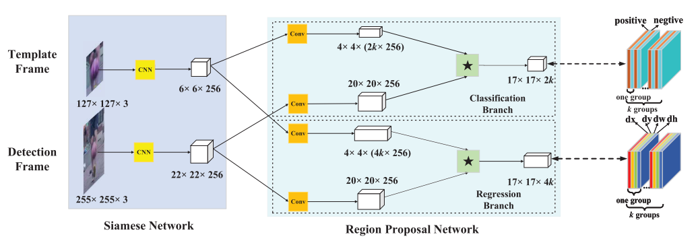
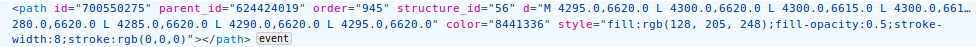
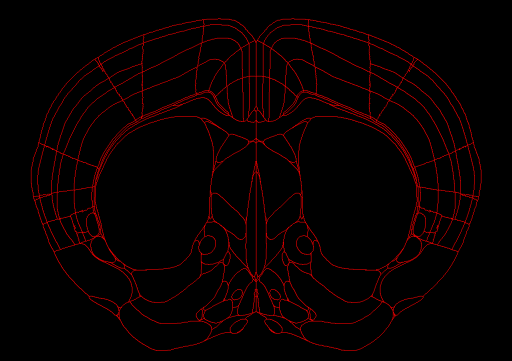
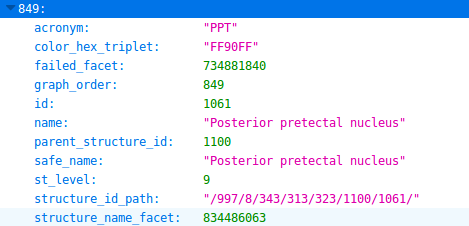

# 1.Visual Tracking

## 1.1 SiamRPN&DaSiamRPN

> [1]SiamRPN:Li, B., Yan, J., Wu, W., Zhu, Z., & Hu, X. (2018). High Performance Visual Tracking With Siamese Region Proposal Network. *Cvpr*, 8971–8980. Retrieved from http://openaccess.thecvf.com/content_cvpr_2018/html/Li_High_Performance_Visual_CVPR_2018_paper.html
>
> [2]DaSiamRPN:Zhu, Z., Wang, Q., Li, B., Wu, W., Yan, J., & Hu, W. (2018). Distractor-aware Siamese Networks for Visual Object Tracking. Retrieved from http://arxiv.org/abs/1808.06048

​	网络结构如上图。SiamRPN主要是基于Siamese的结构来做的，思路也是通过比对下一帧待检测图像与上一帧模板图像的相似度，寻找相似度得分最高的区域。但加入了RPN的结构，相比于SiamFC的全卷积结构，速度更快，准确率也更高。在VOT2018上取得了比较很好的名次。个人感觉这篇论文没有并作出什么突破性进展，只是把前人提出的结构做了一个重组，找到了一个实验效果比较好的结构。但RPN值得重读一遍，也许会有启发。

​	SiamRPN是应用于ST（Short -Term）跟踪的，而DaSiamRPN是应用于LT（Long-Term）跟踪的，出自同一团队（朱政@中科院自动化所）之手，都在VOT2018比赛中取得了很好的名次（几个单项第一，综合能力数一数二）。

​	DaSiamRPN的论文目前还没有读。

​	基于Siamese的跟踪方法都是离线训练模型，不在线更新。这样的好处就是速度更快，也避免了模型被污染。

## 1.1 用跟踪的思路做胞体检测？

​	目标跟踪的思路也可以应用在胞体检测中，因为都可以看成是One-Shot Learning的问题。可以先手动框选出一个或多个神经元胞体，然后在线训练分类器或者使用Siam这种相似度网络，在整张图片中进行搜索，找到所有响应比较高的位置。区别就是跟踪任务需要逐帧搜索，每一帧只要找到一个目标。胞体检测只用在单张图片中进行搜索，找到所有响应峰值，但好处是初始框可以选取多个，训练出更好的分类器后再进行整副图片的搜索。由于一张照片中神经元胞体的形态还是比较单一且好辨认的，所以使用这种方法应该会有一定的效果。这只是基于最近看目标跟踪论文的一点思考，事实上用目标检测甚至暴力二值化的方法可能效果会更好，但跟踪的方法省去了人工标注大量数据的工作，也能具有较强的普适性，个人认为值得一试。之后抽时间编写代码进行效果验证。

# 2.小鼠项目

## 2.1微调算法优化

优化了微调的效果，让微调区域以外的地方所受影响尽量减小。不过目前是人工选取特征点进行微调，目前正在编写自动寻找特征点的代码。

我们设计了基于内部特征轮廓的算法来提取特征点。对于这幅图，使用的是如下图位置的6个绿点，这6个特征点是人为设计的，其坐标采用轮廓算法进行自动提取。针对不同位置的图谱，需要选取其他特征点。

下图为自动提取特征点微调的效果，左图为调整之前的融合图像，右图为自动微调之后再进行融合的效果。图中6个绿点是进行微调的位置。目前鼠脑照片中的特征点为自动选取，图谱中对应的点为手动给出。等图谱数据爬取完毕后，采用相似轮廓搜索的方法即可找到图谱中的对应点，实现自动微调。

## 2.2 分区数据获取

alan-brain网站上提供了图谱的下载链接，但只是提供了jpg图片的下载，没有提供关于分区的具体数据。现在是直接用图谱使用canny算子进行轮廓提取，方便演示，但并未获得各个分区的具体信息，这一部分信息无法直接从图谱图片准确提取，我们选择从alan网站上爬取。

但网页在绘图时使用了脑区分区信息和具体的分区轮廓等信息，我们可以从网站源码获取我们需要的分区数据。

上图为源码部分截图。其中parent_id为图片id，structure_id为分区编号，d为分区的轮廓。

这几个信息就是我们需要的脑区分区信息。只要将鼠脑图片和脑图谱完成图像的匹配，就能用这些分区数据完成对鼠脑图片的自动分区。

编写爬虫代码，将网站上的这些信息爬下来。

此为alan-brain atlas中的精确分区信息。atlas中每张图谱大小均为11400×8000，structure为脑区索引，因为一个脑区会分为多个轮廓绘制，所以一个structure会对应多个contour，contour中存储的就是该脑区的轮廓。

下图为使用网站上爬取的脑区数据绘制的分区图，总共包含525个轮廓。    

轮廓索引为树状结构。如PPT（posterior pedestal nucleus）区域，从根节点997，不断向下索引，最终到达叶节点1061。将1061号绘制出来，就是图片中对应的PPT区域。

后期使用这些数据来进行分区。

# 3.编程基本功提升

## 3.1 LeetCode

141.环形链表

7.反转整数

11.盛水最多的容器m        算法难想，实现简单

2.两数相加         Python执行会超时

## 3.2 Python tips

