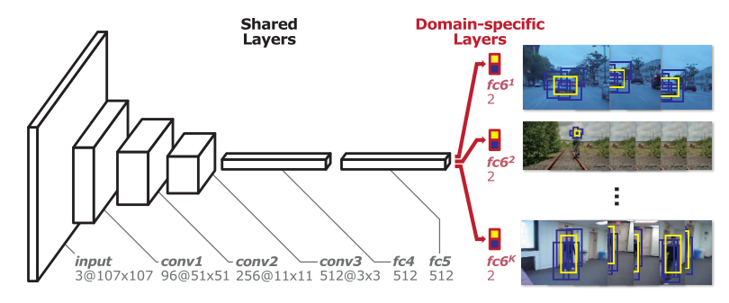
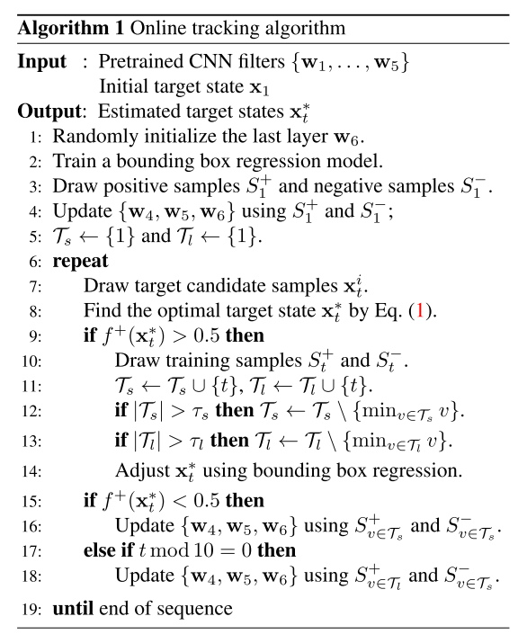
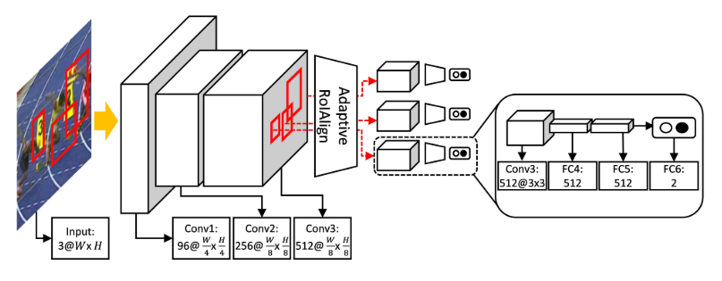
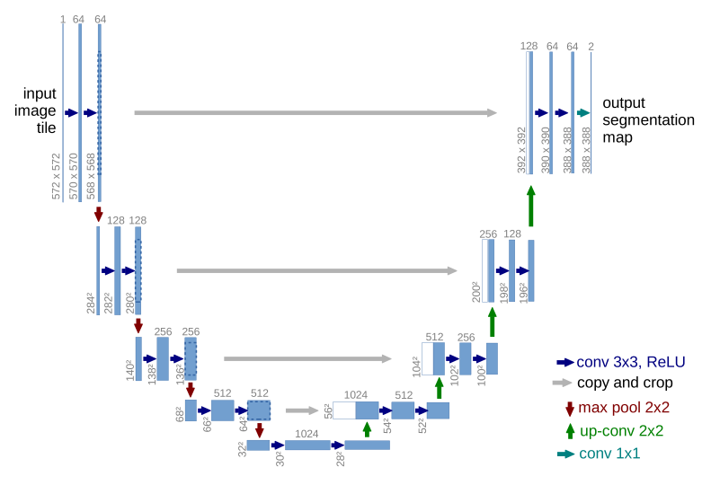

# 1 目标跟踪

上图是别人总结的目标跟踪领域最新进展，比较系统，总结的比较好。目标跟踪算法主要分支是深度学习和相关滤波方法的跟踪器，下方蓝色与绿色分支是跟踪相关的数据集。

这周主要看的是在线更新的深度学习模型。

## 1.1 MDNet

CVPR2016，15年提出，当时性能出众，刷榜vot15。缺点是速度慢，1FPS。

后来其思想被大家大量吸收借鉴，用于其他跟踪器。vot2018长时跟踪的第一名MBMD也用到了MDNet作为验证网络。

MDNet只有六层，前三层为卷积，后三层为FC层。

前五层在ImageNet VID数据集上进行预训练，最后一层为Domain-specific，即只和确定的视频相关，使用视频第一帧的信息利用HardExampleMining进行训练。在后续追踪时，后三个FC层都会进行Fine-tune。

## 1.2 RT-MDNet(RealTime-MD)

ECCV2018，MDNet同组出品的续作，前几天刚开源。FPS二十多，性能优异。但可视化后发现缺点也很明显，回归不准，应对物体形变不灵敏。

RTMDNet与前作MDNet思路并未有太大区别。主要是加入了RoIAlign操作，并且将前面的卷积层试图训练成一个能区分实例的网络。

# 2 胞体检测

> 比赛网址：https://www.kaggle.com/c/data-science-bowl-2018?

无意间看到了kaggle上有一个神经元胞体识别的比赛，叫2018 DataScience Bowl，发现了一个之前没有关注过的网络UNet。

这个比赛已经结束了，但在讨论区里可以看到MaskRCNN和UNet这两个网络讨论热度最高，UNet是一个医学图像处理中很常用的网络，适用于胞体检测分割的任务。

应该对我们的小鼠项目有用，研究了一下这个网络。

还发现了一个会议ISBI，是医学图像相关的，可以关注一下。

## 2.1 U-Net

> Ronneberger, O., Fischer, P., & Brox, T. (n.d.). U-Net: Convolutional Networks for Biomedical Image Segmentation, 1–8.

UNet是15年提出的，应用于细胞图像的分割，效果很好。网络结构如下。

有效结合了高层语义和底层信息，值得学习。

# 3.ImageJ

ImageJ的插件如果要做界面，需要用PlugInFrame类，但这个类是继承于AWT类中。现在AWT用得比较少了，主流会选择用Swing，编程更友好，界面也更漂亮。

找了一个Swing的图片查看器代码，改了改跑通了。但发现好像并不能写在ImageJ插件的框架中，应该是白做了。但AWT实在是比较古老了，用得人也少，所以想以后直接用Python写简单的界面吧，在ImageJ插件中调用，毕竟各种算法也是需要调用Python脚本的。

