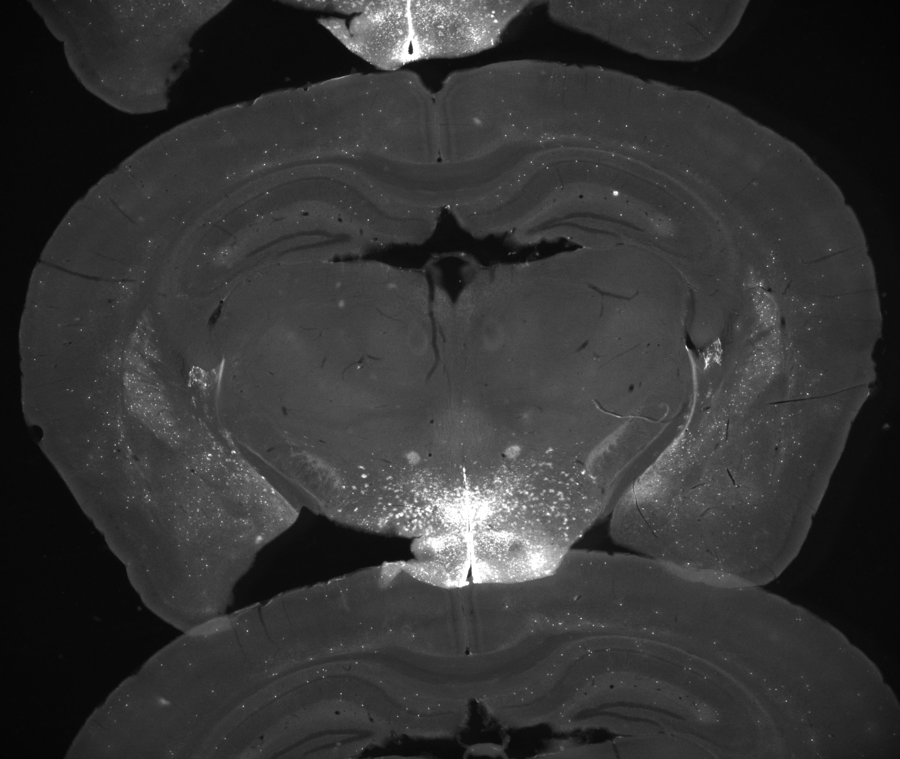

上周在忙各种课程，期末事情比较多。

抽空在看跟踪的论文。

项目的事情也抽空在做。

这周大概时间分配为6：2：2。

# 1 目标跟踪

## 1.1 RT-MDNet

RoI Pooling

RoI Align

BoundingBox Regression

这周RT-MDNet深入看了一下论文和代码

之前看论文只着重看了前三部分，现在也再看后面的实验部分，可以对网络理解更深刻，而不是浮于表面。

## 1.2 安防视频

目前还在帮怡云老师测试跟踪算法在安防视频上的效果，主要是运行一些主流算法，记录下输入分辨率，帧率，效果等。半成品文档见"跟踪算法测试.md"

# 2 小鼠项目

今天提交了每两周的汇报，何苗老师那边发来了他们切的鼠脑图片，和我们之前实验用得图片相比，质量差了很多，主要是挤压很严重。需要想办法处理一下。

感觉要想办法上神经网络了，传统方法hold不住。

