# 1 目标跟踪

CFNet出自KCF与SiamFC同一团队（Jo˜ao Henriques @Oxford）之手，是他们的后续研究，发表于CVPR2017。

把之前一直没有机会看的粒子滤波原理看了一边，基本明白了其思路。虽然是很早的算法，但现在出境率还是比较高，值得了解一下。粒子滤波的思想基于蒙特卡罗方法。

之后继续研究vot2018的结果，把其中两个性能很好的跟踪器MFT和MBMD看了一下，原作者在知乎上有介绍自己论文的文章。

## 1.1 CFNet

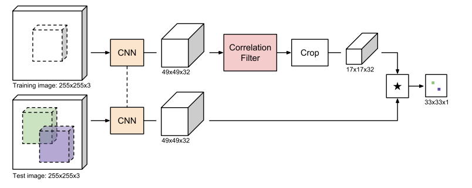

看过了，但还没有看太懂，文中公式比较多，很有KCF论文的风格。先放下，日后需要再细看。

## 1.2 Kalman FIlter

## 1.3 Particle Filter

Particle Filter相比于Kalman，计算量大，不能一步到位（closed-form？）。

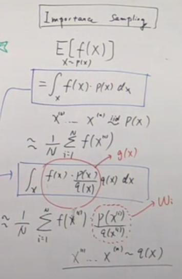

Importance Sampling，用的少，难以选择q(x)。Sequential Importance Sampling (SIS)，用来采高维，逐维递推采样

边缘分布的概念，多维分布在某一维上的投影？

对比卡尔曼滤波与粒子滤波。卡尔曼滤波假设是高斯分布；粒子滤波是任意分布，预测粒子位置和粒子权重。

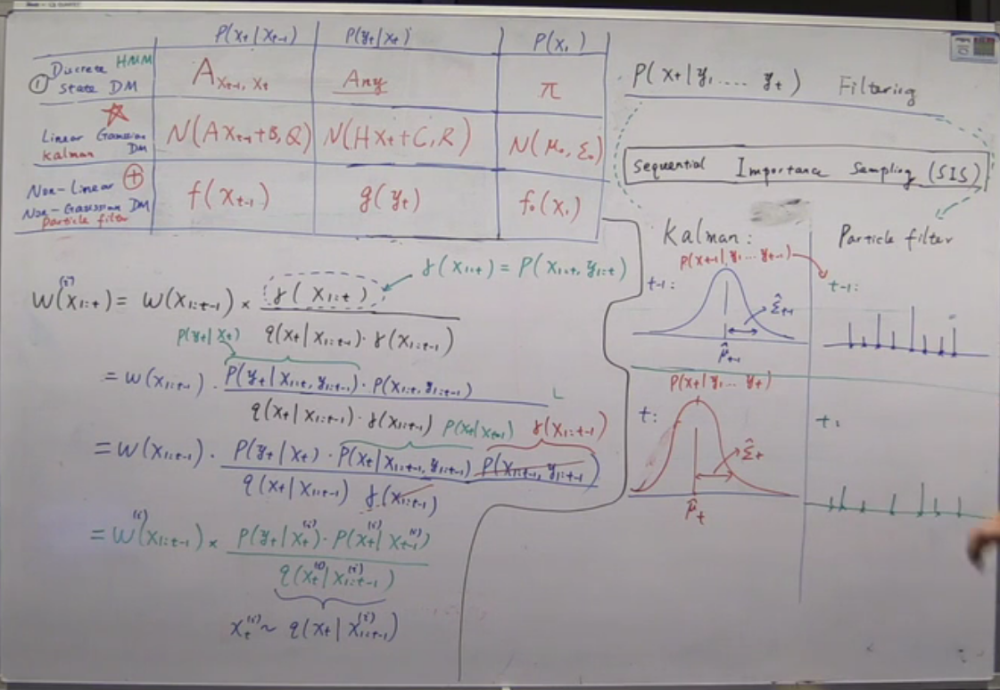

Resampling

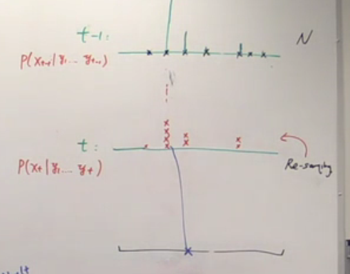

运行了一下代码，matlab和python版本都很短，一百多行即可，思路可以借鉴现在的跟踪检测任务中。

多看论文，多了解一些其他的思路，以及传统方法和其他领域的方法，都会很有帮助。

以下MFT和MBMD均已开源。

## 1.4 MFT

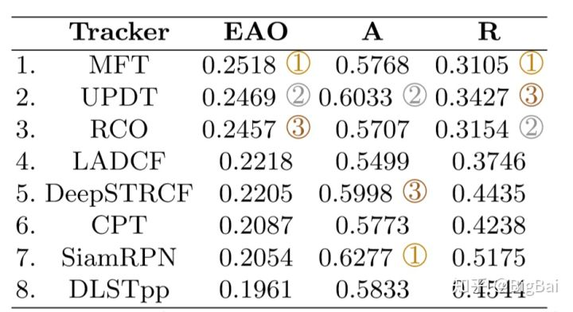

> 有幸在本届的VOT 2018 主赛中，我们的参赛方案Multi-solution Fusion for Visual Tracking（MFT）获得第一名的成绩，通过结果来看，MFT无论在公开序列还在隐藏序列鲁棒性都稳居第一，也验证了我们本次在算法鲁棒性所做出的努力，另外我们的RCO也获得了第三名的结果。

**Motivation：** 单目标跟踪算法发展到现在，对于简单情况已经有着非常不错的精度和鲁棒性，但是当遭遇一些特别困难的情况仍会时常失败.我们本次的工作主要在我们去年的算法CFWCR基础上进一步地发展，关注如何进一步地克服这些困难情况。

俗话说三个臭皮匠顶个诸葛亮，我们总体的思路是引入多个不同的独立判决，然后通过有效的融合得到一个更鲁棒的结果。这样做有三个好处，一方面分解成多个部分，各个部分的参数量减少，克服了相关滤波算法本身快速更新所导致的过拟合，另一方面每个部分学习到的关键信息不同，汇总各个结果总体增加了算法的可靠性，最后，我们还是使用之前相同数量的滤波器数量，相比较联合求解并不会增加数量。

**具体内容如下：**

（1）我们观察到CNN特征不同层次的特征和跟踪中遇到的不同问题有着一定的相关性，比如，浅层能解决尺度问题，深层解决光照，形变问题。针对不同特性，我们选择了不同的特征

（2）对于针对不同问题的特征，我们采用独立求解的方式，并且会根据视频的不同难度去自适应调整我们的融合权重，克服了过拟合，提高了鲁棒性

（3）更进一步地。我们利用合理的运动估计模型以克服甚至是完全遮挡的情况

## 1.5 MBMD

VOT 2018 长时跟踪第一名。综合性能强于DaSiam。

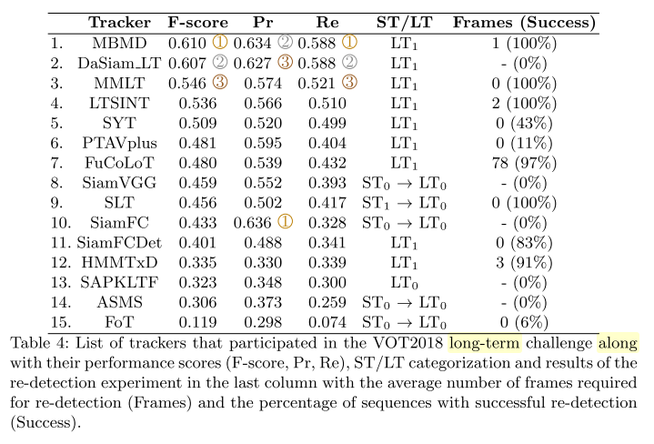

**Motivation:** 匹配网络通过预训练能够适应在线跟踪时目标外观的变化，但是对干扰物区分度不够；分类网络能够很好地区分出干扰物，却很难适应目标外观的变化。如果用单一网络（匹配或分类），很难通过网络输出判断目标是否出现在当前帧，并执行全图搜索。 

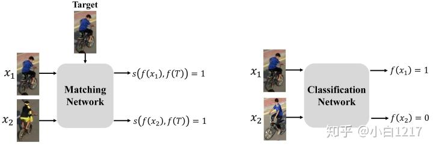

**Algorithm:** 如下图所示，算法由两部分组成，一个基于匹配的回归网络和一个基于分类的验证网络。 

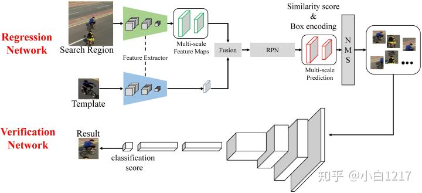

# 2 卷积

之前对卷积的理解还是比较局限，总是默认是3×3或者5×5这种核，其实卷积有很多理论值得研究。

在传统CV中形态学处理就用了各种卷积核，比如canny算子，sobel算子等都是其应用，甚至“x”‘+’型卷积核等，都有一些应用。深入理解卷积的作用，对理解CNN的功能并作出创新有很大帮助。

## 2.1 普通卷积

## 2.2 空洞卷积

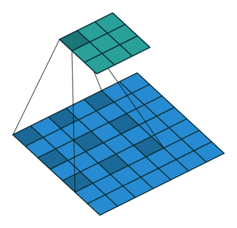

## 2.3 反卷积

## 2.4 Opencv形态学处理的启发--其他形状的卷积核

> https://www.server110.com/python/201308/117.html
>
> ​	与边缘检测不同，拐角的检测的过程稍稍有些复杂。但原理相同，所不同的是先用十字形的结构元素膨胀像素，这种情况下只会在边缘处“扩张”，角点不发生变化。接着用菱形的结构元素腐蚀原图像，导致只有在拐角处才会“收缩”，而直线边缘都未发生变化。 
>
> ​	第二步是用X形膨胀原图像，角点膨胀的比边要多。这样第二次用方块腐蚀时，角点恢复原状，而边要腐蚀的更多。所以当两幅图像相减时，只保留了拐角处。示意图如下

十字型卷积核,X型卷积核

**“+”型和“x”型结构元素来进行腐蚀膨胀，可以达到检测拐角等效果。**

## 2.5 im2col

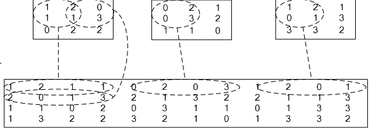

​	im2col先将一个大矩阵，重叠地划分为多个子矩阵，对每个子矩阵序列化成向量，最后得到另外一个矩阵。它先将一个大矩阵，重叠地划分为多个子矩阵，对每个子矩阵序列化成向量，最后得到另外一个矩阵。

​	具体对比如下：

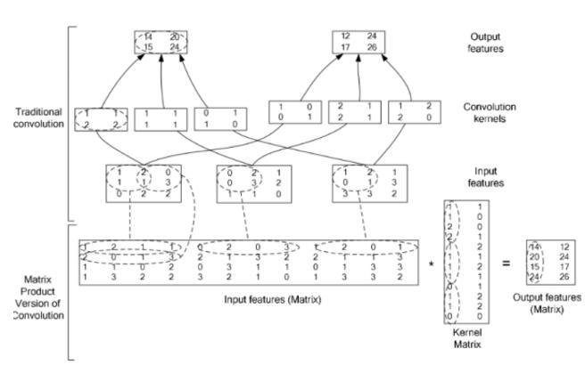

# 3 ImageJ插件

上周在忙各种各样的事情，看得东西比较多，期末也有各种各样的大作业，没抽出什么时间做项目，这周给何苗老师的汇报打算先水过去。

