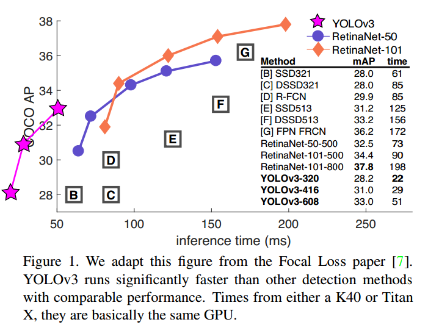
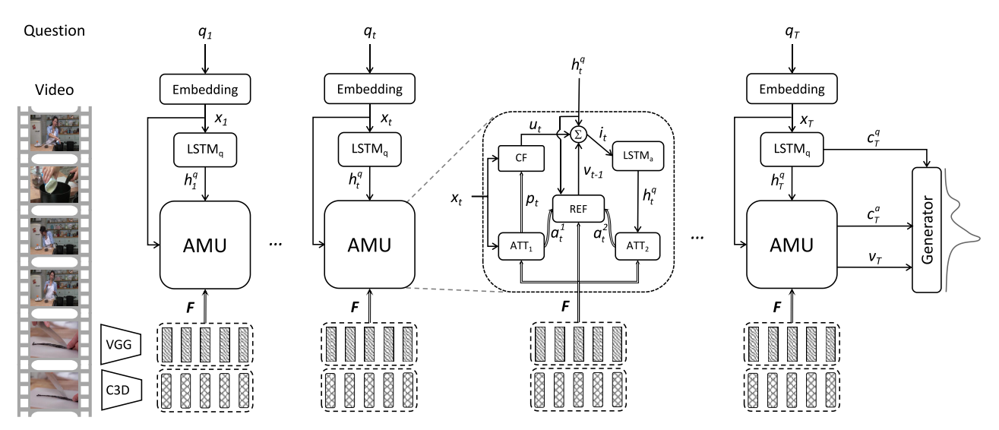

# 本周工作内容

本周主要在跑代码。

1. YOLOv3框架，进行目标检测。利用COCO数据集训练/利用自己的数据集训练。

   > YOLOv3: An Incremental Improvement

2. 视频问答。使用之江杯的比赛数据集进行训练。

   > Video Question Answering via Gradually Refined Attention over Appearance and Motion

------

## YOLO v3

#### YOLO V3的效果

   YOLO V3在Pascal Titan X上处理608x608图像速度达到20FPS，在 COCO test-dev 上 mAP@0.5 达到 57.9%，与RetinaNet的结果相近，并且速度快了4倍。

   在输入320x320时，22ms即可处理一帧，达到28.2mAP，与SSD相同精度，并且速度快了三倍。

#### 尝试训练YOLO V3

1. 使用COCO数据集训练，效果很好，训练几轮就能看到明显的效果
2. 使用布匹数据集训练，瑕疵难以识别，无法训练出可用模型

#### YOLO v3的改进之处

- **Loss不同：** 将YOLO V3替换了V2中的Softmax loss变成Logistic loss，而且每个GT只匹配一个先验框； 
- **Anchor bbox prior不同：** V2用了5个anchor，V3用了9个anchor，提高了IOU；
- **Detection的策略不同：** V2只有一个detection，V3设置有3个，分别是一个下采样的，Feature map为13x13，还有2个上采样的eltwise sum，Feature map分别为26x26和52x52，也就是说，V3的416版本已经用到了52的Feature map，而V2把多尺度考虑到训练的data采样上，最后也只是用到了13的Feature map，这应该是对小目标影响最大的地方；
- **backbone不同：** V2的Darknet-19变成了V3的Darknet-53，这与上一个有关。
- 另外V3还是用了一连串的3*3、1*1卷积，其中，3*3的卷积增加channel，而1*1的卷积在于压缩3*3卷积后的特征表示，这波操作很具有实用性。

### VideoQA

利用比赛数据集来练手，提高代码能力，并且学习视频理解算法。有排行榜，方便对比算法效果。

使用之江杯比赛提供的标注好的视频问答数据集，包含约4000个长度为10s左右的视频片段，配套每个视频有5个问题，每个问题有3个正确答案。

这篇论文开源了代码：https://github.com/xudejing/VideoQA

算法具体实现步骤：

1. VGG提取单幅图片静态特征
2. C3D提取视频片段动作特征
3. word embedding提取问题的特征
4. 融合特征进行训练

