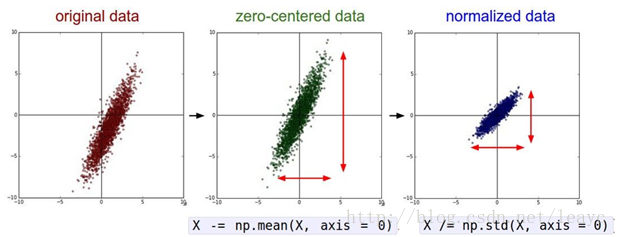
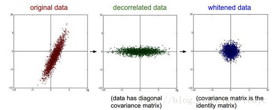
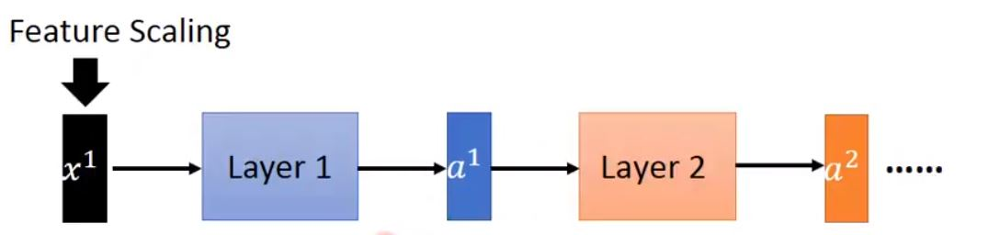
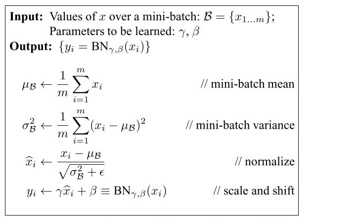
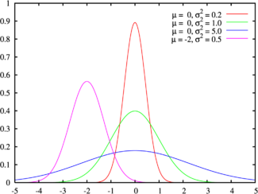
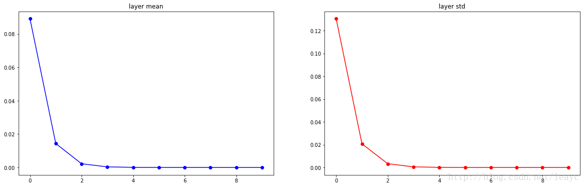
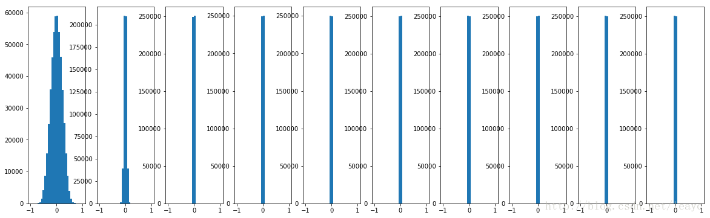
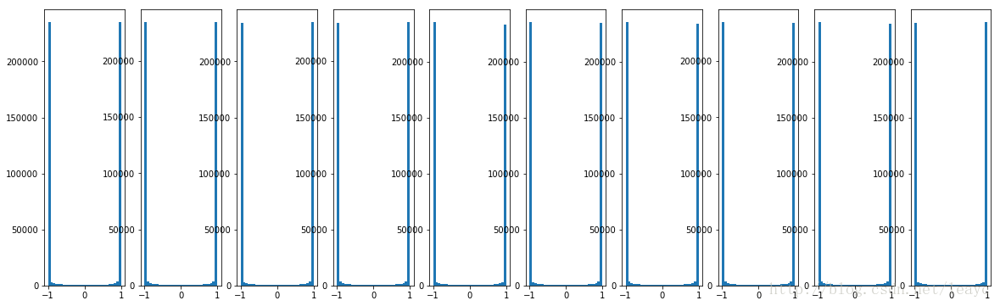

# Batch Normalization：Accelerating Deep Network Training by Reducing Internal Covariate Shift

## 1.BN提出的背景:Internal Covariate Shift

输入的微小改变，通过了很深的网络后，这种微小改变会被一层层放大，所以训练网络这个过程就变得很复杂。

The train- ing is complicated by the fact that the inputs to each layer are affected by the parameters of all preceding layers – so that small changes to the network parameters amplify as the network becomes deeper

在这些复杂改变过程中，每一层的输入数据的分布改变就成为了一个问题，因为网络中的各层需要连续地适应新的数据分布。

The change in the distributions of layers’ inputs presents a problem because the layers need to continuously adapt to the new distribution.

	1、We define Internal Covariate Shift as the change in thedistribution of network activations due to the change in network parameters during training.

	（深度神经网络涉及到很多层的叠加，而每一层的参数更新会导致上层的输入数据分布发生变化。通过层层叠加，高层的输入分布变化会非常剧烈，这就使得高层需要不断去重新适应底层的参数更新。

	换言之，每个神经元的输出数据不再是“独立同分布”。

- 上层的参数需要不断的适应新的输入数据分布，降低学习速度。  
- 下层输入的变化可能趋向于变大或者变小，导致上层落入饱和区，使得学习过早停止。  
- 每层的更新都会影响到其他层，因此每层的参数更新策略需要尽可能的谨慎。）

## 2.如何解决Internal Covariate Shift

归一化、白化等操作就是解决了输入层的数据分布问题。

既然对输入层进行这些变换可以解决数据分布的问题，并且提高深度网络的训练效果，那么深度网络内部的层与层之间能否进行类似的操作呢？由此产生了文章的基本思路：对中间层的特征输出做尺度变换。

（为什么中间层的数据呈单位高斯分布就是最好的？）

在层间传递时，可能数据分布会不再规范，方差和均值都有可能偏移，所以使用BN来将中间层的输出规范化。

## 3.BN具体做法

公式里加上 ϵ，对输入图像也有一些平滑(或低通滤波)的作用。这样处理还能消除在图像的像素信息获取过程中产生的噪声，改善学习到的特征。

关于最后一步两个参数为自适应参数，初始值一般为（0,1），这两个参数在训练时也会进行训练，因为对于有些任务（0,1）的标准分布并不是最合适的，所以要再进行一次缩放和平移。

因为深层神经网络在做非线性变换前的**激活输入值**（就是那个x=WU+B，U是输入）**随着网络深度加深或者在训练过程中，其分布逐渐发生偏移或者变动，之所以训练收敛慢，一般是整体分布逐渐往非线性函数的取值区间的上下限两端靠近**

	其实就是把隐层神经元激活输入x=WU+B从变化不拘一格的正态分布通过BN操作拉回到了均值为0，方差为1的正态分布，即原始正态分布中心左移或者右移到以0为均值，拉伸或者缩减形态形成以1为方差的图形。什么意思？就是说**经过BN后，目前大部分Activation的值落入非线性函数的线性区内，其对应的导数远离导数饱和区，这样来加速训练收敛过程。**

加在激活函数前，让数据落在激活函数的线性区域内。对于ReLU也能避免大量的神经元deactivate。

Internal Covariate Shift到底是什么？

测试时：使用训练时记录的平均值和标准差。

## 4.BN的好处

- 极大提升了训练速度，收敛过程大大加快；
- 增加分类效果，一种解释是这是类似于Dropout的一种防止过拟合的正则化表达方式，所以不用Dropout也能达到相当的效果；
- 另外调参过程也简单多了，对于初始化要求没那么高，而且可以使用大的学习率等。

## 5.其他

假设输入数据的范围是 (0, 1)，初始化参数为0.01x正态分布，非线性函数使用 tanh ——这是过去的常用配置之一。观察 forward passing 的结果。 
代码见[5]。 
(*该部分内容参考了 Stanford CS231n [6]。*)

容易看到，在级联结构的作用下，由于初始权重较小，输入数值在逐层传递的过程中逐渐收缩，最后都成了0。 
将初始化权值去掉0.01系数，后续数值就变成了

反向传播阶段的情形与之类似。这就产生了所谓的梯度消失/爆炸问题。 
换成 sigmoid 函数也一样。其导数 σ′=σ∗(1−σ)σ′=σ∗(1−σ) ，最大值出现在 σ(0)=0.5σ(0)=0.5 时， σ′(0)=0.25≪1σ′(0)=0.25≪1， 因而每经过一层，梯度都会收缩。小梯度降低了学习的速度，甚至导致网络无法学习。 
所以为了“安全”地训练一个网络，我们自然而然地就会希望，数值在层间传递时，能够稳定在一个大概的范围内——既不要太大，也不要太小： 
**比如单位高斯（unit Gaussian） N(0,1)N(0,1) 就是极好的。**

再考虑随机梯度下降的计算过程。

##  

