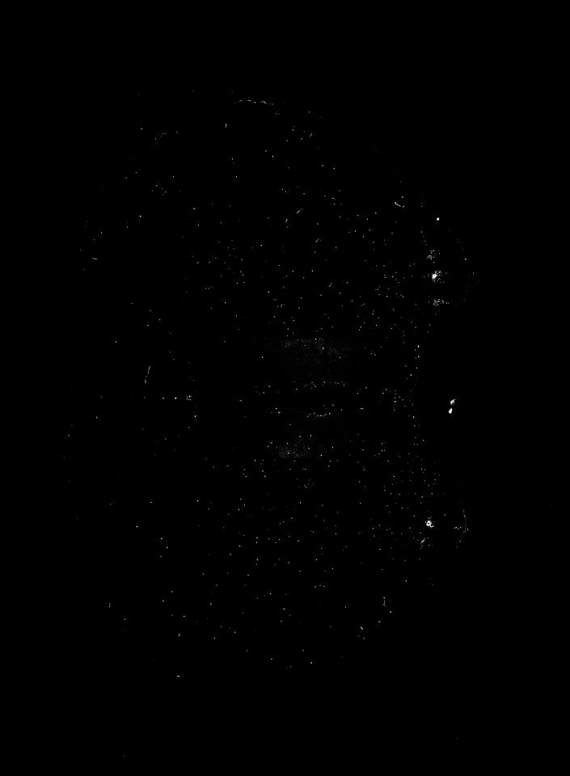
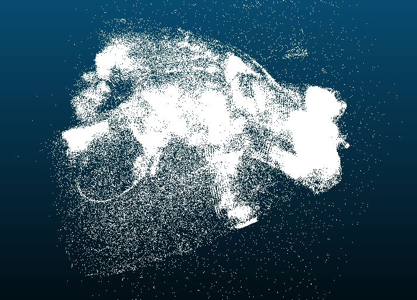

# 上周任务

1. 计算机视觉——算法与应用
2. 读骆清铭文章及鼠脑连接图谱相关文章（疑问：我们的图像是骆清铭组的MOST图像吗？）
3. 抽空读统计学习方法
4. 读取tif图像及处理
5. 切片图像简单预处理后存入三维点云进行三维显示

# 二维图像神经元三维重建

先尝试跑了一遍大概流程，做了个简单的三维点云demo，还未调整细节

1. 先对网盘中的图像进行预处理，使用Photoshop调整色阶，得到人眼能看清的大脑切片图像。网盘中的原图像为tif格式，且亮度很低，和我们平时常见的图像有很大区别，这一步预处理应该仔细研究一下。

1. 预处理过的图像进行二值化，处理成只剩神经元小白点的二值图像

1. 使用OpenCV寻找轮廓，并用外接圆拟合这些轮廓，外接圆的圆心存储为点云文件（.xyz）。点云文件为pc.xyz，已上传。
2. 遍历所有图片，生成三维点云文件，使用CloudCompare软件查看。

#### 缺点&可改进之处：

1. PS中处理时使用的是渐隐自动对比度调整，使用"动作"功能记录脚本，批量处理全部图片。缺点所有统一使用渐隐自动对比度调整，导致有些图片过亮，有些图片过暗。可以更换其他预处理方法，获得更有利于神经元识别的切片图像
2. 使用OpenCV进行简单的阈值二值化，并没有进行针对性的微调。这一步目的是去除图片中除神经元以外的其他部分，方便下一步神经元轮廓提取、
3. 使用二值化之后的图像进行轮廓检索，简单粗暴地提取了所有轮廓（包括噪点的轮廓），并且只把轮廓的中心在点云中显示出来，没有显示整个轮廓。
4. 以上步骤优化以后，再考虑二维点之间的相互连接，识别出相邻两幅二维图像中同一个神经元，并将它们连接起来，可以使用传统CV方法或神经网络的方法进行尝试。

#### 未来应考虑：

1. 虽然是介观层面的大脑切片图像，但能看清部分神经元的形状。神经元的形状信息可以利用，来进行更高精度三维重建。
2. 神经元密集区的连接关系重建是个难点，应先从神经元稀疏的部分入手，从易到难，提高检测精度。

#### 要点：

1. 原图预处理
2. 图像对齐

# 下周任务

继续进行文献调研，同时优化现有程序流程，探索更好的图像处理算法。

------

# 以下为草稿

### 图像预处理

1.图像反转：

作用：看清暗色图像中白色和灰色的细节

2.图像对数变换：

作用：用于对数值范围过大的数据进行调整显示

3.幂次变换（伽马校正）：

作用：用途和对数变换差不多

4.分段线性变换：

分类：对比拉伸（对比度拉伸），灰度切割，位图切割

以上几个处理方法的思想都是将固定范围内的像素值得显示范围放大或缩小，让图像

更符合意向

### 三维点云数据

# 相关技术调研

## 计算机断层扫描 CT（Computerized Tomography）

