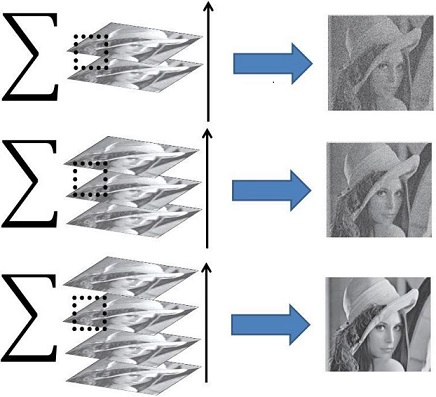
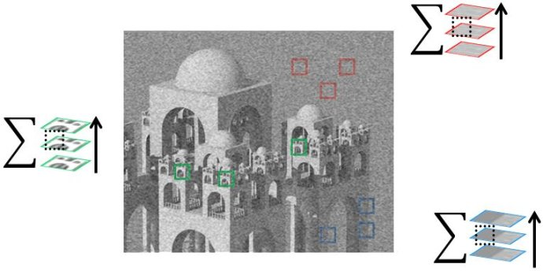
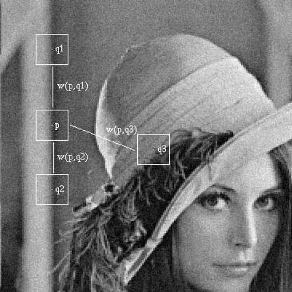
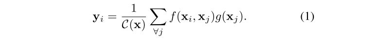
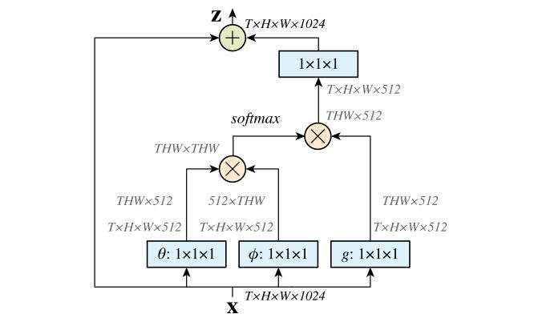
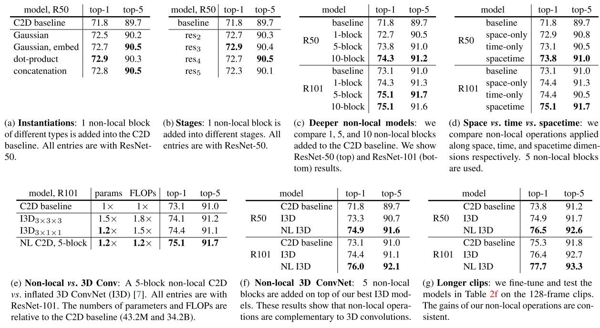
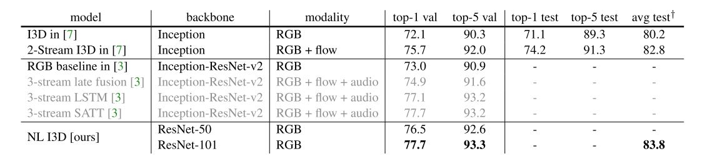
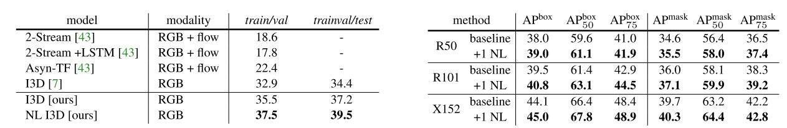

# Autism Diagnosis

需要请教医生的问题：

1. 自闭症诊断整个过程中，医生脑中思路是什么样的？
2. 医生觉得工作量大的部分，或者可以交给电脑处理的部分是什么？
3. 目标群体年龄范围？4岁以下（治疗效果）还是7、8岁左右（数据集）？

项目实现的可选方式：

1. <u>设计出一套模型，输入指定特征如ADOS量表等，输出患病概率与病情严重程度。</u>（大多数论文的研究目标）
2. 输入视频语音等数据，分析得到刻板行为、缺乏眼神接触等指标，同时在视频中进行标示，供医生诊断。
3. 根据视频等数据，自动填写ADOS量表并打分，可以作为人类医生的对照组。
4. 不利用ADOS量表，使用大量视频数据，直接通过CNN学习特征，训练端到端模型，判断患病概率（不建议，缺乏可解释性，严谨的医学诊断中，理论性强的中间环节是必要的）

模拟医生的一次诊断过程，大致分为以下四个阶段：

**采集视频音频数据 => 得到有效数据 => 病情分析 => 得出结论**

我的理解，ADOS等工具就是方便医生从视频音频数据中提取出有效数据从而进行诊断。

辅助诊疗系统设计重点放在第二阶段还是第三阶段。方式1、4针对的是第三阶段（大多数论文也是针对此阶段），方式2、3更侧重于第二阶段。

更具体的要求：

1. **缩短孤独症诊断所需时间**，减少人类医生工作量。
2. 模型要具有通用性和准确性，实现临床可用才有价值。

许多文献研究了目标1，并且将ADOS量表中许多条目删去，只留少数关键项目，能达到较高诊断准确率（95%@数千样本，十个特征）。

> 医生提供的论文：Sparsifying machine learning models identify stable subsets of predictive features for behavioral detection of autism,2017,Molecular Autism

值得注意的细节：

1. 模型的可解释性

   logistic回归分析、LDA和线性SVM只能直觉性地解释用于分类的权重值和特征等信号。而深度学习相关的模型是众所周知的可解释性差。决策树可解释性较强（论文中如是说，待考证）

   为避免种种种由模型可解释性差引起的不良后果，我个人建议利用深度神经网络处理视频数据，得到一些中间特征，例如刻板行为次数与严重程度、眼神交流次数、对别人提问的在意程度等。即输入一段诊疗视频后，网络输出得到这些特征与对应的视频片段，汇总交予人类医生进行最终的诊疗判断，也可达到辅助诊疗系统设计的初衷。相当于设计的这一套系统用于帮助人类医生发现视频中的一些细节，进行初步的信息提取与无效信息过滤。
   

2. 项目初期数据量不足

    	

论文理解：

- 论文中指出的选取模型的三个指标：accuracy,simplicitiy,and interpretability
- 程序实现中增加了特征丢失或未填写标志位。
- 对比了使用不同训练方法，使用不同特征得到的模型准确率。
- 减少为5特征数据集与10特征数据集。
- Module2与3准确率明显不同（95%/87%）,一组是语言流利的病人（3），而2的病人是短语型语言

&nbsp;

# Non-local Algorithm

> [1]Wang, X., Girshick, R., Gupta, A., & He, K. (2017). Non-local Neural Networks. https://doi.org/10.1109/CVPR.2018.00813
>
> [2] A. Buades, B. Coll, and J.-M. Morel. A non-local algorithm for image denoising. In Computer Vision and Pattern Recog- nition (CVPR), 2005. 1, 2, 3

	

## 05年提出的经典NL算法

用于图像去噪声。

        自然图一般都具有Redundancy性，所以可以在同一幅图像中对所有具有相同性质的patch进行分类，如上，最后加权平均得到去噪后的图片，这也是non-localdenoise这篇文章[1]的核心思想。

	在这篇文章[2]中，作者提出使用整幅图的similarpatch对某一个图像patch去噪，具体如下图所示：为了对patchp去噪，在整幅图中搜索与之类似的patch，然后根据patch之间的相似性对不同的patch赋予不同的权值，加权平均得到最后得到denoisedpatch，即non-localdenoising。如这里q1和q2相对q3其不管灰度值分布还是局部纹理都与p更相似，所以权值w(p,q1)和w(p,q2)会比w(p,q3)大很多。

 	这篇文章[2]中，作者还提出了一个新的denoise算法对的评价指标---method noise，简单点说就是去噪算法带来的误差，是用ground truth图像与直接denoise后的图像相减得到的。按照作者的思路，去噪算法越好，相减后得到的image应该以噪声为主，而edge和texture应该很少，或几乎没有。

	具体可以从下图看出差异。从左到右、从上到下分别为：originalimage, Gauss filtering, anisotropic filtering, Total variation minimization,Neighborhood filtering and NL-means algorithm.

## 受此启发产生的nl-NET

non-local NET的数学公式：

	i代表输出的位置（时间点、空间点、时空点），j代表遍历全部可能点，f代表相似度的函数，g是输入缩放函数，c(x)是归一化因子。

	NL block可以用作网络设计中的一个补充结构插入到CNN中任意的一层之后。因为使用的是1x1卷积，因此对输入特征没有尺寸限制。同时整个操作计算量相对较小，额外参数量也很少。

实验结果：在已有视频分类、目标检测、目标分割模型中加入nl block。

