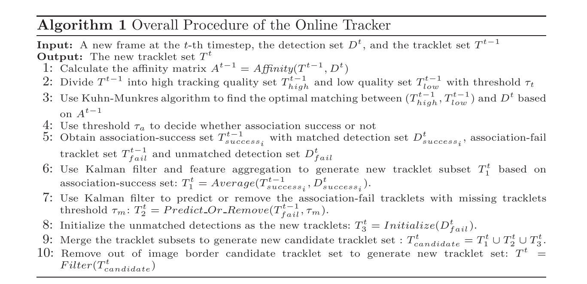
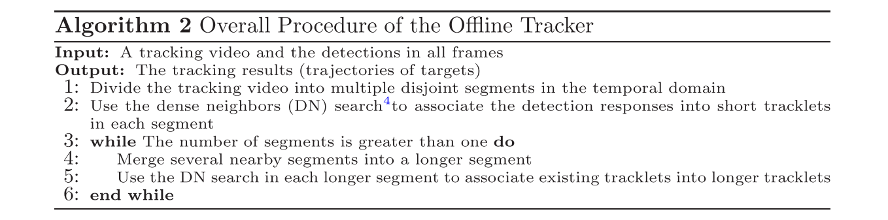
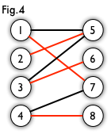

# 1 MOT(Multiple Object Tracking)

> Multi-Target, Multi-Camera (MTMC)
>
> Multiple Object Tracking(MOT)

调研了多目标跟踪的算法，看看学界和业界都有哪些方法来做多目标跟踪。明显感觉多目标跟踪研究的人比较少，各种论文和代码都比较少。也许是一个可以深入研究出点成果的领域，又或者是不好出成果？不过难度大的东西往往更有研究价值，总之MOT和MTMC值得关注一下。

由于手头有安保视频，主要想试试多目标行人跟踪，看看有没有合适的算法。

之后看能不能结合单目标跟踪和目标检测的方法做一些改进。

希望能引入无监督的方法。

至于多目标跟踪的数据集，类似于单目标跟踪的VOT比赛，多目标跟踪有MOT比赛。

> https://motchallenge.net/

多目标跟踪分为离线跟踪与在线跟踪，这一点与单目标跟踪和还是有比较大的区别的。离线跟踪指实现把所有目标的检测框提取出来，在跟踪的时候再利用数据关联的方法来对目标的轨迹进行绘制；而在线跟踪比较类似于单目标跟踪的过程，只给定初始框（？），之后逐帧进行目标检测+数据关联。

目标检测这一步一般直接使用成熟的框架如Faster RCNN等，不做改动；数据关联一般采用匈牙利算法和KM算法等，数据的相似性由马氏距离、余弦距离等来衡量。

注意到一点，多目标跟踪比单目标跟踪要复杂许多，多目标跟踪往往是由很多模块构成（目标检测、数据关联等等），不像单目标跟踪那么简单纯粹。所以能否研究出一个统一的多目标跟踪框架，在一阶段内完成多目标跟踪的任务？

上周和怡云老师聊了聊安保项目，现在好像没什么人在做这个项目（貌似只有我和陈佳禹在看相关的东西？）。但其实我感觉挺好的，没有进度压力，而且可以提供大量安保视频（怡云老师说视频如果不够的话还可以再要），虽然没有标注数据，但也是一笔宝贵的财富。所以想看看有没有无监督的方法，能把这些数据利用起来。服务器的GPU们也闲置蛮久了，是时候开动起来了，正好下学期也课不多了，沉下心来做一些研究。

以下是一些论文代码记录等。

## 1.1 DeepSORT  

浏览了论文，运行了代码。

最基本思路是卡尔曼滤波+匈牙利算法。

卡尔曼滤波得到的预测与新的测量求马氏距离（Mahalanobis Distance）为d1。

第i次跟踪结果和第j次检测结果求余弦距离d2。

匈牙利算法来进行数据关联

按论文中的表述，应该是在线跟踪方法。但代码中需要预先进行检测框提取，才能进行正确的跟踪。why？懂了

## 1.2 POI

很多其他文献中都中提到了POI，应该是多目标跟踪中比较经典的一篇。

POI提出了一种在线跟踪方法，一种离线跟踪方法

Faster-RCNN来进行行人检测。

使用卡尔曼滤波进行行人运动路线估计，使用KM算法来进行数据关联。

算法流程如下图。

还提出了一种offline tracker，算法流程图下图。是在H2T基础上进行改进的。

## 1.3 马氏距离与欧氏距离

​	马氏距离(Mahalanobis distance)是由印度统计学家马哈拉诺比斯(P. C. Mahalanobis)提出的，表示数据的协方差距离。它是一种有效的计算两个未知样本集的相似度的方法。与[欧氏距离](https://baike.baidu.com/item/%E6%AC%A7%E6%B0%8F%E8%B7%9D%E7%A6%BB/1798948)不同的是，它考虑到各种特性之间的联系（例如：一条关于身高的信息会带来一条关于体重的信息，因为两者是有关联的），并且是尺度无关的(scale-invariant)，即独立于测量尺度。

## 1.4 匈牙利算法与KM算法

**最大匹配**：一个图所有匹配中，所含匹配边数最多的匹配，称为这个图的最大匹配。上图 是一个最大匹配，它包含 4 条匹配边。

**完美匹配**：如果一个图的某个匹配中，所有的顶点都是匹配点，那么它就是一个完美匹配。图 4 是一个完美匹配。显然，完美匹配一定是最大匹配（完美匹配的任何一个点都已经匹配，添加一条新的匹配边一定会与已有的匹配边冲突）。但并非每个图都存在完美匹配。

**匈牙利算法**就是用于解决二分图的最大匹配问题。

**KM算法**，用于求二分图匹配的最佳匹配。何为最佳匹配？就是带权二分图的权值最大的完备匹配称为最佳匹配。 那么何为完备匹配？X部中的每一个顶点都与Y部中的一个顶点匹配，或者Y部中的每一个顶点也与X部中的一个顶点匹配，则该匹配为完备匹配。

KM算法全称是Kuhn-Munkras，是这两个人在1957年提出的，有趣的是，匈牙利算法是在1965年提出的。 

# 2 小鼠项目

​	那篇论文基本把我们前期的想法实现完了……详情见上周md记录。既是坏事也是好事吧。坏处就是前期我们做的网格变形算法、微调算法等等旧基本算是白做了；但好处是我们以后可能不用开发费事费力容易出错的界面了，可以在他们的基础上做，专心研究算法。

​	感觉需要讨论一下小鼠项目后期的计划。我的想法是可以在他们这个工具包的基础上进行一些研究，这样就可以省去一些工具开发的时间，专心研究算法。他们提供的工具实现的功能是比较完善了，但算法我个人感觉还是比较基础的，有很大的改进空间。而且那篇论文只是像一个功能简介，并没有详细介绍技术细节，他们官网上的theory栏目目前也还是空的。

​	我觉得目前有几个切入点：

​	1. 先安装起来那一套软件包，走一遍整个流程，对他们能完成的功能有一个更完整的认识。

​	2. 胞体识别他们用的应该是很传统的算法（不确定，直观感受），需要在软件中手动调参，调至较好的识别效果。可以尝试开发深度学习算法来改进这一步。参考U-Net等网络。这一步的胞体识别其实很类似于胞体分割的任务。

​	3. 三维的cell bodies和fiber tracts重建等等，甚至可以和目标跟踪联系起来，尤其是多目标跟踪（每层切片看成视频中的一帧，每个神经元看成一个需要追踪的目标，脑洞略大），可以了解一下相关算法，看看相关论文。