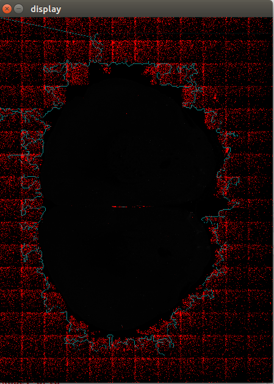
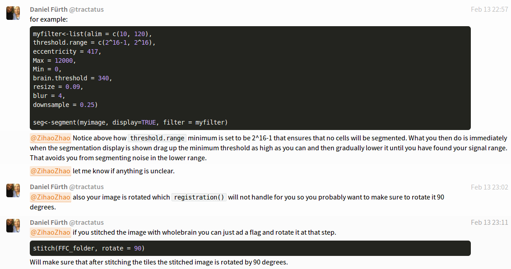

# 1 论文的想法

以下只是一些零碎的想法，是看论文时的一些记录，还未成型：

行人跟踪，引入无监督方法。

多目标跟踪统一框架，端到端训练。

天然跟踪器结构。CNN辅助。

无监督学习的样本，就是除第一帧外为标注的框。上一帧给出的预测位置，可以认为是不精确的标签。借鉴RPN与Anchor机制。特征空间中聚类/精确边界回归/细粒度分类。特征空间使用CNN生成/ReID+光流

siamese只与模板比对，信息不够丰富。

Apperence/shape/motion/ReID/flow/video


以下是寒假和最近看的一些论文，有几篇是精读的，有几篇只是浏览，都论文主题有一定关系：

Feng, W., Hu, Z., Wu, W., Yan, J., & Ouyang, W. (n.d.). *Multi-Object Tracking with Multiple Cues and Switcher-Aware Classification*. 长时线索与短时线索

**Zhou, Z. H. (2018). A brief introduction to weakly supervised learning. *National Science Review*, *5*(1), 44–53. https://doi.org/10.1093/nsr/nwx106  弱监督学习综述**

Lu, C., Xia, S., Shao, M., & Fu, Y. (2018). High-quality Ellipse Detection Based on Arc-support Line Segments, 1–14. https://doi.org/arXiv:1810.03243v1  椭圆检测，非深度学习方法

Yun, S., Choi, J., Yoo, Y., Yun, K., & Choi, J. Y. (2017). Action-Decision Networks for Visual Tracking with Deep Reinforcement Learning. In *2017 IEEE Conference on Computer Vision and Pattern Recognition (CVPR)* (Vol. 2017–Janua, pp. 1349–1358). IEEE. https://doi.org/10.1109/CVPR.2017.148  强化学习做目标跟踪

Wen, L., Li, W., Yan, J., Lei, Z., Yi, D., & Li, S. Z. (2014). Multiple target tracking based on undirected hierarchical relation hypergraph. *Proceedings of the IEEE Computer Society Conference on Computer Vision and Pattern Recognition*, 1282–1289. https://doi.org/10.1109/CVPR.2014.167  图模型多目标跟踪

Yu, F., Li, W., Li, Q., Liu, Y., Shi, X., & Yan, J. (2016). POI: Multiple Object Tracking with High Performance Detection and Appearance Feature. *Lecture Notes in Computer Science (Including Subseries Lecture Notes in Artificial Intelligence and Lecture Notes in Bioinformatics)*, *9914 LNCS*, 36–42. https://doi.org/10.1007/978-3-319-48881-3_3  多目标跟踪

Dong, X., Shen, J., Wang, W., Liu, Y., Shao, L., & Porikli, F. (2018). Hyperparameter Optimization for Tracking with Continuous Deep Q-Learning. In *2018 IEEE/CVF Conference on Computer Vision and Pattern Recognition* (pp. 518–527). IEEE. https://doi.org/10.1109/CVPR.2018.00061 Q-learning做目标跟踪（强化学习）

Zhou, T., Tucker, R., Flynn, J., Fyffe, G., & Snavely, N. (2018). Stereo Magnification: Learning View Synthesis using Multiplane Images, *37*(4). https://doi.org/10.1145/3197517.3201323 多视角照片合成

**Wu, W., Meng, Y., Han, Q., Li, M., Li, X., Mei, J., … Li, J. (2019). Glyce: Glyph-vectors for Chinese Character Representations. Retrieved from http://arxiv.org/abs/1901.10125  中文NLP**

Gowda, S. N., & Yuan, C. (2019). *ColorNet: Investigating the importance of color spaces for image classification ⋆*.  输入多种颜色空间的图片

Zhang, S., Zhu, R., Wang, X., Shi, H., Fu, T., Wang, S., … Li, S. Z. (n.d.). *Improved Selective Refinement Network for Face Detection*. 选择性提取网络进行人脸检测

Zhang, Z., He, T., Zhang, H., Zhang, Z., Xie, J., & Li, M. (2019). Bag of Freebies for Training Object Detection Neural Networks. https://doi.org/arXiv:1902.04103v1  提高检测效果的技巧

Wojke, N., Bewley, A., & Paulus, D. (2017). Simple Online and Realtime Tracking with a Deep Association Metric. *Proceedings - International Conference on Image Processing, ICIP*, *2017*–*Septe*, 3645–3649. https://doi.org/10.1109/ICIP.2017.8296962 SORT

**Babenko, B., Yang, M. H., & Belongie, S. (2011). Robust object tracking with online multiple instance learning. *IEEE Transactions on Pattern Analysis and Machine Intelligence*, *33*(8), 1619–1632. https://doi.org/10.1109/TPAMI.2010.226 半监督学习做目标跟踪。思路迁移，改变输入输出。**

Brendel, W., & Bethge, M. (2019). a Pproximating CnnS With BAg - of - Local - FEatures Models Works Surprisingly Well. *Iclr*, 1–15. 

Varior, R. R., Shuai, B., Tighe, J., & Modolo, D. (2019). Scale-Aware Attention Network for Crowd Counting. Retrieved from http://arxiv.org/abs/1901.06026    


# 2 小鼠项目

安装好了那一套软件包，使用最早给的那些优质照片可以做胞体识别。但用后来给的质量差一点的照片就不行了，完全找不准，也可能是我参数没有调好。


目前还未完全掌握软件包的用法。有些迷茫，感觉这个项目里不好找发论文的点，所以工作重心基本还是在看论文，思考无监督跟踪的论文上面。


以下是和论文作者交流的一些记录，期间请教了他一些问题，他叫Daniel，是个很负责的人，解答问题很耐心认真，而且很及时。

Hi Daniel, thanks for developing such a useful tool.

I have some problem in segmentation.

When I used a stitchedimage for segmentation, and I got the warning:

```
WARNING: Contours found: 233029 this may take some time... try adjusting your thresholds and rerun.
```

After a minute ,I have a display like this.



the codes are following:

```
library(wholebrain)

filename<'/home/zzh/data/Brain/A/StitchedImage_Z066_L001.tif'
#imshow(filename)

seg<-segment(filename)
```

Thanks for your help!


Reply:



for example:

myfilter<-list(alim = c(10, 120),
threshold.range = c(2^16-1, 2^16),
eccentricity = 417,
Max = 12000,
Min = 0,
brain.threshold = 340,
resize = 0.09,
blur = 4,
downsample = 0.25)

seg<-segment(myimage, display=TRUE, filter = myfilter)

@ZihaoZhao Notice above how threshold.range minimum is set to be 2^16-1 that ensures that no cells will be segmented. What you then do is immediately when the segmentation display is shown drag up the minimum threshold as high as you can and then gradually lower it until you have found your signal range. That avoids you from segmenting noise in the lower range.
@ZihaoZhao let me know if anything is unclear.
Daniel Fürth
@tractatus
Feb 13 23:02
@ZihaoZhao also your image is rotated which registration() will not handle for you so you probably want to make sure to rotate it 90 degrees.
Daniel Fürth
@tractatus
Feb 13 23:11

@ZihaoZhao if you stitched the image with wholebrain you can just ad a flag and rotate it at that step.

stitch(FFC_folder, rotate = 90)

Will make sure that after stitching the tiles the stitched image is rotated by 90 degrees.
_


ZihaoZhao
@ZihaoZhao
14:02
@tractatus Thank you very much! I solve my problem by adjusting the threshold.range. By the way, where can I find the detailed document of these parameters,such as "alim/eccentricity"of the filter.I even don't know how many parameters the filter has before you give me this example, ORZ. Thank you again!

Daniel Fürth
@tractatus
21:17
@ZihaoZhao

alim: a two scalar integer vector with minimum and maximum allowed soma area size.
threshold.range: a two scalar integer vector with minimum and maximum fluorescent intensity to iteratively search for soma in.
eccentricity: a single integer between 0-1000 describing the how conic (roundness vs elongation) an ellipse that would fit the cell body is allowed to be. The smaller the value the more round. Default is 1000 which allows any elongated ellipse.
Max: single integer value that determines what maximum pixel intensity to render in 8-bit rendering mode.
Min: single integer value that determines what minimum pixel intensity to render in 8-bit rendering mode.
brain.threshold: single integer value sets the segmentation of brain outline used for registration later on.
blur: integer value with added blur of brain section outline. Default is 4, increase if you have damaged tissue at the edges.
resize: positive numeric value indicates matching of atlas to brain section. Increase to make atlas (orange outlines in registration) smaller, decrease to make it larger. If too small atlas wont fit image and registration will not start. Usual range 0.3 - 0.9.

downsample: downsampling to save computational time (default 0.25).

Daniel Fürth
@tractatus
21:41
For the GUI the 8-bit renderer sets Max and Min. Eccentricity sets eccentricity only with the maximum slide knob. Soma area sets alim and intensity sets threshold.range. Brain outline sets brain.threshold only with the minimum slide knob and blur sets blur (only with the minimum slide knob) and resize roughly sets resize (only with the minimum slide knob). Downsample is not set at the GUI but rather in the segment() command directly (or through the filter list).
@ZihaoZhao This and how to think about the settings is described in the video tutorial starting 16:03 here: https://youtu.be/ZLnNlcKlRdM?t=963
The connection between the filter list and the segmentation object is done in the tutorial at this place 21:25: https://youtu.be/ZLnNlcKlRdM?t=1285


# 3 杂记（请忽略）


数人头

人群计数 细胞计数 行人跟踪


1.Whole-brain工具包

**2.细胞计数**


感受野能覆盖目标即可


前景背景分割


水漫填充、分水岭算法、KNN、MOG2、GMG

grab cut、graph cut


OpenCV-C++、QT Creator


