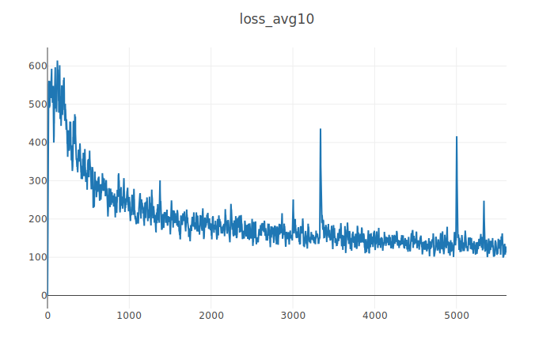
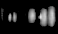
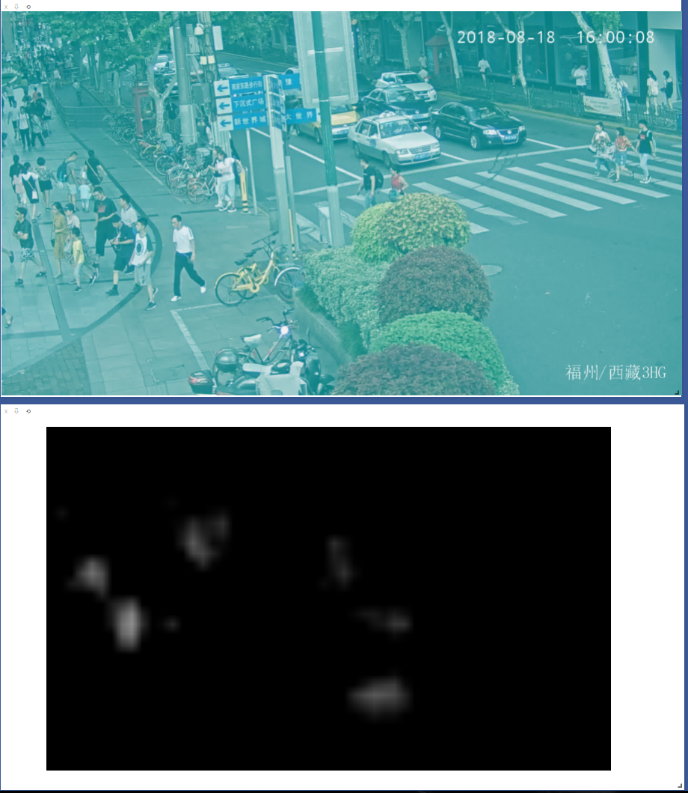

#### 2019-03-19

​	完成初版，MSELoss，标签map乘100。labelmap有bug，多图重叠。刚开始训练时loss～1100，收敛在500左右。

​	label列表的元素为**字符类型**，使用时应注意。

#### 2019-03-20

​	MSELoss无法收敛，N1Loss可以。

​	修好labelmap，重新训练，开始训练时loss～500，收敛在几十，训练一晚，到10左右，但应该是过拟合，因为无验证集与测试集。但证明此种网络可以完成行人位置预测的任务。下面是网络输出与输入图片。loss曲线很完美。下图结果有点问题，因为打标签的时候忘记去除除人之外的目标了，所以路灯和车等物体在输出中也有响应。

.png)

#### 2019-03-21

​	添加MOT的其他视频作为训练集，总图片～5000，总行人boundingbox～200000。

​	dataloader迭代时，将长度不同的list统一成最短，已修复。

​	生成labelmap，行人数越多，map值越高，查明是labelmap未及时清空，已修复。

​	添加多GPU训练。

​	目前labelmap响应，峰值设置为10(×20)，能比较合理的进行训练。

​	尝试划分训练集验证集，失败，Dataloader数据类型无法克服。

​	labelrate设为50，训练失败。想起之前labelrate为80的时候成功是因为有累加的bug，所以**加大labelrate至5000**，labelmap应该等效与之前的数值。很重要，不加大网络无法收敛。

#### 2019-03-22

​	这是昨晚用vgg作为backbone在整个MOT上训练一晚的结果，收敛了，loss曲线和输出如下。

	

​	在MOT测试集上进行测试，预测结果比较准确，使用黄浦视频测试，明显也有预测效果，但误识别比较严重，将花花草草识别为人，应该是因为训练时视频里并没有出现过类似的东西。测试结果与想象中相同。

​	resnet版本未收敛，推测可能是标签有bug，或是因为输出map太小（17×31）。

​	尝试3×5卷积，在两个epoch后开始收敛（batchsize32），和3×3区别不大。

#### 2019-03-25

​	尝试缩小labelmap为原来的一半，从头训练无法收敛，几个epoch后变成输出全黑。

​	从大labelmap的10.pkl开始训练，可以收敛。今晚尝试训练，看下降极限在何处。

​	进一步尝试使用点labelmap标注，从半labelmap的模型中开始训练，失败。明天继续尝试。

​	并思考新的结构，点label感觉不是很合理。

​	位置+大小+时间=MOT

​	时间是采用连续三帧作为输入，可以捕获时间信息，详细思路见笔记。待后续优化思路。

​	总体思路，统一的多目标框架，不变。

#### 2019-03-26

​	halflabel的训练很成功，但测试结果非常查，并不能预测出黄埔行人的位置，和largelabel的效果相差甚远，思路应该调整。弱监督分割思路或许可行。

​	放弃labelmap缩小的思路，因为不合逻辑。

​	修改代码进行5帧协同训练，输入通道改成15，输出通道改成5。

​	目前发现一个问题，5个通道会有部分通道输出变成全黑。

​	很神奇的一点是，改成5帧协同训练后，还能以原来的batchsize训练，显存不会爆但速度慢了很多。

#### 2019-03-27

​	昨天训练一晚，练了24个epoch，效果如图所示，第三和第五通道依旧为全黑，待寻找原因。	

​	

​	5帧senet训练失败。

​	观察output.sum()和target.sum()，相差极大（100倍），output一直降低，感觉labelrate还是不合理。

#### 待处理

​	当务之急建立测试机制。**OK**

​	处理数据时间太长，待优化。已经稍作优化。**OK**

​	更换vgg为resnet进行试验。**OK，失败**

​	更换比二次函数更尖的label，换MSE

#### 新思路

​	可以尝试SENet。

​	或许可以试试反卷积上采样，放大图片，达到类似行人分割的效果。（bbx弱监督）

#### 心得

​	batchsize越大，收敛越慢（？）

​	labelmap的数值大小很重要，过小会使网络输出趋向于零。

​	可以从大labelmap的模型接着训练小labelmap，而不是从头开始，从不可收敛质变为可收敛。有用性存疑