#### 2019-03-19

​	完成初版，MSELoss，标签map乘100。labelmap有bug，多图重叠。刚开始训练时loss～1100，收敛在500左右。

​	label列表的元素为**字符类型**，使用时应注意。

#### 2019-03-20

​	MSELoss无法收敛，N1Loss可以。

​	修好labelmap，重新训练，开始训练时loss～500，收敛在几十，训练一晚，到10左右，但应该是过拟合，因为无验证集与测试集。但证明此种网络可以完成行人位置预测的任务。下面是网络输出与输入图片。loss曲线很完美。下图结果有点问题，因为打标签的时候忘记去除除人之外的目标了，所以路灯和车等物体在输出中也有响应。

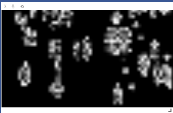
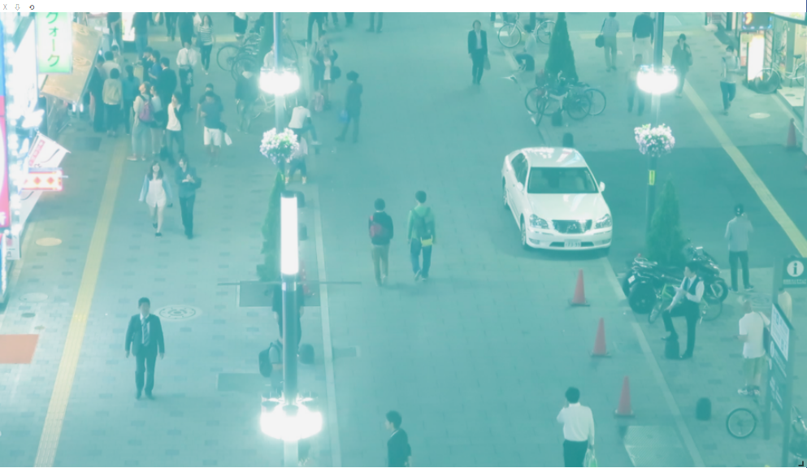

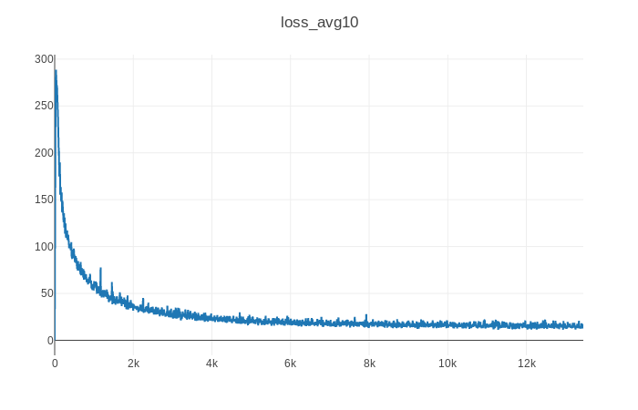

.png)

#### 2019-03-21

​	添加MOT的其他视频作为训练集，总图片～5000，总行人boundingbox～200000。

​	dataloader迭代时，将长度不同的list统一成最短，已修复。

​	生成labelmap，行人数越多，map值越高，查明是labelmap未及时清空，已修复。

​	添加多GPU训练。

​	目前labelmap响应，峰值设置为10(×20)，能比较合理的进行训练。

​	尝试划分训练集验证集，失败，Dataloader数据类型无法克服。

​	labelrate设为50，训练失败。想起之前labelrate为80的时候成功是因为有累加的bug，所以**加大labelrate至5000**，labelmap应该等效与之前的数值。很重要，不加大网络无法收敛。

#### 2019-03-22

​	这是昨晚用vgg作为backbone在整个MOT上训练一晚的结果，收敛了，loss曲线和输出如下。

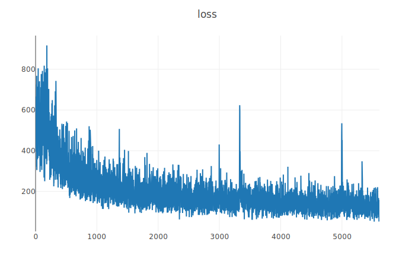

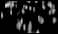

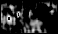

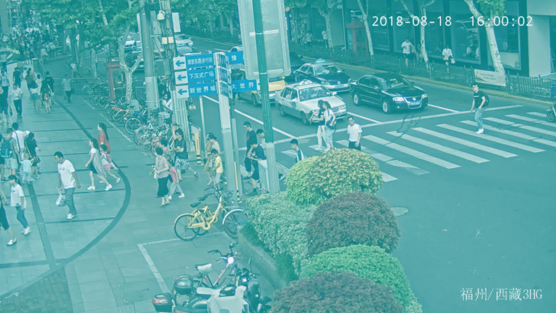

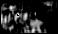	

​	在MOT测试集上进行测试，预测结果比较准确，使用黄浦视频测试，明显也有预测效果，但误识别比较严重，将花花草草识别为人，应该是因为训练时视频里并没有出现过类似的东西。测试结果与想象中相同。

​	resnet版本未收敛，推测可能是标签有bug，或是因为输出map太小（17×31）。

​	尝试3×5卷积，在两个epoch后开始收敛（batchsize32），和3×3区别不大。

#### 2019-03-25

​	尝试缩小labelmap为原来的一半，从头训练无法收敛，几个epoch后变成输出全黑。

​	从大labelmap的10.pkl开始训练，可以收敛。今晚尝试训练，看下降极限在何处。

​	进一步尝试使用点labelmap标注，从半labelmap的模型中开始训练，失败。明天继续尝试。

​	并思考新的结构，点label感觉不是很合理。

​	位置+大小+时间=MOT

​	时间是采用连续三帧作为输入，可以捕获时间信息，详细思路见笔记。待后续优化思路。

​	总体思路，统一的多目标框架，不变。

#### 2019-03-26

​	halflabel的训练很成功，但测试结果非常查，并不能预测出黄埔行人的位置，和largelabel的效果相差甚远，思路应该调整。弱监督分割思路或许可行。

​	放弃labelmap缩小的思路，因为不合逻辑。

​	修改代码进行5帧协同训练，输入通道改成15，输出通道改成5。

​	目前发现一个问题，5个通道会有部分通道（3,5）输出变成全黑。

​	很神奇的一点是，改成5帧协同训练后，还能以原来的batchsize训练，显存不会爆但速度慢了很多，**正常**。

#### 2019-03-27

​	昨天训练一晚，练了24个epoch，效果如图所示，第三和第五通道依旧为全黑，待寻找原因。	

​	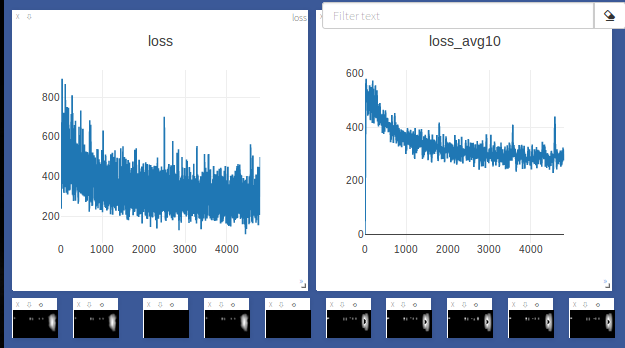

​	5帧senet训练失败。

​	**观察output.sum()和target.sum()**，相差极大（100倍），output一直降低，感觉labelrate还是不合理。

​	网络内部5帧分离处理，重要。

​	

| lr   | loss | labelrate |      | out                                                          |
| ---- | ---- | --------- | ---- | ------------------------------------------------------------ |
| 10-3 | L1   | 30        |      | 一直下降                                                     |
| 10-3 | MSE  | 100       |      | 下降至300,极其缓慢上升（3）                                  |
| 10-4 | MSE  | 100       |      | 2140000–25434(20000),在106-104范围内大幅波动，50step后突然变120,输出基本消失 |
| 10-4 | MSE  | 30        |      | 一直下降，到4000左右震荡下降                                 |
| 10-4 | L1   | 30        |      | 一直下降                                                     |
| 10-3 | L1   | 5000      |      | 一直下降                                                     |
| 10-4 | MSE  | 80        |      |                                                              |
|      |      |           |      |                                                              |
| vgg  |      |           |      |                                                              |
| 10-4 | MSE  | 30        |      | 收敛， 五通道都有数据，完美                                  |

​	

​	五通道都有数据，vgg，10-4,mse，30,输出先下降再上升。五帧联合训练取得初步进展。

​	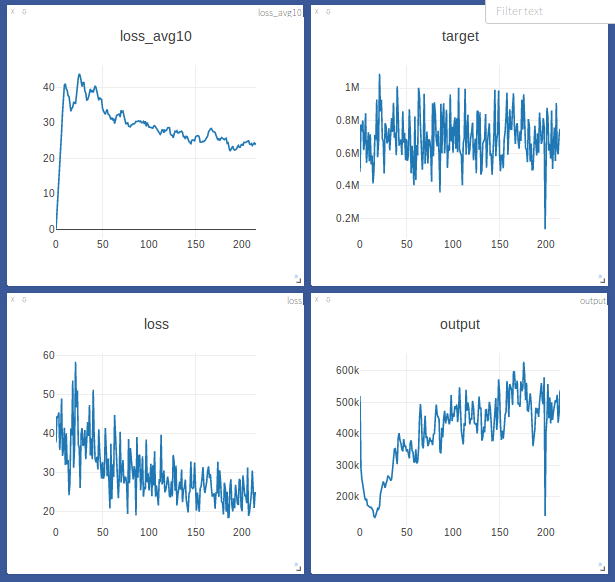

​	看起来MSEloss比L1loss效果好很多。

​	34×56×5×24 = 228480	

​	labelmap 有部分出错

#### 2019-03-28

​	五通道都有数据，vgg，10-4,mse，30,训练成功。预测效果很真实，但似乎不如L1Loss的效果

​	输出五帧求平均out0 = ((output0[0][0]+ output1[0][1]+ output2[0][2]+ output3[0][3]+ output4[0][4]) / 5)

​	`s = float(label[4]) * float(label[5])# * float(label[8])  
​        value = np.asarray(imgmap.crop((start_x, start_y, start_x+step_x, start_y+step_y))).sum()`	

​	利用s/value试图分离个体，失败。发现预测的效果似乎不好，怀疑是模型还未训练好，改L1Loss重新训练。**没有用**

大方向可能错误，**思考方向**

丧失动力时就去MOT比赛网站上看一眼别人的结果，每次都会觉得又燃起了希望，因为大家的效果真的都不好……

#### 2019-03-29

​	尝试Side View Network，试图提取出时间维度的投影，一次输入20帧。时间维度和高度维度卷积，宽度维度作为通道。相当于把图像块旋转90度。

​	若SVN能训练成功，再训练TVN（TopViewNetwork）

​	20帧图像提前转化为npy文件，可以大大加快训练速度。

​	一个20帧块文件111MB，～5000个块文件占500GB空间，可以接受。

​	先暂时不考虑长时间遮挡后的恢复，先做到20帧以内能生成较准确的tracklet。

​	无预训练的情况下无法收敛。只预测出了帧间分界线。……和训练机制关系很大，loss应仔细设计。

​	**Loss仔细想想**

#### 2019-03-30

​	逐渐确信是loss的问题，因为想起之前resnet和senet都训练不成功，应该也是因为预训练权重的问题。只有用imgnet的预训练权重，才能训练出输出类似rpn的效果。想办法解决这个问题，SVN和TVN应该能够实现。

​	可以借鉴FCN看看它是怎么训练的。

​	FCN的loss：per-pixel, unnormalized softmax loss.听起来和我用的loss很像，待读完全文再下定论。

​	不过分割问题对应的label是有分类的，考虑修改labelmap成类似分割label的形式

​	好奇超分辨率的loss怎么设计，找篇论文稍微看看。

​	下载VID数据集，验证SVNTVN思路是否可行，是否能卷出帧间可用信息。

​	应思考一些跟踪相关的东西，现在的实现更像是在做视频中的目标检测。

​	**先训练一个分类网络，去掉最后一层，在此权重的基础上再训练STVN**

​	加BN

#### 2019-04-01

​	看了一下昨天训练的分类网络的结果。居然分类网络训练也失败了，没有想到。今天查一下原因，可能是因为编程时的小错误。

​	可能是随机的权重运气不好，今天重开了一次，效果好多了，貌似能下降，等观察几个epoch看结果。

​	1e-3太小，1e-2可能合适，1e-1试试太大。

​	想用3e-2，手误写成3e-3，结果还不错，观察试试。不行,换3e-2.

​	用3e-2，loss波动越来越大，调小学习率，可能1e-2还是最合适的。

​	

​	查看网络的输出，发现虽然输入图片不同，但输出基本类似，只有小数点后第四位有细微区别。训练过程中，图片数量最多的那一类分值不断增大（不管输入为什么类别的图片），所以loss在不断下降。感觉有问题。loss调到1e-1,想看到输出变化更大，至少让各个图片输入时的输出不一样。好像有一定效果。loss波动越来越大的过程中，同一batch中各个输入的输出也在分化。

​	发现分化不断严重，然后爆炸，然后洗牌，输出又变成一样的。

​	怀疑是label和输入不对应，检查一下。发现标签没问题。

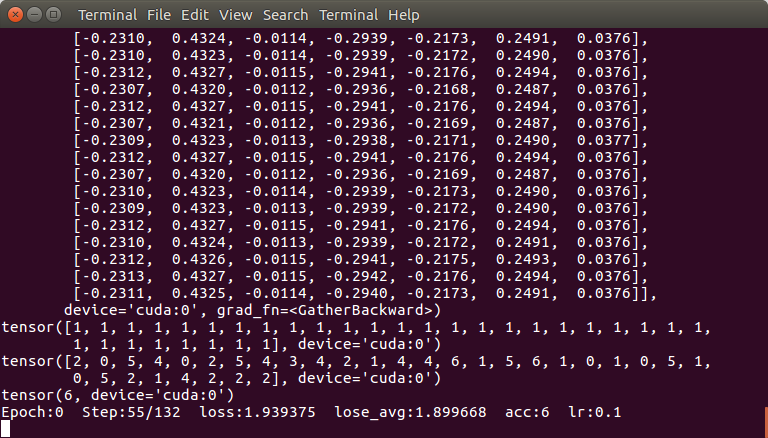

​	初始化方式也应纳入考虑。

​	也许是这样结构的网络无法获取帧间信息，甚至无法训练？

​	新训练一个分类网络时，学习率的选择，网络结构的搭建，都很重要，会影响网络训练的成功与否，而不只是准确率高低。

#### 2019-04-02

​	暂时搁置以上思路，代码与实验结果存档。

​	系统学习reid方法，寻找突破口。

​	使用tripleloss，利用MOT的数据集，切割出reid的数据集，尝试训练了一下，准确率还挺高。

​	需要进一步研究一下reid的一些术语和评价指标。诸如satisfying margin、Multi Query、cmc score等。

​	

#### 待处理

​	当务之急建立测试机制。**OK**

​	处理数据时间太长，待优化。已经稍作优化。**OK**

​	更换vgg为resnet进行试验。**OK，失败**

​	更换比二次函数更尖的label，换MSE。

​	图像块转为npy文件存储，**OK**。

#### 新思路

​	可以尝试SENet，失败，怀疑为初始化权重的问题。

​	或许可以试试反卷积上采样，放大图片，达到类似行人分割的效果。（bbx弱监督）

​	如何利用其他帧的信息来做推断。

​	大小目标尺度信息，分尺度检测。

​	SideView,TopView,更好的把**帧间信息**卷进网络。

#### 心得

​	batchsize越大，收敛越慢（？）

​	labelmap的数值大小很重要，过小会使网络输出趋向于零，**有问题**。

​	可以从大labelmap的模型接着训练小labelmap，而不是从头开始，从不可收敛质变为可收敛。有用性存疑

​	网络的输出量级很重要，和label的值，loss的值，应统一，不统一网络会更难收敛，收敛时量级肯定是统一的。	

​	随机初始化权重的网络很难训练，在寻找训练方法。尤其是这种label自定义非主流的。