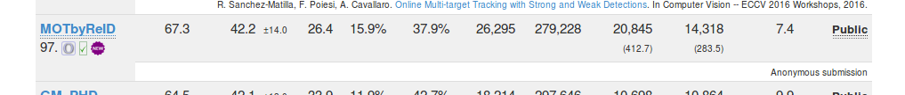

# 1.MOT

这周主要还是在做MOT的实验。

之前的思路先暂时放下了。

先尝试利用SOTA的行人重识别（Person Reidentification）网络进行MOT。

基本思路就是每一帧之间，使用ReID进行搜索，把最相似的人物分配为同一个ID。算是一个baseline吧 ，是比较容易想到的思路。

在MOTchallenge上提交成绩试了一下，没想到这么简单的机制居然效果不是非常差。但也不好，排名倒数（97/109）哈哈。但感觉还有很大提升空间。

在这个基础上进行改进，加入lostlist，保存丢失的目标，在预测ID重复时，把置信度较差的bbx在lostlist中搜索进行ID恢复。

下一步加入ID恢复时的位置判断，排除非常远的目标。因为目前发现恢复的效果并不好，恢复成功的目标很少。

