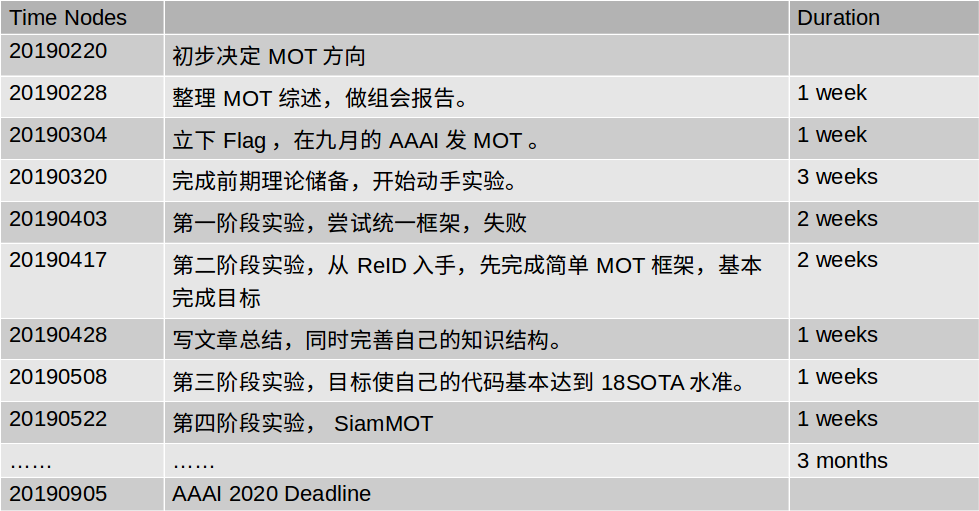
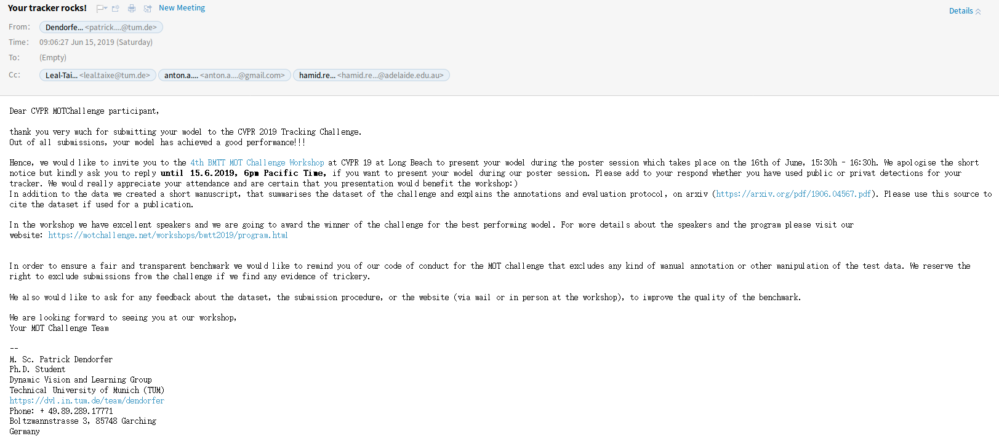
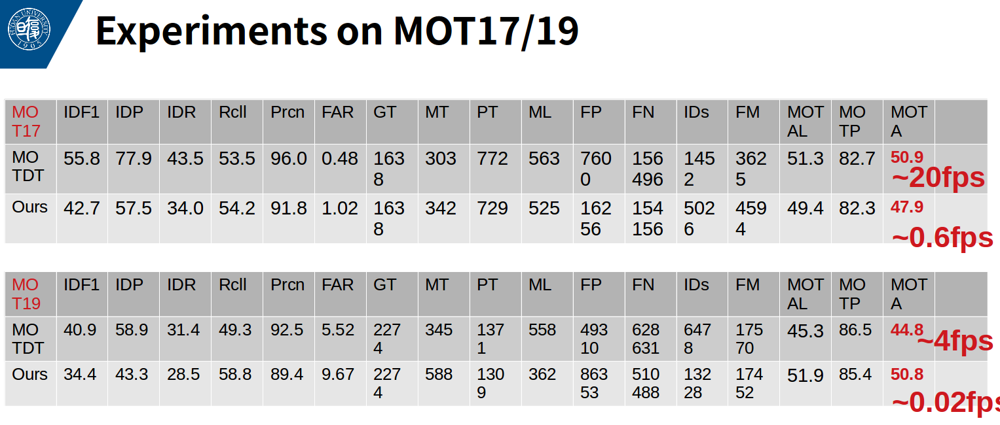
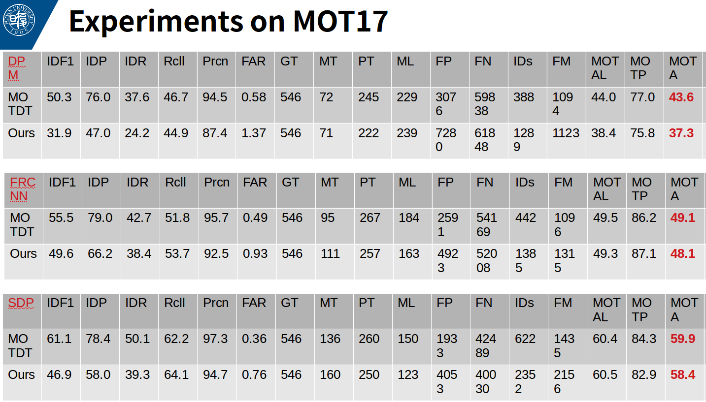
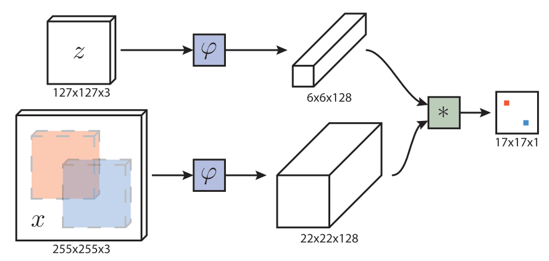
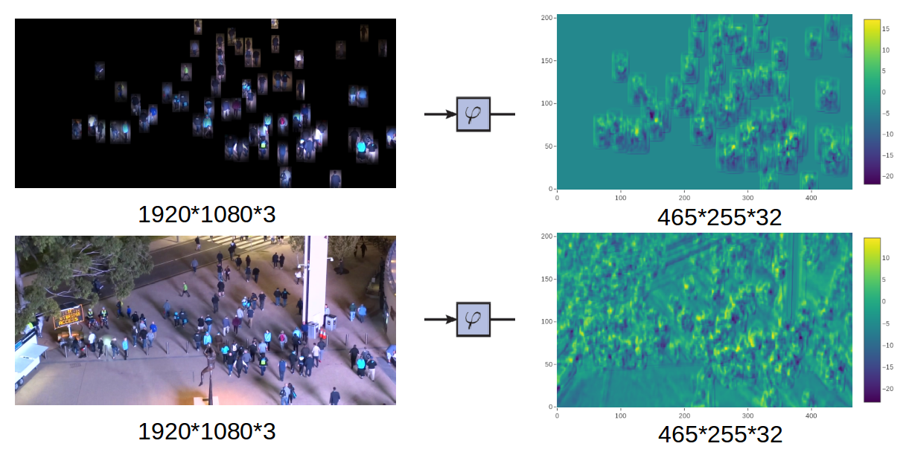
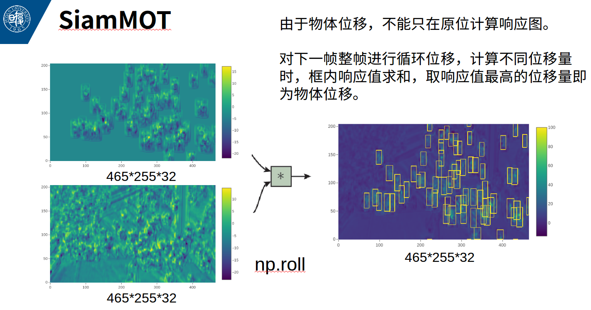

# 1 近期工作

## 1.1 小鼠项目软件设计

目前我和陈佳禹分别负责软件系统设计和图像处理算法。

软件设计已经基本完成，左侧显示鼠脑图片，右侧为图谱。可以实现鼠脑图谱打点标注、分组打点、导出打点文件等基本功能。

还支持一些附加设置：

1.输入换算比例功能，输入像素=X微米。

2.输入Z轴脑片厚度。

3.修改零点。

4.加入Z轴信息，如脑片编号。

5.胞体显示初步界面。

六月底完成期末考试后，软件收尾，预计七月初提交给何苗老师一版可用的软件进行测试。

## 1.2 多目标跟踪（MOT）研究

以下为MOT研究进度表，现在SiamMOT实验已经基本完成。

主要思路是在多目标跟踪中加入SiamFC单目标跟踪网络，实现在一个网络中进行一次前传，即可预测图像中所有目标的运动方向。既获得了使用单目标跟踪算法的高性能，又避免了大量tracker的使用会帧占用大量时间。思路示意图见附图。

在MOT19上提交算法的结果进行测试，目前只能看到自己的结果，排行榜还没有公布。MOT19是CVPR19的一个workshop，在开会前夕收到了他们的邮件，说我的tracker取得了一个good performance，邀请我在poster环节去分享我的model，验证了这个思路是比较可行的。

但目前算法还没有完全完成，近两周没有太多进展，主要是在忙项目和期末考试。暑假会继续完善算法，尝试撰写论文投稿。

# 2 暑假安排

1.完成论文并投稿，AAAI 2020，9月初截稿。

2.七月至九月项目进入收尾阶段，小鼠项目九月结题。

# 3 附图

