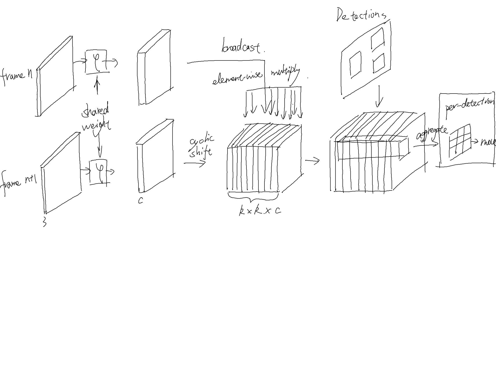

这周主要做的事是继续改进SiamMOT。

尝试了很多方法，简单记录如下。

- 清洗（move/size）过高的数据。
- 去除一部分位移0的数据。
- 制造shift数据。
- 把之前去除遮挡目标后的训练模型提交测试。
- 尝试预测（move/size）
- 尝试预测尺寸
- 尝试多帧预测
- 尝试多帧预测并融合结果，改变成Near-online模式。

测试集MOTA达到52.1，比之前提升了一点点。

论文阅读这周没有读新的论文，主要在温习之前的一些经典论文，R-FCN、Tracktor、D2T等等，准备开始cvpr2020的论文写作。

这周项目碰到一些难题，花了比较多时间做项目，进行技术攻关。

重画了一下SiamMOT结构图，这个应该比之前的更清晰易懂，之后用电脑再美化一下。

