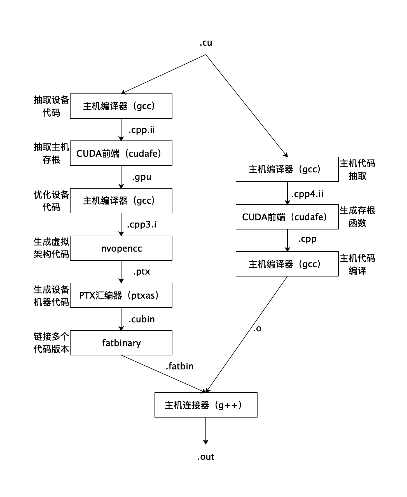

# CUDA学习

## 1 编译

### 1.1 C语言编译的四个过程

1.预处理（Preprocessing）：把所有#include头文件以及宏定义替换成其真正的内容。

2.编译（Compilation）：将经过预处理之后的程序 转换成特定汇编代码。

3.汇编（Assembly）：将上一步的汇编代码转换成机器码。

4.链接（Linking）：将多个目标文件已经所需的库文件（.so）链接成最终的可执行文件。

### 1.2 CUDA程序编译过程

整个流程 与普通c语言编译过程类似，但区别是分为两条路径分别作用于设备和主机代码，在最后的链接阶段之前会生成一个可执行文件。可以通过在运行nvcc时添加-dryrun编译选项查看整个过程。这两条路径的连接比途中显示的更加复杂。

## 2 线程网络、线程块以及线程

每个线程执行的代码是一样的，但是数据却不相同，这就是CUDA的核心——SPMD（Single Program Multiple Data）模型。

在GPU上编程时，往往会创建成千上万个并发线程，若干个线程会构成一个线程块，而若干个线程块构成一个线程网络。在程序中，尽量避免使用小的线程块，通常192是我们所考虑的最少的线程数目。比如处理1920×1080的图片。我们可以是孙10800个线程块，每个线程块有192个线程，一共调度二百多万个线程来处理。假设有16个SM可供使用，则每个SM会被分配675个线程块进行处理。在1080Ti中，每个SM最多支持同时调度2048个线程。每个线程块最多支持调用1024个线程，但在实际编程中应注意合理分配。因为有时候会出现所有的线程束等待一个线程束执行完毕的情况，导致SM也闲置了，大大降低了程序的性能。如果每个线程块中线程过多，就潜在地增加了等待执行较慢的线程数的可能性，因为当所有的线程没有到达同步点时GPU是无法继续向下执行的。

## 3 CUDA内存处理

最快速也是最受偏爱的存储器是设备中的**寄存器**，接着是共享内存，然后是常量内存、纹理内存、常规设备内存，最后则是主机端内存。书中也是按照这个顺序进行介绍的。

三种主要的存储类型是：寄存器、共享内存和全局内存。

首先应该得到最大化利用的存储器是寄存器，因为其延时是最低的。每个线程中每个变量会占用一个寄存器，而每个SM拥有32KB的寄存器空间。有效使用寄存器可以避免其他更慢的内存类型的使用，从而获得更高的程序运行速度。尽量使用寄存器，尽量将数据声明为局部变量。当数据需要多词访问或重复利用是，也要使用寄存器，先将数据写回寄存器，最后再写会全局内存，以避免多次全局内存的写操作。也要注意避免过度使用寄存器，以致寄存器的数据溢出到本地内存中，导致程序性能下降。

接下来是共享内存，共享内存是GPU上可收用户控制的一级缓存。对于共享内存的使用，主要考虑数据的重用性。如果数据不被重用，则直接将数据从常量内存或全局内存读入寄存器即可。当存在着数据的重复利用时，使用共享内存是比较合适的。

对于全局内存，我们需要注意用一种合理的方式来进行数据的合并访问，以尽量减少设备对内存子系统再次发出访问操作的次数。而将相同数据分配到多个线程中或将相同数据分配到多个线程块的线程中是，考虑使用常量内存。

# 论文阅读

Packing Sparse Convolutional Neural Networks for Efficient Systolic Array Implementations: Column Combining Under Joint Optimization

Can computers understand word meanings like the human brain does?

# 写Verilog

帮刘诗玮写Verilog代码。
