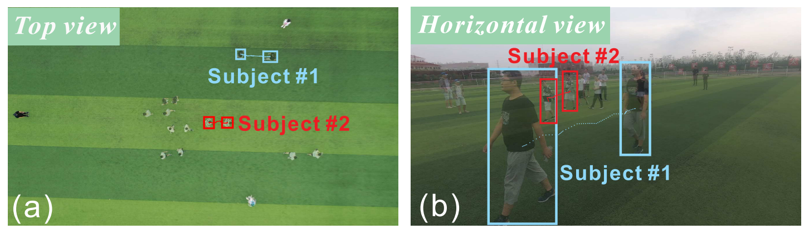
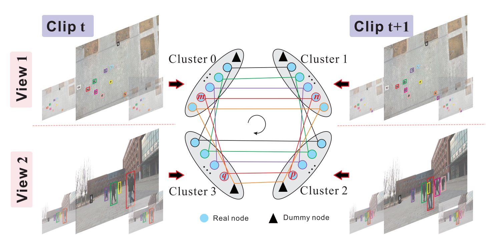
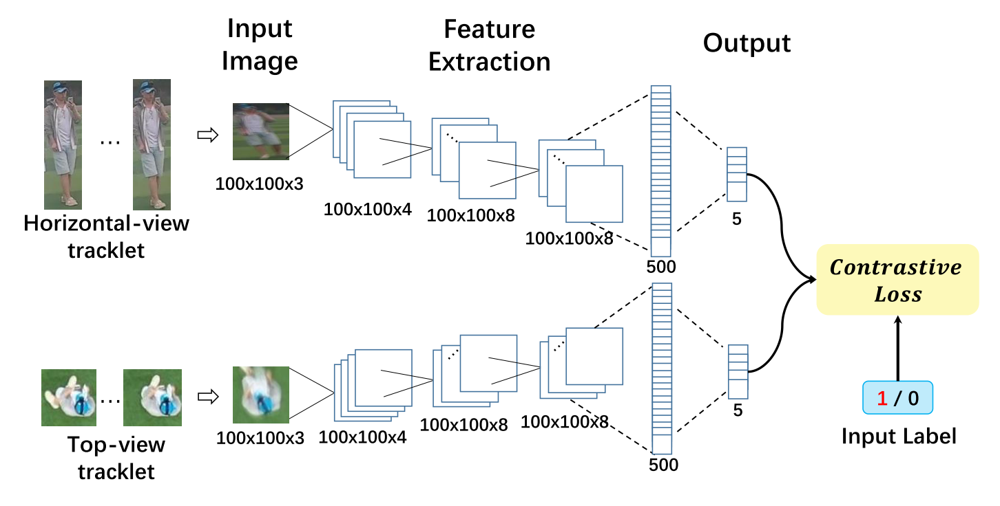
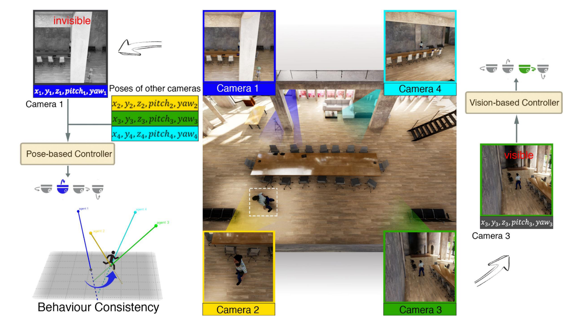
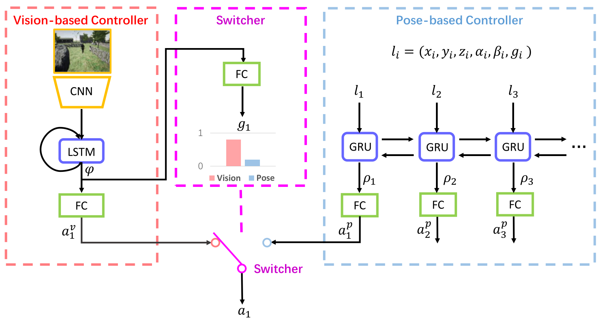
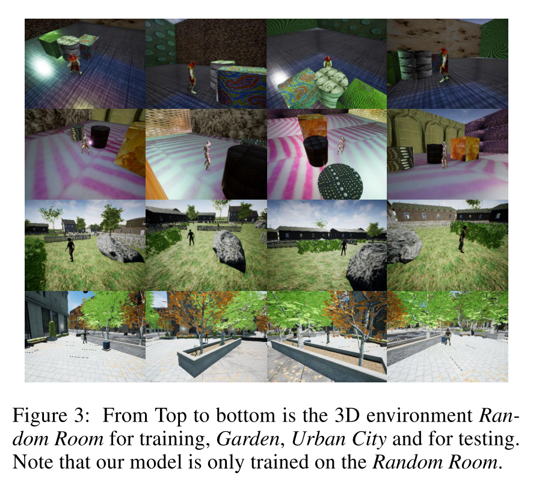

# 1 AAAI论文阅读

#### 1.0 DASOT: A Unified Framework Integrating Data Association and Single Object Tracking for Online Multi-Object Tracking

最想看的是这一篇，不过这一篇论文还没放出来，等待中。

------

#### 1.1 Complementary-View Multiple Human Tracking

这篇文章出自天津大学，解决的是多摄像头多目标跟踪问题，具体来说是中的无人机摄像头加地面摄像头，利用这两个互补的视角来进行多目标行人跟踪。因为之前没有这方面的数据集，作者团队是自己收集了一个数据集在自己的数据集上进行的实验。文章的主要贡献有三：1）这是第一篇进行俯视与水平视角结合来解决多目标行人跟踪问题的文章。这样做的好处是可以利用顶视视角的全局信息与水平视角的局部信息来进行全局最优求解。2）提出了统一优化模型来同时从时间与视角两个维度进行数据关联。3）提出了一个新的数据集。

具体是这么做的，先把视频分成很多clips，每个clip长度是10帧，相邻的clip之间会有overlap。之后clip之间要进行两个层次的数据关联，如下图。

第一个层次是不同view之间的数据关联，是通过Spatial reasoning和Appearance reasoning来做的。1）空间位置推理，作者使用了2019年的一篇论文中的公式，没有详细介绍。理论基础可以这么理解理解，因为虽然view不同，但实际上是同一个时刻的不同目标的分布，所以不同view的物体位置分布是有直接关系的。作者套用了这篇论文中的公式，来推断不同视角下两个目标是同一个目标的概率。2）至于外观特征，作者使用了Siamese网络来进行相似度对比，如下图。

第二个层次是时间维度上的数据关联，本文也通过两个方面来进行，一个是Appearance consistency，另一个是Motion consistency。这个就是比较基础的多目标跟踪的方法了。Appearance consistency是通过颜色直方图来实现的，因为数据集中背景简单，目标明确，所以这种方法还是比较有效的。另一个是Motion consistency，就是假设物体运动速度是恒定的，以此来推断下一帧物体的位置。

总的来说，这篇论文中最有启发的是Spatial reasoning，其他部件比较常见。

------

#### 1.2 Pose-Assisted Multi-Camera Collaboration for Active Object Tracking

这一篇是有关AOT，北大出品，是我之前了解比较少的一个领域，也许可以翻译为活跃目标跟踪，就是跟踪镜头中运动的目标，这种跟踪往往是物理的摄像头转动。但在实际场景中，由于环境的复杂（遮挡、光照变化等），运动目标往往会被跟丢。本文提出了一种多摄像头协同的AOT方法，

基于视觉与相机姿态的协同工作，以解决这一问题。简单来说是这样的，当一个摄像头中的目标被遮挡时，该摄像机会切换为受其他相机的姿态驱动来进行跟踪。实验证明，使用摄像头群的姿态信息来协助跟踪，可以取得很好的效果，在目标被遮挡时，也能准确跟踪。整个系统分为如下图三个部分：Vision-based controller、Switcher和Pose-based controller。当物体明确在场景内，未被遮挡时，通过Vision-based controller来控制云台转动。当Switcher判断物体被遮挡时，会切换至Pose-based controller，根据其他摄像头的运动，来推断本摄像头的运动状况。

Vision-based controller首先通过CNN来编码Appearance feature，之后通过LSTM来编码时序信息，输出a1v是摄像头的运动量，另一路输出给Switcher来判断是否需要切换Controller。Pose-based controller是通过GRU来处理pose信息的。

最后，实验部分作者是在电脑上进行仿真模拟的，使用的3D虚拟数据，并不是实际摄像头拍摄的视频。据作者说，这已经是一种常见操作了。

------

#### 1.3 GlobalTrack: A Simple and Strong Baseline for Long-term Tracking

这篇论文标题很吸引人，一作是Lianghua Huang，以前在github上经常用他的代码，代码风格很好，是个大佬，自动化所的，通讯作者是Kaiqi Huang。

# 2 Compiler课程

学了week3的课程，准备加快速度过完前面的基础部分，开始优化部分。

时老板推荐了我一篇深度学习编译器的综述，北航出的，新鲜出炉，后面有空了看看。

> Li, M., Liu, Y., Liu, X., Sun, Q., You, X., Yang, H., … Qian, D. (2020). *The Deep Learning Compiler: A Comprehensive Survey*. *1*(1), 1–36. Retrieved from http://arxiv.org/abs/2002.03794

# 3 C model

已开工，争取开学前写完C model。

和lsw重新讨论了C model的思路，更加理解这个C model的用处。