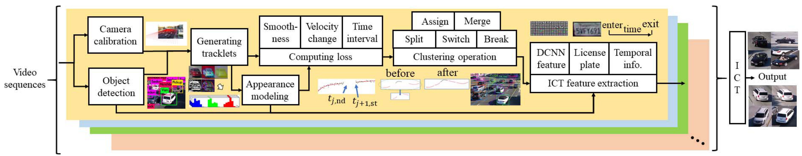
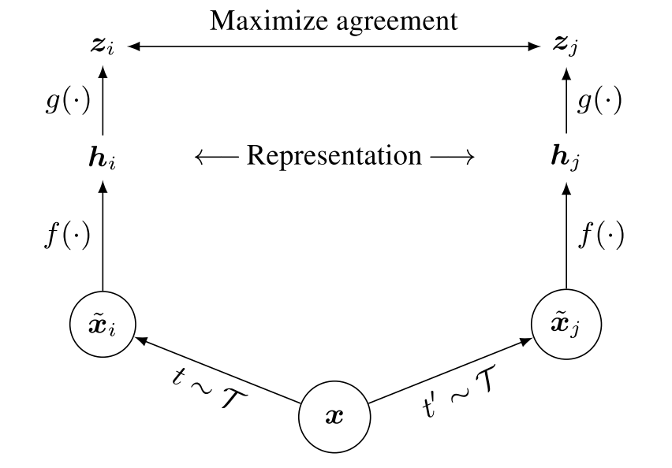

# 1 C model

卷积和FC已完成，在尝试进行wavenet的mapping。

# 2 小鼠项目

何苗老师提了新需求，在远程控制他们实验室的电脑做，最近沟通交流比较频繁。

# 3 论文阅读

这次选了两篇CVPR workshop的论文，有关多摄像头多目标跟踪的。由于是workshop，论文没有很大的理论创新，侧重于工程实现，而且对整个系统的细节介绍得很到位。都是开源的，有一定借鉴意义

## 3.1 Multi-camera vehicle tracking and re-identification based on visual and spatial-temporal features. 

这一篇是2019 CVPR workshop的文章，baidu出品，详细介绍了了他们的参赛方案。

他们实现车辆MTMCT的方案是这样的：

1）利用detector检测出画面中所有的车辆，这与MOT的tracking-by-detection方法是一致的。

2）使用单摄像头多目标跟踪的方法，先进行一次数据关联，获得tracklet。

3）使用Re-ID模型提取每一个tracklet的visual feature。Re-ID模型也是本文介绍的一个重点，这篇文章的Re-ID模型获得了workshop中Re-ID题目的第一名。

4）最后使用多摄像头跟踪的方法，对不同摄像头下的tracklet进行关联，得到最终的结果。

详细说说每一个步骤的细节。

- 单摄像头多目标跟踪
  - 作者借鉴了DeepSORT论文中的方法作为pipeline，稍作改造变成3D tracking。
  - 卡尔曼滤波辅助预测，卡尔曼的预测值作为gate来避免数据关联时关联到过远的目标。
  - 使用Appearance similarity和motion similarity进行数据关联，以获得tracklet。

- 多摄像头跟踪

  - Appearance similarity
  - Overlap location similarity
  - Direction similarity
  - Traveling time similarity
  - 使用以上获得的四种similarity使用匈牙利算法，进行Tracklets Clustering。

- Re-ID

  Video-based Multi-Constraint Vehicle ReID

## 3.2 Single-camera and inter-camera vehicle tracking and 3d speed estimation based on fusion of visual and semantic features

总体套路与上一篇文章的四个步骤类似，下面着重分析一下不同点。

最大的不同是，detector得到的bounding boxes会首先利用相机参数信息，转化到三维空间，获得车辆的真实世界坐标。后面的步骤都是根据这一步得到的真实世界坐标进行的。

相机参数校准，是分两步进行的。先利用公式和相机参数进行初步的三维坐标映射，之后把这个问题建模成一个non-linear optimization problem，再使用Estimation of Distribution Algorithm求解精确三维坐标。

在Data Association环节中，作者提出了几个loss，与上篇中使用的similarity略有不同：

- Smoothness loss
- Velocity change loss
- Time interval loss
- Appearance change loss

## 3.3 A Simple Framework for Contrastive Learning of Visual Representations

> Hinton组力作：ImageNet无监督学习最佳性能以此提升7%，媲美监督学习。

这篇论文之前被各大公众号疯狂吹捧。

首先要清楚Contrastive learning是什么，Contrastive learning是无监督学习的一种，作者通过Contrastive learning的方法在ImageNet数据集上进行训练，得到了有效的Visual representation。

先给出本文的三个结论：

- Data Augmentation对于difining effective prediction tasks非常重要，相比于有监督学习提升更明显。
- 在Representation和contrastive loss之间引入learnable nonlinear transformation可以大大提升representation的质量。
- 大batch size和更多的training step对无监督学习的提升比对有监督学习的提升更明显。

具体的模型是这样的。

1）由同一个样本进行Data Augmentation，获得一对样本。值得注意的是，这一对样本采用的是同一种Data Augmentation方法，作者说如果不这样，效果会不好。

2）通过encoder f(.)提取视觉表征hi，作者使用的f为ResNet。

3）g(.)是一个隐藏层，以得到最终输出。作者指出，用g(.)的输出计算loss比直接使用hi计算loss，效果会更好。

实验结果：无监督情况下，在ILSVRC-2012上达到76.5%的top1 accuracy；在使用1%的ImageNet标签时，达到85.8%的top1 accuracy。