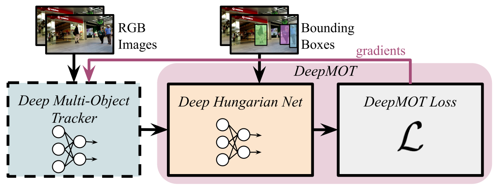
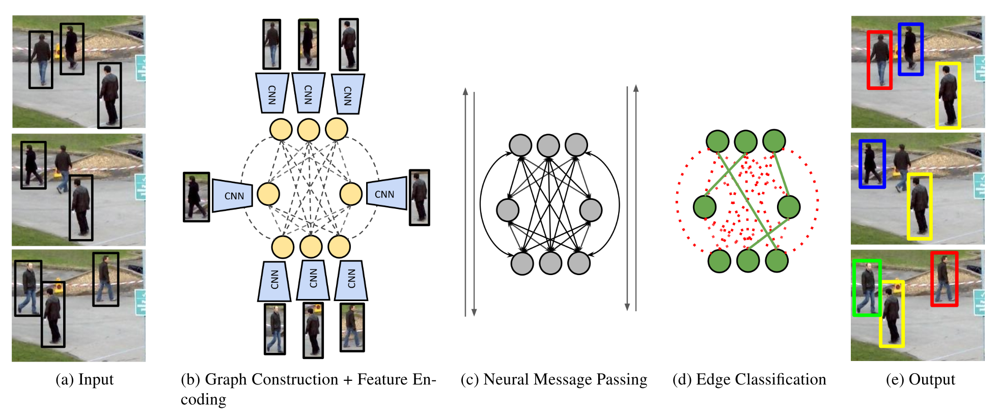
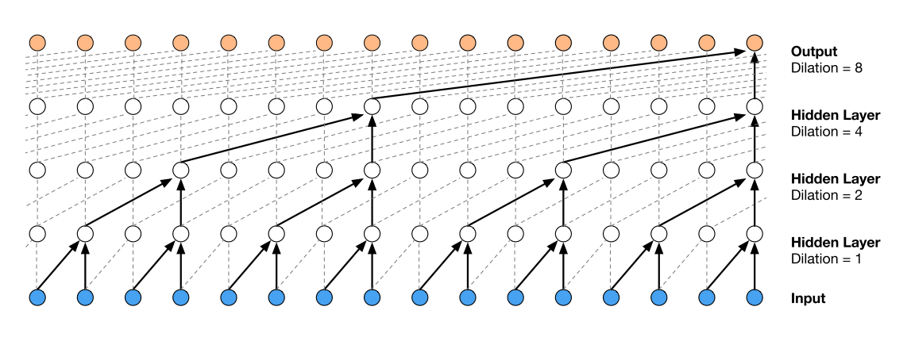

# C model

先跑通了这个Speech-to-Text WaveNet，花费了两天时间。因为wavenet是三年前的模型了，这个代码使用的是TensorFlow 1.0，已经很老了，只支持cuda 8.0版本。

开始想着使用高版本TensorFlow，修改代码，折腾一天，未果。

后来改变策略，想办法给服务器上装cuda 8.0，尝试了不用sudo权限的方法，但没成功，而且担心把服务器上的环境搞乱，略作尝试也放弃了。

最后，发现不需要用gpu，cpu的版本也可以进行预测，才跑通了语音识别的流程。

Speech-to-Text WaveNet

1. 抽取MFCC特征
2. 计算zero-padding情况下的序列长度
3. 输入MFCC特征，得到输出
4. 将输出进行CTC解码
5. 转为dense tensor

整个语音识别流程大概分为以上几步，C model中首先实现第三步，也就是wavenet的，模型部分。

首先需要明白语音识别的模型的内部细节。模型分为三个block，每一个block里包含5个res_block，这五个res_block分别对应dilate_rate=[1,2,4,8,16]。这些res_block中的kernel_size都是7。

下图中每一个虚线框中都是一个res_block。每个res_block包含kernel_size是7的conv_gate和conv_filter，对应的图中tanh和sigma（指conv对应的激活函数），这一步论文图里略有简化，其实是两个dilated conv。conv_gate和conv_filter的结果想乘以后，再进行一个1*1的conv_out，得到res_block的输出。

# 论文阅读

读了今年CVPR接受的两篇MOT论文，还有重新精读经典的WaveNet论文。

## How To Train Your Deep Multi-Object Tracker

三个贡献：

1. 根据MOTA、MOTP等评测指标，提出了一个新的loss function用于MOT任务。
2. 提出Deep Hungarian Net，可以回传loss。
3. 使用提出的loss和DHN训练了Tracktor，获得了一定的的精度提升。

这篇文章是以ICCV2019的Tracktor作为baseline的，在Tracktor后面接了一个DHN模块，使用DeepMOT loss进行训练，相比baseline有了精度的提升，所以作者说这两个模块有效。

不过我看了一下结果的对比，在mot17上，DeepMOT的MOTA是53.7，而Tracktor的MOTA只有53.5，只有0.2的提升，微乎其微，其他指标也没有非常明显提升，个人觉得并不能很好的证明他们提出的模块的有效性。

感觉一般的组，写这种文章，肯定凉凉。

目前已开源。

## Learning a Neural Solver for Multiple Object Tracking

这篇文章之前我的arXiv爬虫根据关键字爬到了，所以我之前第一时间就读了，他们在MOTchallenge榜单上起的名字叫GMOT，之前一直是榜单第一名，MOTA55.7，当时占据绝对优势。（现在已经掉到第十一名）

这篇文章算是首个成功将图网络用在MOT任务上，而且取得了很好的效果的方法。

贡献有三：

1. 使用Message Passing Networks（MPN），可以利用MOT任务中天然的图结构，同时完成了特征学习和数据关联这两个步骤。
2. 受传统MOT图模型的启发，提出了一种新的MPN更新方法。
3. 在MOT17上MOTA55.7，MOT16上MOTA55.9，达到新的SOTA。

这篇文章的核心思路就是利用MPN来解决MOT任务。模型如下图。

- 首先采用图像与detection bbox作为输入。
- 之后构建图模型，以bbox作为节点，不同帧的bbox会有边相连，同一帧的bbox不会相连。
- 节点的embedding使用CNN提取的特征。边的embedding使用MLP encoding geometry information，图中未展示。
- 通过Neural Message Passing进行迭代。
- 迭代完成后，Neural Message Passing的结果embedding，对边进行分类，分为active和non-active。

已开源。

## WaveNet: A Generative Model for Raw Audio

WaveNet是Google在16年提出的一种音频处理模型，可以完成语音合成、语音识别等任务。之前读过这篇论文，最近需要在DLA C model上mapping网络，所以再细读下论文中的相关细节。

论文的几个贡献：

- WaveNet可以产生原始语音信号，完成Text-to-speech的任务。
- 基于dilated causal convolution的新的网络架构，解决了时序长程依赖问题，获得很大的感受野。
- 基于说话人的identity信息，使用单一模型可以产生不同音色的声音。
- 相同的结构也能用于语音识别任务，以及音乐生成等领域。

总的来说，在音频领域，WaveNet是一个十分通用且灵活的框架，值得好好学习。

首先，WaveNet的理论基础是这样的，由之前PixalCNN的理论继续发展而来。

一个音频波形$X=\{x_1,...,x_T\}$的联合概率可以被分解成一系列条件概率的乘积，如下：

$$p(X)=\prod_{t=1}^T p(x_t |x_1, ...,x_{t-1})$$

因此，每一个音频样本$x_t$，都是取决于之前所有timesteps的样本。而这个条件概率分布，就是使用多层的convolution layers来建模的。

上图就是dilated causal convolution，相比于原先的causal convolution，dilated causal convolution的感受野每经过一层就会翻倍，而不是原先的只增加一个单位，这样在层数不大的情况下，也能获得很大的感受野。下面这个动图能更直观描述dilated causal convolution的过程。

还有一点值得注意，WaveNet里面没有用到pooling layer，所以输入与输出在时间维度是保持一致的。

