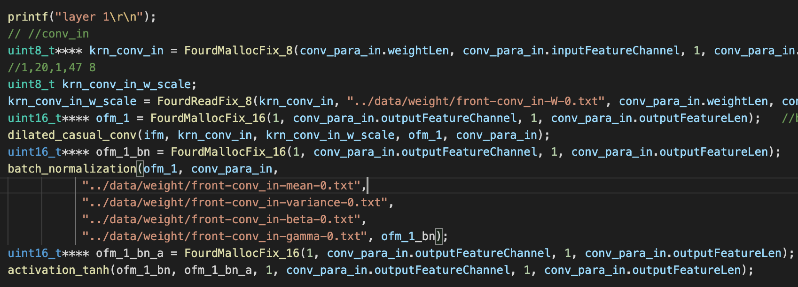
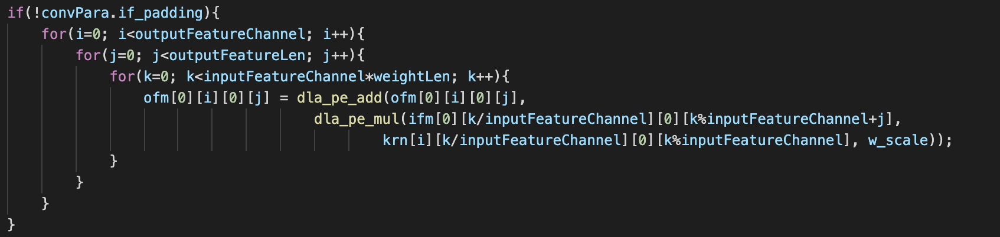
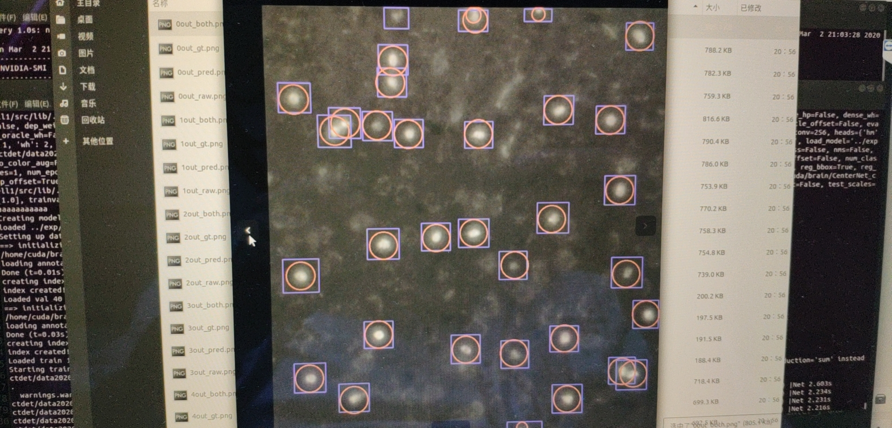

# C model

卷积，BN，激活函数等操作都基本完成，开始测试。

c语言读取tensorflow的输入。

模拟硬件和tensorflow运算结果相比有多少误差。逐层对比中间结果。这一步意料之外地花了不少时间，习惯了pytorch的傻瓜式操作，相比之下tensorflow要保存各层输出的中间结果要麻烦许多。

后面就是在数字的海洋里沉浮，验证每一个输出的结果是否与目标值一致。

第一层卷积的验证完成，后面的其他层还有bug。

下图是第一层卷积的流程，输入feature是uint16，kernel是uint8。（这里我有一个误区，量化到16位不一定用uint16，之前的c model是量化到16位后存到float型变量中，相当于计算时内部精度无限，没有截位。）

下图是卷积，这个版本中卷积的乘加完全使用硬件来代替。

最早想法是完全模拟硬件行为，后来想法是模拟硬件误差。

目前的C model好像和lsw的需求还有一点差别，暂时还没有完全理解C model要模拟硬件的哪些部分，而哪些部分不用模拟。在进一步沟通C model到底要验证什么。经过不断讨论，目前C model逐渐脱离硬件限制，但在体现了硬件设计的前提下，寻找一个最合适的硬件内部位宽。

先保持量化和计算的方式不变，把conv layer调试好。后面在这个框架下再改变量化方式和计算方法，来指导硬件设计（运算时的中间位宽）。

​		需要对比的tensor

- mfcc （1，20，478）
- front/conv_in/add:0  （1，128，478）
- front/conv_in/Tanh:0  （1，128，478）
- front/conv_in/out:0 （1，128，478）

block_0_1/conv_filter/Tanh:0

block_0_1/conv_filter/out:0

block_0_1/conv_gate/Sigmoid:0

block_0_1/conv_gate/out:0

block_0_1/mul:0

block_0_1/conv_out/Tanh:0

block_0_1/conv_out/out:0

add:0

上面是一个resblock中需要关注的tensor，后面类似。

block_2_16/conv_out/Tanh:0

block_2_16/conv_out/out:0

后期也许需要finetuning来提高准确率？准确率无法衡量？

weight根据分布提w_scale，统一脚本提取。

# TensorFlow卷积底层实现原理

conv原始计算输出与front/conv_in/add:0相对应。

bn输出与front/conv_in/add:0相对应

Activation Function输出与front/conv_in/add:0相对应

w_scale策略

激活函数硬件代码

BN硬件实现，DFP？

fmul相加等于零

# 胞体识别

用新数据集重新训练了模型，红圈是标注框，紫色方框是识别框。

这次的胞体比上次更大，不再是一个小白点，但训练出来的模型效果还是不错的，average precision是95.7%，average recall是97.3%。