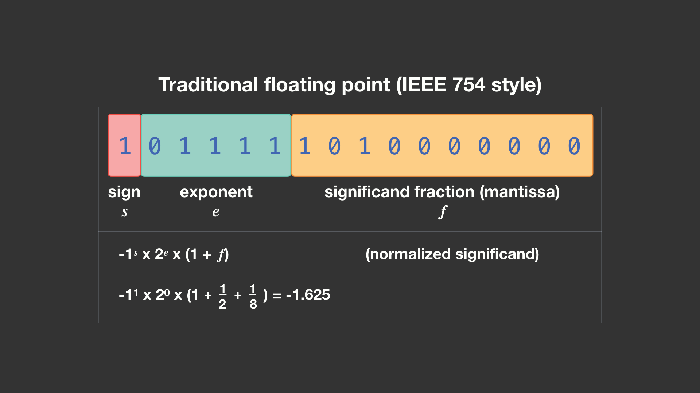
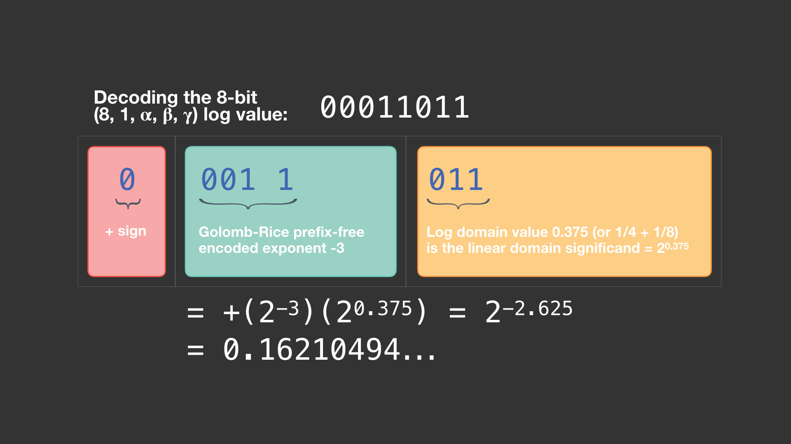
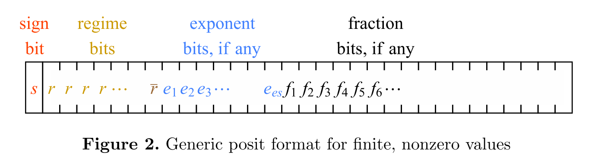
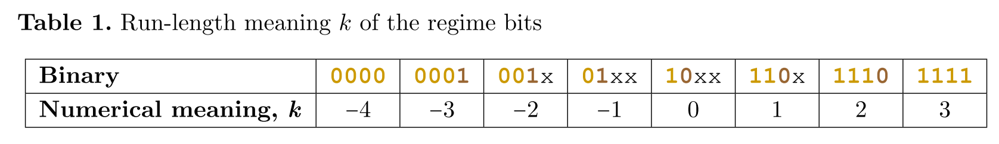
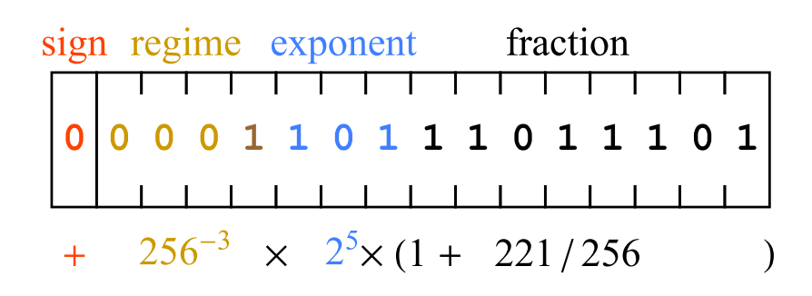

# C model

按照硬件中的截位情况，进行C model设计，并且进行参数化、模块化。

- dla_pe_add，在硬件计算时，先比较指数部分，然后尾数移位相加，尾数相加时中间最大保留17位，结果保留10位。
- add_tree，第一级中间最大保留21位，结果保留18位；第二、三级中间最大保留25位，结果保留18位。第四级中间最大保留25位，结果保留10位。
- dla_pe_fmul，无精度损失。尾数相乘，中间保留21位。
- dla_pe_mul，将DFP转为float后进行计算，转化过程无精度损失。

全部编写完成并且测试完成。最近手写大量底层运算代码，对这些数据格式有了更深的理解。

不过貌似老板有换数据格式的打算，最近研究一下Facebook的那篇ELMA和之前的Posit。


# 小鼠项目

花了些时间，把处理流程写成了脚本，效率提升不少。

```shell
rm -r /home/cuda/brain/2020-02data/annotations1
mkdir /home/cuda/brain/2020-02data/annotations1
rm -r /home/cuda/brain/2020-02data/img1
mkdir /home/cuda/brain/2020-02data/img1
rm -r /home/cuda/brain/2020-02data/coco
python he_cut.py --he_channel 0
python csv2coco_cut.py --he_bboxsize 15
python main.py --task ctdet --dataset cocomot --exp_id  data202002-1  --batch_size 16 --master_batch 8 --lr 1.25e-4  --load_model ../models/ctdet_coco_dla_2x.pth       

rm -r /home/cuda/brain/2020-02data/annotations1
mkdir /home/cuda/brain/2020-02data/annotations1
rm -r /home/cuda/brain/2020-02data/img1
mkdir /home/cuda/brain/2020-02data/img1
rm -r /home/cuda/brain/2020-02data/coco
python he_cut.py --he_channel 1
python csv2coco_cut.py --he_bboxsize 22
python main.py --task ctdet --dataset cocomot --exp_id  data202002-2  --batch_size 16 --master_batch 8 --lr 1.25e-4  --load_model ../models/ctdet_coco_dla_2x.pth  

rm -r /home/cuda/brain/2020-02data/annotations1
mkdir /home/cuda/brain/2020-02data/annotations1
rm -r /home/cuda/brain/2020-02data/img1
mkdir /home/cuda/brain/2020-02data/img1
rm -r /home/cuda/brain/2020-02data/coco
python he_cut.py --he_channel 2
python csv2coco_cut.py --he_bboxsize 22
python main.py --task ctdet --dataset cocomot --exp_id  data202002-3  --batch_size 16 --master_batch 8 --lr 1.25e-4  --load_model ../models/ctdet_coco_dla_2x.pth  

python demo_folder.py
```


# 论文阅读

## 1 Rethinking floating point for deep learning

深度学习使用数据格式

### INT8/32

常用，但表示范围小。

### Float16/32



运算消耗资源大。

### log ELMA

精度高同时硬件计算效率也高的格式。

(8, 1, alpha, beta, gamma) 的格式。其中(8,1)是posit parameters。(alpha, beta, gamma) 用来控制log-linear与linear-log的转换精度。




## 2 Beating Floating Point at its Own Game : Posit Arithmetic

### posit








## 3 MOT20: A benchmark for multi object tracking in crowded scenes

刚刚在arxiv上放出来的文章。之前那个CVPR19的MOT数据集终于要放出来了，并且起名为MOT20。