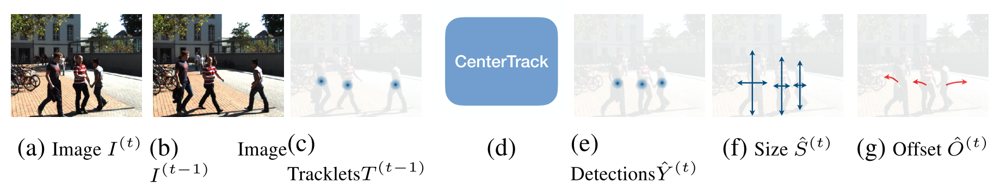
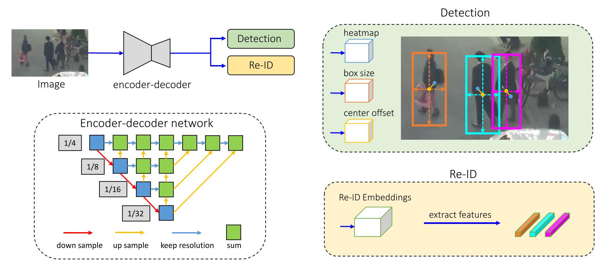

# 1 C++(Cuda) Model

用一周多时间，把之前C Model的代码用C++做了整体的重构。以前只用过C语言，最近慢慢学习入门C++，正好可以把之前学的CUDA也加入进去，进行一些实践练习。

等开学后，准备系统学习一下C++语法，目前是用到哪学到哪。


## 1.1 编写C model的关键

目前看来，写C model的关键在于两点

​	1）合理的工程架构。

​	2）关键的算子与硬件保持一致。

关于这两点，我在写C model的过程中试图借鉴TensorFlow、Pytorch等成熟框架的思想，在其基础上进行探索，不过目前还只是模仿了皮毛。

使用C model时，类似如下代码。

```C++
string model_dir = "/Server-Code/DLA_code/C_model_cpp/data/weight/";
auto wavenet = load_wavenet_model(model_dir);

TensorFloat32 input_tensor("input_tensor", 1, 20, 478, "mfcc.txt");
auto output_tensor = wavenet.Forward(input_tensor);
TensorMinifloat input_tensor("input_tensor", 1, 20, 478, "mfcc.txt");
auto output_tensor = wavenet.Forward(input_tensor);
```

由于之前使用的是C语言，函数不能重名。用了C++以后发现函数重载（Overload）功能十分强大，非常好用。

现在对卷积实现还完成了一个CUDA版本，确实比CPU实现快很多，但并行编程确实比串行编程更复杂以前，而且debug不易。


## 1.2 工程架构

至于工程架构，目前我是这样规划的，按层次分为Model，Layer，Tensor，Op，Type。

```
\src
		\Model
		\Layer
		\Tensor
		\Op
		\Type
		main.cpp
\include
		\Model
		\Layer
		\Tensor
		\Op
		\Type
\CUDA
		conv_kernel.cu
		conv_kernel.cuh
		CMakeLists.txt
CMakeLists.txt
```

从底层到上层介绍：

- Type内包含的是对底层数据格式的定义。
- Tensor是在底层数据格式基础上定义的一个类，可以进行整体运算，如Add、EMul、DMul、MMul、Tanh、Sigmoid等。
- Layer内定义Conv、AConv、BN等Layer。
- Op内定义了一些基本的运算函数，用于模拟底层硬件运算结果。
- Model内定义WaveNet、LSTM等完整的网络。

至于如何在C model中添加对CUDA的支持，方法如下。

因为CUDA编程只支持C语言风格，而不支持C++语法，所以在C++工程里使用CUDA，其过程类似于调库。具体来说就是把需要用CUDA实现的功能在.cu文件中进行实现，包括device端的核函数以及host端的函数。之后在比如main.cpp中include头文件.cuh，然后调用host端的函数即可。

编译工程时，需要首先使用nvcc编译器对CUDA文件进行编译，之后使用g++编译C++代码，以实现CUDA与C++的混合编译。


## 1.3 与成熟框架有何不同

现在的C model有点类似于自己写的一个推理框架，但与成熟框架有一些不同点，主要有三。

- C model中卷积的实现**采用硬件中的Data Flow**。对一次卷积中的累加分多次完成。

- 采用**自定义格式的数据**用来存储Feature与Weight。C++中可以使用重载运算符（Overload Operator）的方式比较方便地实现这一点，代码类似于下面这样。

  ```c++
  class minifloat
  {
  private:
      uint16_t value;
      /* data */
  public:
      minifloat(/* args */);
      ~minifloat();
  
      minifloat(const minifloat& a);
      minifloat(uint16_t);
      minifloat(float);
      minifloat(double);
  
      minifloat& operator =(const minifloat& a);
      minifloat& operator =(int a);
      minifloat& operator =(uint16_t a);
      minifloat& operator =(float a);
      minifloat& operator =(double a);
  
      minifloat operator +(const minifloat& a);
      minifloat operator *(const minifloat& a);
      minifloat operator *(const dfp& a);
  
      uint16_t uint16t() {return this->value;};
  
      operator float();
  };
  ```

  可以实现下面这样的操作。

  ```c++
      minifloat a = -1.1, b = 2.2;
      dfp e = 2.3;
      auto c = a + b;
      auto d = a * b;
      auto f = a * e;
  ```

- 并且模拟硬件中运算的**精度损失（内部精度）**。


## 1.4 关于训练的思考

目前的C model只能进行预测，无法进行训练。

为了获得可以在硬件上运行且有较高精度的模型，训练是必须的。

后面有几种可能的方案：

1. 直接在C model里实现反向传播，在完成CPU版本的反传后，再进行提速写CUDA版本的反向传播。
2. 利用TensoFlow、Caffe等框架，在调用其函数时在输入输出部分加入量化代码，之后利用其框架进行训练。
3. 修改TensoFlow、Caffe等框架的源码，在其基础上加入量化，之后进行训练。

第一种方案缺点是工程量大，且效果可能不尽如人意。

第二种方案是无法模拟硬件运算的内部精度，最多模拟量化误差。

第三种方案需要对这些框架的架构有很深入的了解，需要较长时间的学习。

之前并没有很关注量化训练的方法，所以以上几个方案可能并不成熟，这几天会继续调研其他工程是如何实现量化训练的，找找有没有更好的方案。


# 论文阅读

最近新出了几篇多目标跟踪的文章，其中有些挺值得一看。检测与跟踪结合逐渐成为最近的一个趋势，出来很多相关的文章。

## 1 Tracking Objects as Points

这一篇借鉴了当时CenterNet的思路，把目标看做点来进行预测，他们起名叫CenterTrack。



网络的输入有三个：当前帧图片、上一帧图片、根据上一帧图片预测结果生成的heatmap。

输出有三个：当前帧的detection heatmap、当前帧目标的大小、当前帧目标的移动量。

思路和我最早的有一版代码几乎是一模一样的，可惜我当时对网络的理解不够，也没有他们那么强的训练能力，没能把这个网络训出来。


## 2 A Simple Baseline for Multi-Object Tracking

这篇是华科的，开源了一个性能不低的baseline代码。虽然起名叫MOT，但似乎论文中只是对Detection和Re-ID部分进行了很多探讨。至于多目标跟踪的部分，则还是Kalman Filter + IoU distance + 人工规则的套路。这篇论文看格式是投稿了ECCV，但看上去不太像能被接收，感觉贡献有限。不过他们的代码倒是值得收藏一份。




这两篇都在实验部分重点突出了自己在Private Detector上的性能，这是我一直期待的局面。

这几年Object Detection和 Re-identification都取得了很大的发展，而MOT算法发展停滞不前，近几年基本没有让人眼前一亮的文章，我认为一个重要的原因就是MOT16和17提供的Public Detector结果太差，严重限制了MOT算法的效果提升和这一领域的发展，甚至把大家引上了一条魔改检测框的道路。再加上最近MOT20数据集的公开，这数据集里面的检测框质量都是很高的，感觉MOT领域未来可期。希望之后领域的大佬们能找出一个更公平的比较方法，推动MOT算法更进一步。


这周会读两篇Google的量化训练的文章。

Quantizing deep convolutional networks for efficient inference: A whitepaper

Quantization and Training of Neural Networks for Efficient Integer-Arithmetic-Only Inference