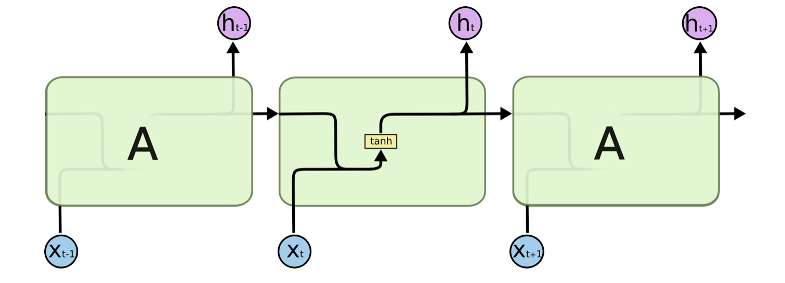
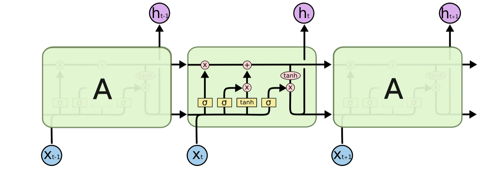
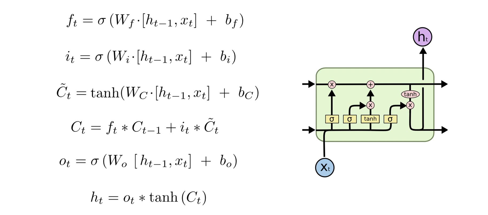
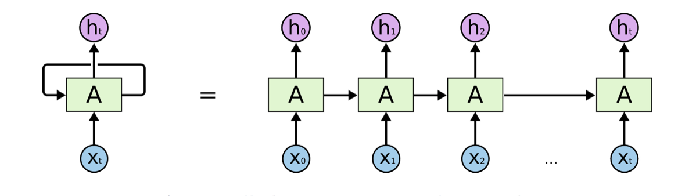
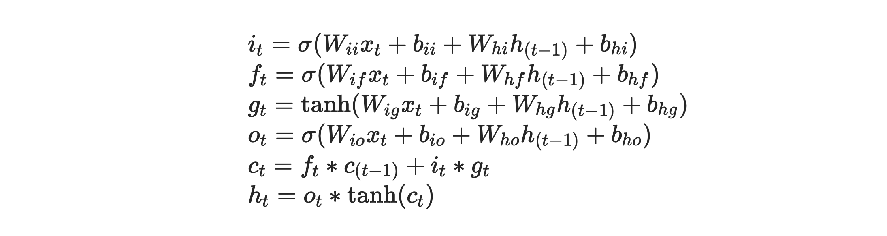
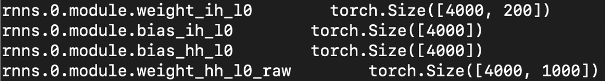

# LSTM

上周在C model里调通了基础的LSTM，分享一下我的理解。

算法的原理没有深究，主要看了看LSTM的实现。

// 希望给不懂LSTM内部原理的CV同学简单介绍一下，同时希望NLP同学帮我找找理解错误的地方。

## 基本概念

Long Short Term Memory networks（以下简称LSTMs），一种特殊的RNN网络，该网络设计出来是为了解决长依赖问题。该网络由 Hochreiter & Schmidhuber (1997) 引入，并有许多人对其进行了改进和普及。他们的工作被用来解决了各种各样的问题，直到目前还被广泛应用。

所有循环神经网络都具有神经网络的重复模块链的形式。 在标准的RNN中，该重复模块将具有非常简单的结构，例如单个tanh层。

基本的RNN（Recurrent Neural Networks）：



基础的LSTM：



一个LSTM单元内部运算的公式表示如下。



一些首字母代表的缩写：f(forget)、i(input)、o(ouput)、h(hidden)、c(cell)


误区：对于做CV的同学，如果不仔细看，比较容易把图中的块想象成实际的结构，其实图中的每一个绿色方块都是同一个结构，图中这样只是表示用同一个cell来不断处理序列数据，不断更新这个cell里面的记忆单元。


## Data Flow



以一层LSTM处理一个长度为70的序列为例。     LSTM（200，1000）

- input_tensor (200, 70)  200维，序列长度70。
- output_tensor (1000, 70) 1000维，序列长度70。

这一层LSTM的输入输出如下：

- Inputs:      input_tensor, (h_0, c_0)
- Outputs:  output_tensor, (h_n, c_n)

注意，在这个例子里，h与c的维度是(1000, 1)。


处理序列时，有两个tensor是不断更新的。

cell_tensor，原理图中上面那条横线，表示细胞的状态。可以理解为一个长期记忆存储单元。

hidden_tensor，原理图中下面的横线，既是一个不断被更新的tensor，也是网络的输出，


## Pytorch中实现方式

```python
torch.nn.LSTM(input_size, hidden_size, num_layers)
torch.nn.LSTMCell(input_size, hidden_size)

Parameters:
      input_size – The number of expected features in the input x
      hidden_size – The number of features in the hidden state h
      num_layers – Number of recurrent layers. E.g., setting num_layers=2 would mean stacking two LSTMs together to form a stacked LSTM, with the second LSTM taking in outputs of the first LSTM and computing the final results. Default: 1
      bias – If False, then the layer does not use bias weights b_ih and b_hh. Default: True
      batch_first – If True, then the input and output tensors are provided as (batch, seq, feature). Default: False
      dropout – If non-zero, introduces a Dropout layer on the outputs of each LSTM layer except the last layer, with dropout probability equal to dropout. Default: 0
      bidirectional – If True, becomes a bidirectional LSTM. Default: False
```

以下是pytorch文档中的公式，也是pytorch内部中计算LSTM的方式。



和看原理图的直观理解，主要有两点不同：

1. 可以看到，最明显的不同是对输入的处理。LSTM原理图中，是将 $x_t$ 与 $h_{t-1}$ 进行concat然后作为整体输入。而pytorch里对这两个tensor是分开处理的，并且weight和bias也是分开存储的。
2. 第二点是对$i_t$、$f_t$、$g_t$、$o_t$的处理，在pytorch里是当做一个整体，一次算出的。


下图是把pytorch中一层LSTM存储的权重打印出来。这层LSTM为输入输出为（200，1000）。

