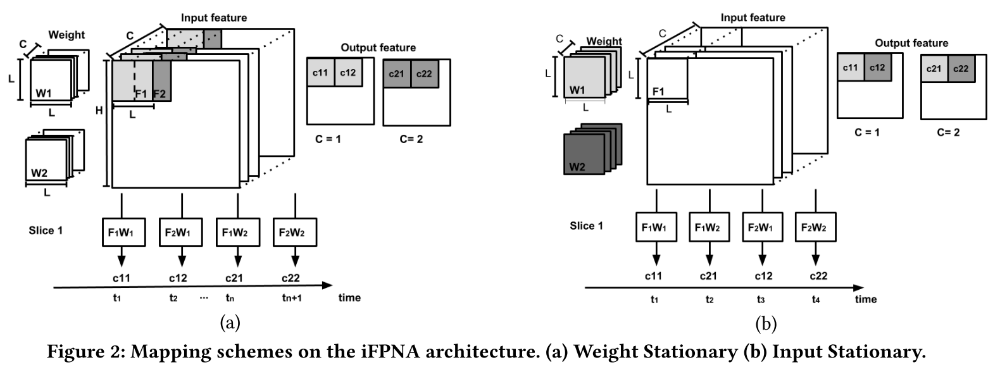
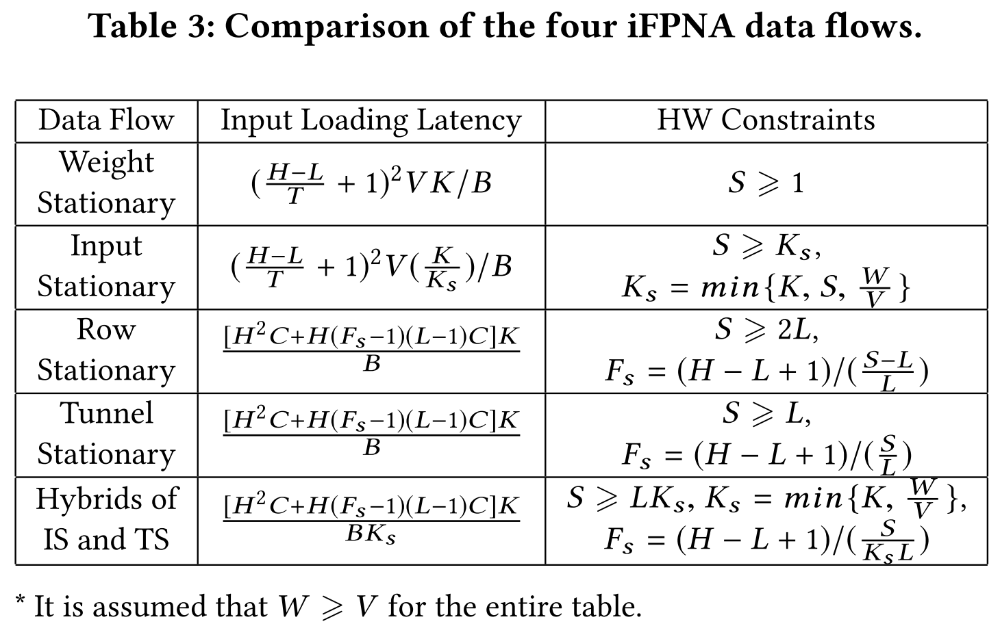

# 1 DLA

## 1.1 Notice

优化Mapping时考虑的因素主要有三，按优先级排序如下

- Energy
  - DDR->GB比片内传输耗能多十倍。
  - 若Energy最小，可简单理解为DDR到片上搬运次数最小。
- Through put（Time Consumption）
  - 相当于运行网络的耗时。
- Utility
  - 不用刻意优化，但好的mapping方案的utility理论上不会低。

Mapping时对每个PE的IC与OC分配，还应重点考虑Fbuf的容量。

有关传输的速度，整理如下

每 1 clock cycle 

- 从DDR传64bit到片上
- 从Fbuffer传16*16bit到PE array
- 从Weight Buffer传16*256bit到Weight Bank

总的来看，数据传输的瓶颈还是DDR到片内的部分。

若数据量足够（不需要太多），计算延迟就会隐藏掉片内传数据的延迟。

这里的数据量足够，并不需要填满Weight Bank的32个weight。

​	

关于容量

- 所有16个Fbuf加起来大小256KB（2^17个16bit，每个Fbuf为2^13个16bit）。
- 每个LB大小为2KB
- Weight Buffer的大小为2^13个256bit。

Fbuf的容量需要优先关注，因为IFM、部分和、OFM等都是存在Fbuf中的。**建议Mapping时首先考虑这里。**

## 1.2 Example

- conv1
- conv3
- Conv5
- batch normalization
- activation function
- element-wise op

weight.bin

IFM.bin

example.cpp

# 2 WaveNet

由于TensorFlow版本过旧，不兼容服务器的CUDA版本，进行重新训练，首先按原网络结构，进行复现。

之后把网络中的conv7替换成conv3与conv5。

之前跑的speech-to-text-wavenet，没有一个完整的评价机制。之后想办法在各大型数据集上进行评测。

# 3 Exploring the programmability for deep learning processors: From architecture to tensorization

DAC2018的一篇文章，提出了一款神经网络加速器叫iFPNA，从架构设计，到网络Mapping，到Compiler设计。

### 1 Instruction and Architecture

**Instruction Set Architecture (ISA)**

- Common RISC Instructions

- Weight Load

- Vector Collect

  ​		The SIMD register file has four 128-bit registers to store the input features and output computing results. The registers are filled by the vector collect instruction.

- Computing Excute

Using the extended instruction set, all the data reuse and PE operations can be defined in a previously compiled program. The major task of the iFPNA compiler is to re-order these three instructions (sometimes assisted by other RISC instructions) to maximize data reuse.

### 2 DNN Data Flow Mapping

- Data Flow I: Weight Stationary
- Data Flow II: Input Stationary
- Data Flow III: Row Stationary
- Data Flow IV: Tunnel Stationary

### 3 Compilation

- Front-end Compilation
- Mapping Scheme Selection
- Partition
- Code Generation

