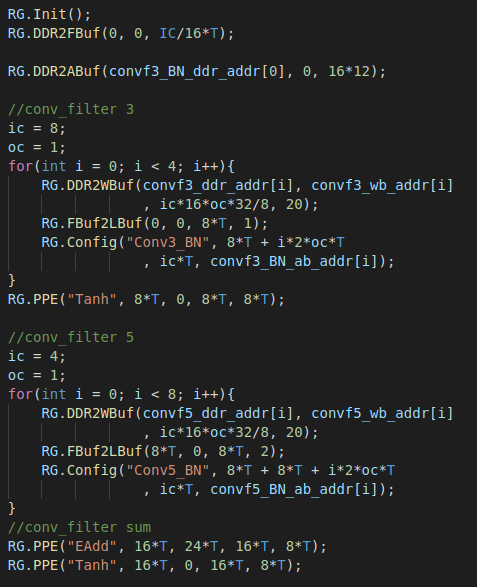
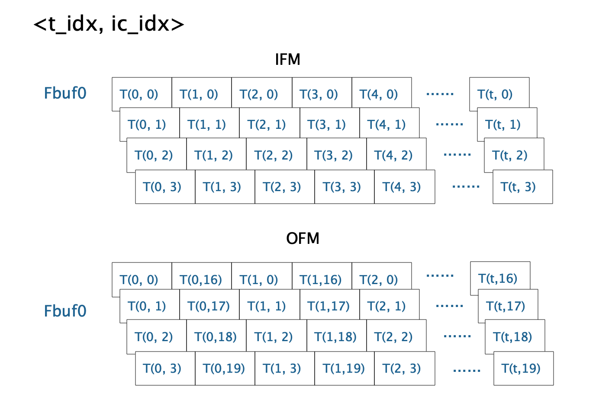

# 1 DLA

## 1.0 Mapping

1. Register Configuration Code

- void **Init**();
- void **DDR2FBuf** (int ddr_addr, int fb_addr, int f_num);
- void **DDR2WBuf** (int ddr_addr, int wb_addr, int w_num, int w_scale);
- void **DDR2ABuf** (int ddr_addr, int ab_addr, int a_num);
- void **FBuf2DDR** (int ddr_addr, int fb_addr, int f_num);
- void **FBuf2LBuf** (int fb_addr, int lb_addr, int f_num, int dila=1);
- ​void **Config** (string type, int fb_i, int fb_o, int f_num);

2. Fbuf、WBuf、Abuf Mapping

- Fbuf
  - 每个Fbuf存2^13个16bit数，一共16个Fbuf。
- Wbuf
  - 2^13个256bit数。
- Abuf (BN、bias parameters)
  - 1024个16bit数，所有BN参数需要从DDR到ABuf传两次。
- Lbuf
  - 2048个16bit数(2K)。

| DDR                                  |
| ------------------------------------ |
| Input Feature 128*119/4 = 3808       |
| Conv_filter 3-0  128\*32\*3/8 = 1536 |
| Conv_filter 3-1  128\*32\*3/8 = 1536 |
| Conv_filter 3-1  128\*32\*3/8 = 1536 |
| Conv_filter 3-1  128\*32\*3/8 = 1536 |
|                                      |
|                                      |
|                                      |
|                                      |

## 1.1 WaveNet

Resblock

- conv_filter_3 + BN + Tanh
- conv_filter_5 + BN + Tanh
- conv_gate_3 + BN + Sigmoid
- conv_gate_5 + BN + Sigmoid
- emul
- conv_out + BN + Tanh

## 1.2 LSTM

- LSTM(28, 64)
- FC(64, 10)