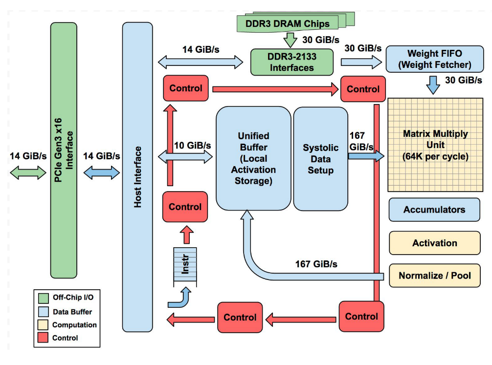
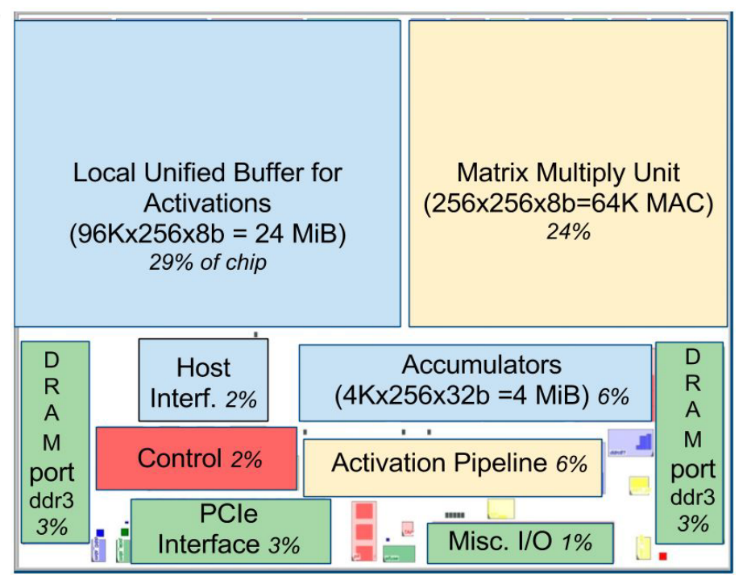
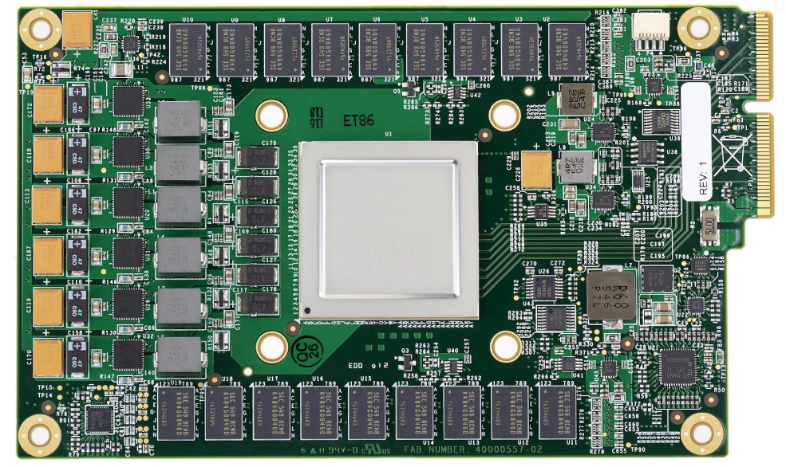
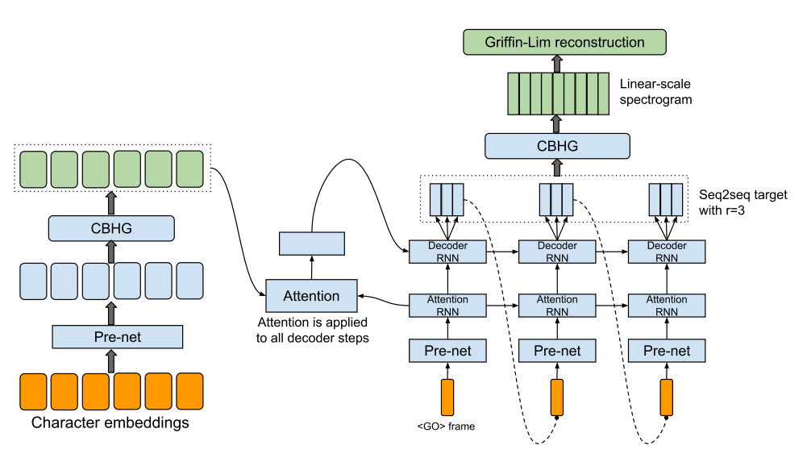
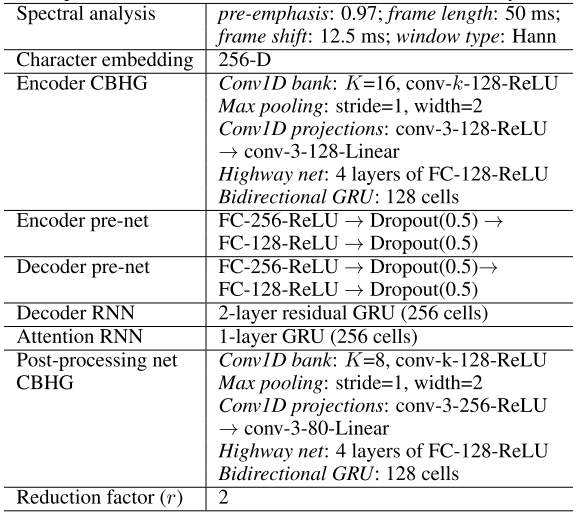
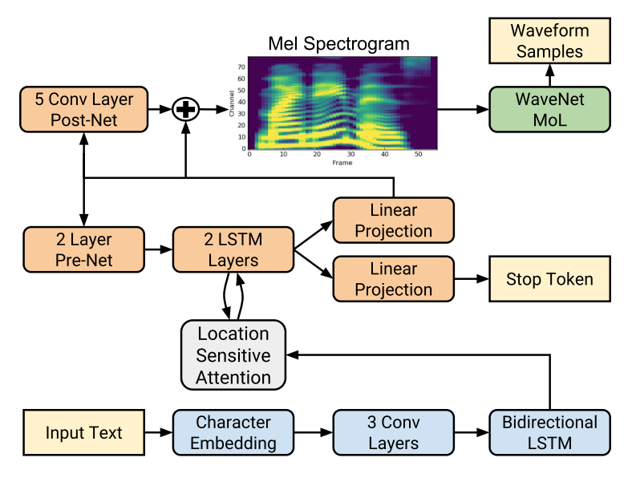

# 1 DLA

## 1.1 TPU架构

### 1.1.1 TPU架构

**TPU核心-MMU**（Matrix Multiply Unit矩阵乘法单元）：

MMU包含256*256=65536个MAC，每个MAC可以执行8bit的signed or unsigned 整数乘法和加法。

**Accumulators（累加器）**：

4MiB  32bit。用于处理MMU乘积后得到的16bit的运算结果。（1MiB=1024*1024  Bytes）4MiB代表4096*256-elements*32-bit。每个时钟周期，矩阵单元都会产256-elements的部分和。我们选择了4096，首先是注意到每个字节的操作需要达到峰值性能为大约1350，所以我们将其舍入到2048；然后复制了它，以便编译器可以在峰值运行时使用双缓冲方式。

注意：当使用8bit的weights和16bit的activations混合计算（反之亦然）的时候，矩阵单元以半速运算。如果都是16bit，就以四分之一速度运算。每个时钟周期读写256个值，进行一次矩阵乘法或者卷积。

**Weight FIFO**：矩阵单元的权重从片上Weight FIFO上进行缓存，该FIFO从片外8GiB DRAM上读取。（作为推理使用，weight 是只能读取的状态，8GiB 可以同时支持许多不同的模型）FIFO的深度是4 tiles。

中间结果保存在24MiB的片上统一缓存区，可以作为矩阵单元的统一输入。可编程DMA实现和CPU主内存以及统一缓存区的数据通信。

### 1.1.2 TPU芯片布局

这张图展示的是TPU die芯片布局。24MiB的统一缓存区几乎占芯片的三分之一，矩阵乘法单元占四分之一，所以数据通路几乎占了芯片的三分之二。

TPU板卡可以想SATA硬盘一样插入服务器中，不过需要PCIe总线进行通信。

# 2 WaveNet

WaveNet之后比较得到主流承认的TTS模型貌似是Tacotron，是google提出的，简单看了一下Tacotron的结构。

## 2.1 Tacotron V1

Tacotron V1的结构如下图。

下表给出了更加详细的结构参数。

看上去是可以mapping到我们的DLA上面的，因为拆分开其实也是一堆Conv和FC已经激活函数的组合，不过对mapping的考验更大。我们需要研究一种更加聪明的mapping方式，单靠现在的手工mapping我觉得效率太低。

## 2.2 Tacotron V2

以下是第二版Tacotron网络。

从mapping的角度来看与V1类似，也能拆分成FC和Conv的组合。