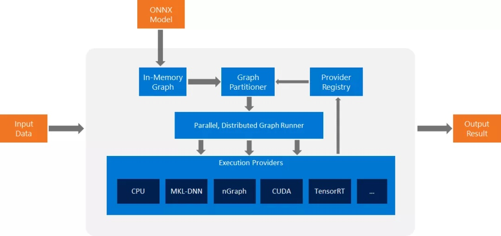
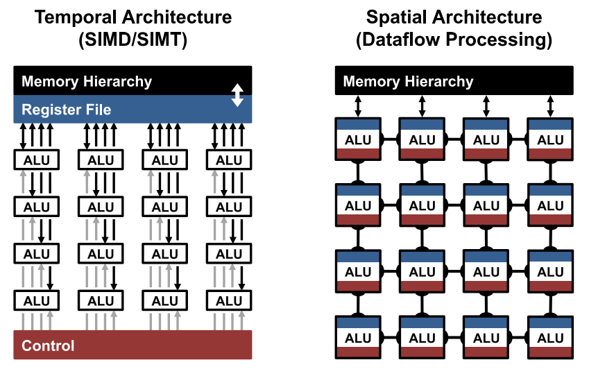
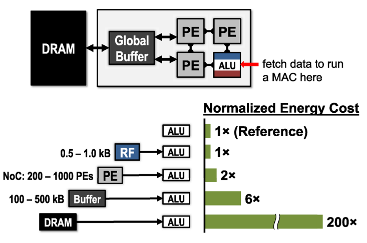
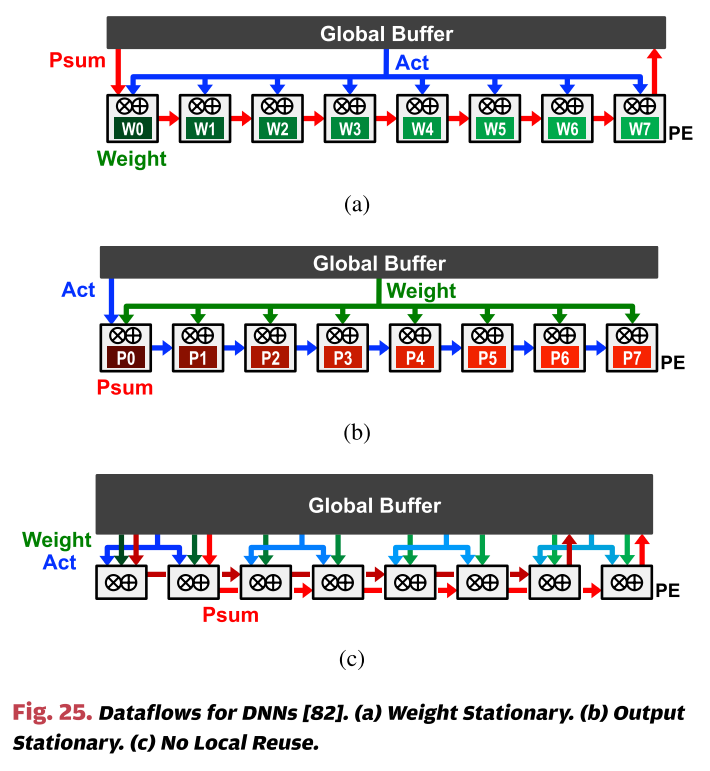
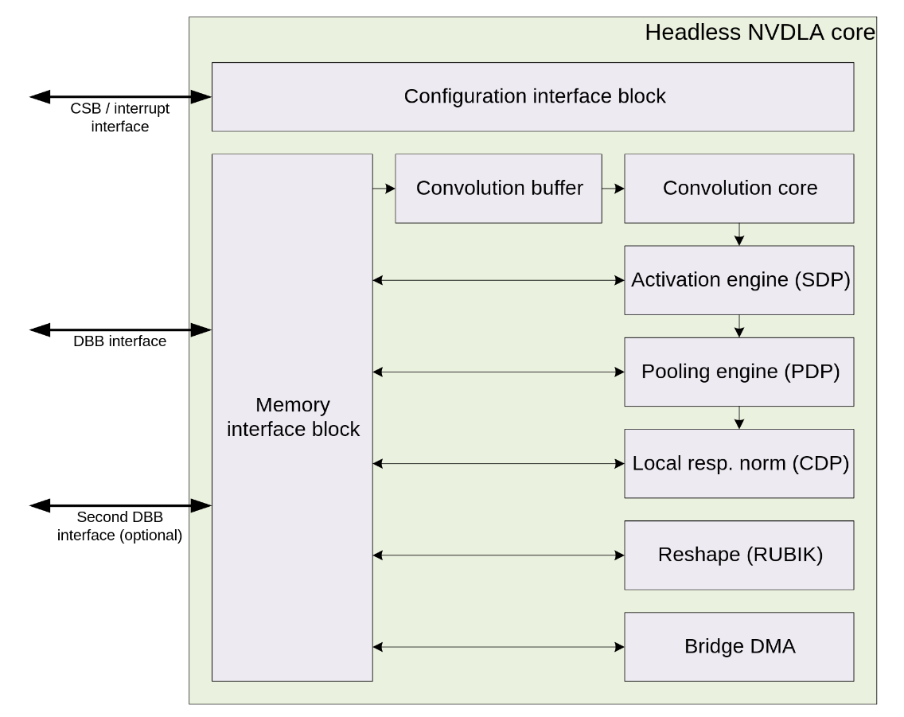

# 1 DLA

DLA这周有了比较大的改动。

我个人非常认同的一点是把16×32的PE array改成了32×32的PE array，这样能使OFM在Fbuf里的存储更加规整，极大方便了网络Mapping。

思考：

目前DLA处理WaveNet的方式，相比于GEMM有什么好处？坏处？

- 修改C model
- Conv7 WaveNet
- Conv Compression
- PE array分析

tf:
(1, 28, 478)
0 0 0 -0.699518
0 0 1 0.118345
0 0 2 2.17437
0 0 3 4.10296
0 0 4 2.92203
0 0 5 4.97069
0 0 6 -0.945226
0 0 7 0.210512
0 0 8 3.81429
0 0 9 11.0374

psum:
(1, 28, 478)
0 0 0 -0.792969
0 0 1 -0.0693359
0 0 2 1.80078
0 0 3 3.96875
0 0 4 2.51367
0 0 5 4.53125
0 0 6 -0.987305
0 0 7 0.0253906
0 0 8 3.31641
0 0 9 10.7109

adtree:
(1, 28, 478)
0 0 0 -0.859375
0 0 1 -0.189941
0 0 2 1.88379
0 0 3 3.6875
0 0 4 2.16406
0 0 5 4.57422
0 0 6 -0.992188
0 0 7 0.16626
0 0 8 3.6875
0 0 9 10.5938

# 2 ONNX

Open Neural Network Exchange（ONNX，开放神经网络交换）格式，是一个用于表示深度学习模型的标准，可使模型在不同框架之间进行转移。

我现在觉得ONNX可能是做Compiler的一个比较容易入门的突破口，至少是学习上的突破口。因为使用ONNX，可以把不同框架的模型转化为统一的格式，且转化过程中ONNX就会做一定的优化。TVM也是支持编译ONNX模型的。不过ONNX相比与TVM的IR来说，优化的程度应该是低得多，不过这也意味着更容易学习。

ONNX官网上说其两个key benefits是：

- Interoperability

  Develop in your preferred  framework without worrying about downstream inferencing implications.  ONNX enables you to use your preferred framework with your chosen  inference engine.

- Hardware Access

  ONNX makes it easier to  access hardware optimizations. Use ONNX-compatible runtimes and  libraries designed to maximize performance across hardware.                                         

这两点我觉得对与目标是完成自动Mapping的Compiler来说，都是非常重要的。

不过ONNX单就使用来说，是比较简单的，后面会找找有没有相关论文，学习一下其中的原理。

另外，在被张韦丰大佬面试的时候，我请教了一下他Compiler的学习路线。他说有两点比较重要，一是对硬件架构的了解，二是对Compiler原理要有比较深入的了解。他比较建议通过课程学习来积累这两方面的知识。感觉这样学出来的话，知识体系会比较完成，会有科班出身的感觉，值得借鉴。

下面这幅图是ONNX runtime的原理图，不过我还没找到其官方出处。

# 3 PaperReading

## Efficient Processing of Deep Neural Networks: A Tutorial and Survey

## 1 Architecture

重点看其中有关DLA硬件设计以及DataFlow的部分。

- Temporal Architecture
- Spatial Architecture

前一种是CPU和GPU中使用的，后一种多见于ASIC和FPGA。

## 2 Accelerate Kernel Computation

计算卷积的方法有很多种，常见的有以下几种方法:

1. 滑窗：这种方法是最直观最简单的方法。但是，该方法不容易实现大规模加速，因此，通常情况下不采用这种方法 (但是也不是绝对不会用，在一些特定的条件下该方法反而是最高效的.)
2. im2col: 目前几乎所有的主流计算框架包括 Caffe, MXNet 等都实现了该方法。该方法把整个卷积过程转化成了 GEMM 过程，而 GEMM 在各种 BLAS 库中都是被极致优化的，一般来说，速度较快.
3. FFT: 傅里叶变换和快速傅里叶变化是在经典图像处理里面经常使用的计算方法，但是，在 ConvNet 中通常不采用，主要是因为在 ConvNet 中的卷积模板通常都比较小，例如 3×3等，这种情况下，FFT 的时间开销反而更大.
4. **Winograd**: Winograd 是存在已久最近被重新发现的方法，在大部分场景中，Winograd 方法都显示和较大的优势，目前 cudnn 中计算卷积就使用了该方法. 此外还有**Strassen**算法，也值得一学。

在学Winograd和Strassen的过程中，感受到为什么说学Compiler对数学要求高了…

## 3 Energy-Efficient Dataflow for Accelerators

多层级的memory设计可以让能耗最小化。图中的energy cost和lsw描述的我们的DLA里的能耗是一致的。

在实践中学习了一款DLA后再来看这种综述，有一种拨云见日的感觉，感觉知识体系都联通了。

几种Dataflow

- Weight Stationary
- Output Stationary
- No Local Reuse
- Row Stationary

感觉目前我们的DLA是Output Stationary Dataflow。而之前的架构应该勉强属于Weight Stationary。至于其中的优劣之处，我准备这两天分析分析。

# 4 NVDLA

> http://nvdla.org/primer.html
>
> https://github.com/nvdla

NVDLA中有两个卷积计算核，每个核中有8个MAC，每翁额MAC有64个Mul，每个Mul是一个16位的乘法逻辑。

一个核从顶层得到2个1024bit数，这些数据会给到64个Mul，每个Mul输入数据16bit。这64个Mul一次得到64个部分和，用3-2CSA tree变成16个部分和，之后这16个部分和使用普通的卷积计算或Winograd计算发放，算出MAC最终的4个输出。NVDLA支持Winograd算法的F（2x2，3x3）形式。

CSA tree就是Carry Save Adder Tree。