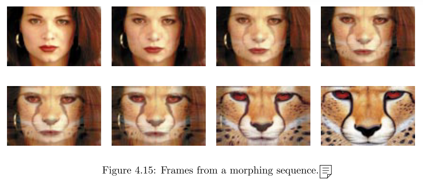
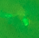
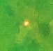

# 小鼠项目会议记录


1.motivation：标准脑切片模板和鼠脑切片图片人工一一对应。soluation：将鼠脑切片图片映射到标准脑切片模板上，并实现分区和点击胞体自动计数 result：可以轻松标注出胞体和所在区域，并且计数

（可扩展成自动匹配标准脑模板，减少人力比对模板的挑选时间）

2.motivation：胞体点数非常费人力  soluation：（可以用点特征算法试试）传统CV方法从拼接好的的鼠脑切片图片中切割出分辨率较低的局部切片图片，用深度学习方法自动识别出胞体的位置，准确率达95%以上方可使用 result：点击分区，自动识别出胞体数量

3.motivation：想要实现标准脑模型一样的3D结构，能够映射到标准脑模型上，以便更好的对整个标准脑中各分区胞体分布、连接的研究 solution：将2D自动识别好的鼠脑切片图片重构成3D立体模型，并根据切片层之间的整体关系，将胞体之间连接好 result：能够得到较为精确的标准脑下的鼠脑切片图片三维重构

总体上需要做的工作步骤：

1.UI界面

基本功能选择，如：打开图片、保存数据结果

可以进行功能上的选择，如：胞体通道选择、标准脑切片模板选择、胞体数量计数、分区统计胞体数、自动绘制直方图

2.映射算法（鼠脑切片图片映射到标准脑切片模板）

3.匹配算法（自动匹配标准脑模板）

4.拼接算法（原始局部切片拼接成全局切片）

5.目标识别（自动识别出胞体数目）

6.三维重建 （得到映射到标准脑的三维模型）

7.连接算法（将三维模型的截断处进行连接）

8.不规则立体展开算法（将三维模型的皮层展开成平面）


http://atlas.brain-map.org/

http://connectivity.brain-map.org/


# 目前在进行的工作

何苗老师提了三个层次的需求。

1. 标准脑切片模板和鼠脑切片图片人工一一对应标准脑切片模板和鼠脑切片图片人工一一对应。
2. 点击分区，自动识别出胞体数量。
3. 将2D自动识别好的鼠脑切片图片重构成3D立体模型。

## 1.一些尝试


- [x] 使用简单的预处理和轮廓寻找算法提取出大脑切片的轮廓，轮廓有毛刺，尚未平滑。

  ```python
  cv2.threshold(img_res,40,255,cv2.THRESH_BINARY)  #阈值二值化
  cv2.dilate(thresh,kernel,iterations = 1)		#膨胀
  cv2.erode(thresh2,kernel,iterations = 1)		#腐蚀
  cv2.findContours(closing,cv2.RETR_TREE,cv2.CHAIN_APPROX_SIMPLE)    #寻找轮廓
  ```

- [x] 在alan图谱中手动找出最接近的一副图，也识别出其轮廓。（两个轮廓均由约3000个特征点构成。）

  若要自动寻找最相近的图片，简单实现可以用OpenCV自带库可以计算轮廓的**Hu矩**，用来粗略比对轮廓相似性。

  

  上图大脑图片与标准脑图片计算的Hu矩为0.06，可以遍历所有的标准脑图片，使用匹配度最高的图片来进行与照片的融合。

- [ ] 通过寻找点间的对应关系，将两幅图进行混合（image blending）。




可优化之处：

- [ ] 轮廓提取
- [ ] 轮廓平滑
- [ ] 轮廓相似度计算
- [ ] 增加内部标志性轮廓，实现精度更高的图片融合


## 2.关于胞体识别的一些想法

传统CV确定候选区域+CNN二分类模型


先利用阈值二值化等方法寻找候选点，之后以候选点为中心crop出一定大小的区域，用此区域作为输入使用cnn进行预测。


CNN网络可用类似与以下图片的数据进行训练，需要手工标注一定数量的样本。






# 下一步计划

脑区自动分割，手工点细胞。

- [ ] 完成软件界面设计，实现标注胞体的功能。
- [ ] 实验并优化图像融合算法，在大脑照片图片上显示参考分区，用以辅助人工标注。


> Reference:
>
> [1]Gomes, J. (1999). Warping and morphing of graphical objects. *Books.Google.Com*. Retrieved from http://books.google.com/books?hl=en&lr=&id=bWlMzXmw8ZMC&oi=fnd&pg=PR15&dq=morphing+art+metamorphosis&ots=5LhkGc80OP&sig=MOsY58rWJtQ1BjUNtacP2Ap-HEA
>
> [2]Igarashi, T., Moscovich, T., & Hughes, J. F. (2005). As-rigid-as-possible shape manipulation. *ACM SIGGRAPH 2005 Papers on - SIGGRAPH ’05*, 1134. https://doi.org/10.1145/1186822.1073323
>
> [3]Kim, Y., Yang, G. R., Pradhan, K., Venkataraju, K. U., Bota, M., García del Molino, L. C., … Osten, P. (2017). Brain-wide Maps Reveal Stereotyped Cell-Type-Based Cortical Architecture and Subcortical Sexual Dimorphism. *Cell*, *171*(2), 456–469.e22. https://doi.org/10.1016/j.cell.2017.09.020
>
> [4]Ragan, T., Kadiri, L. R., Venkataraju, K. U., Bahlmann, K., Sutin, J., Taranda, J., … Osten, P. (2012). Serial two-photon tomography: an automated method for ex-vivo mouse brain imaging. *Nature Methods*, *9*(3), 255–258. https://doi.org/10.1038/nmeth.1854.Serial


