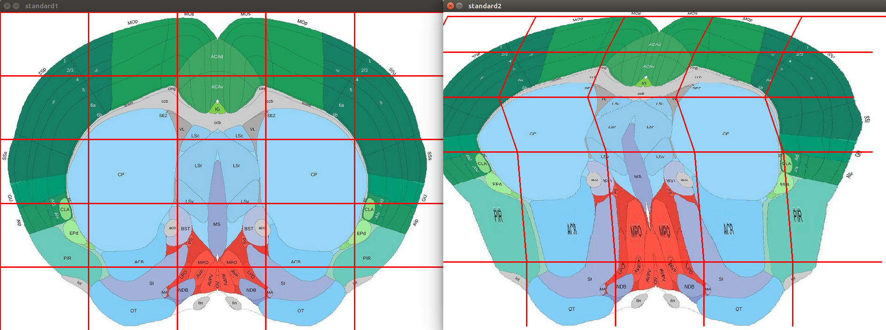
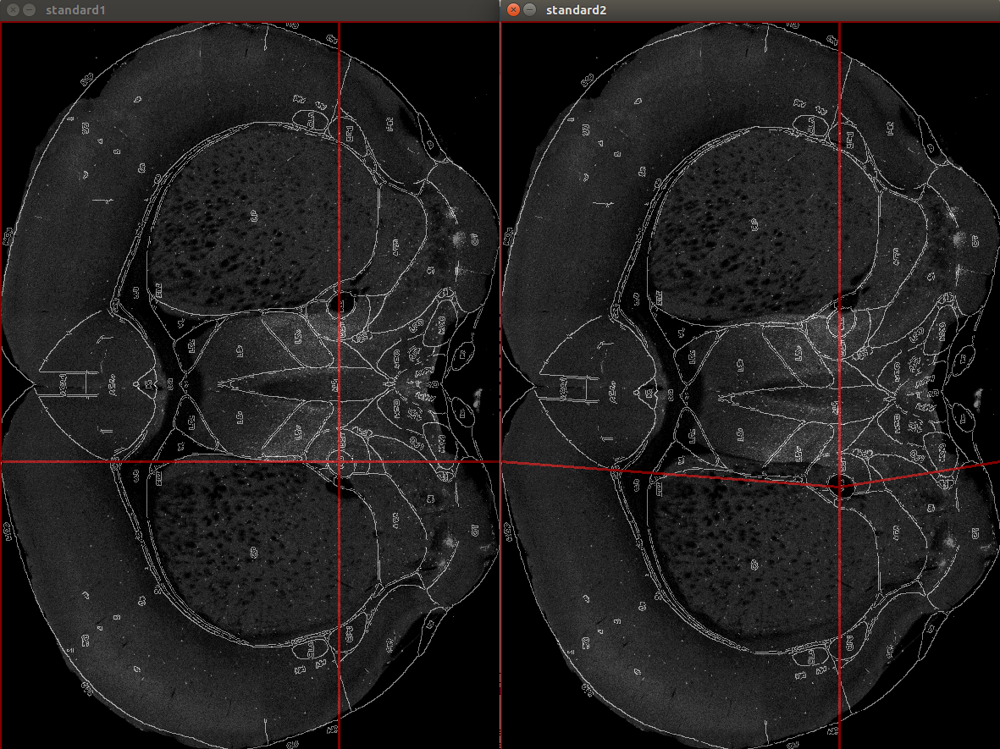
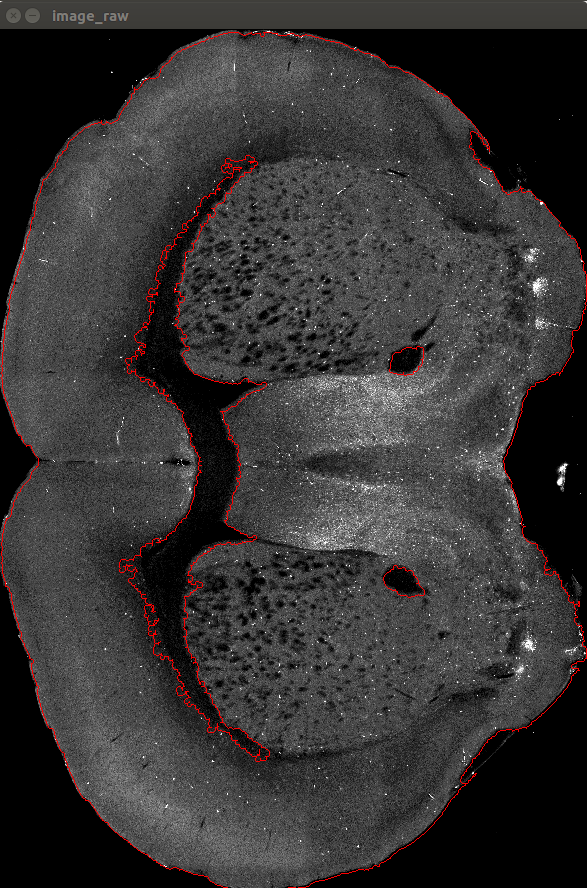

# 小鼠项目进度记录 2018-11-21

截至目前已完成任务：

1. 开发基于网格的变形算法
2. 基于变形算法进行图谱微调
3. 依据实现设定好的特征进行自动特征点检测
4. 由自动检测好的特征点进行自动微调
5. 编写爬虫，从Alan Brain网站上获取分区数据

下一步任务：

1. 将自动微调算法应用于图谱中的其他图片，实现较为通用的微调算法
2. 使用爬取的鼠脑分区数据代替目前canny算子提取的边缘图像
3. 学习Java语言的GUI库（awt）与ImageJ插件开发

# 1. 自动微调算法开发

## 1.1 基于网格的变形算法

开发出一套基于网格对图片进行形变的算法，可以实现对一副图谱进行比较自由的微调。

## 1.2 基于网格变形算法进行图谱微调

简单的微调实现，虽然目标位置成功调整，但能明显看到其他区域被该点拖拽变形。

更进一步优化微调算法下图微调图中小黑点区域，可以对周围其他区域影响更小

## 1.3 初步实现自动微调算法

自动实现自动分区主要基于对鼠脑图谱中黑色区域的检测。因为我们观察发现在图谱中ccg、ccs等区域对应着图片中的黑色区域。这一部分特征较为明显，可以使用cv的方法自动检测。然后利用其上的特征点来实现自动微调。黑色区域如下图所示。

自动微调算法效果如下图。左边为微调前，右边为微调后。我们设计了基于内部特征轮廓的算法来提取特征点。对于这幅图，使用的是如下图位置的6个绿点，这6个特征点是人为设计的，其坐标采用轮廓算法进行自动提取。针对不同位置的图谱，需要选取其他特征点。

# 2. 脑区数据获取

alanbrain网站上提供了图谱的下载链接，但只是提供了jpg图片的下载，没有提供关于分区的具体数据。

但可以从网站源码中使用爬虫获取我们需要的分区数据。下图为alan-brain atlas中的精确分区信息。atlas中每张图谱大小均为11400×8000，structure为脑区索引，因为一个脑区会分为多个轮廓绘制，所以一个structure会对应多个contour，contour中存储的就是该脑区的轮廓。

使用该数据进行轮廓绘制，效果如下图。

后续将整个图谱里包含的所有图片和对应的脑区数据爬取下来，使用这些数据来进行分区。

