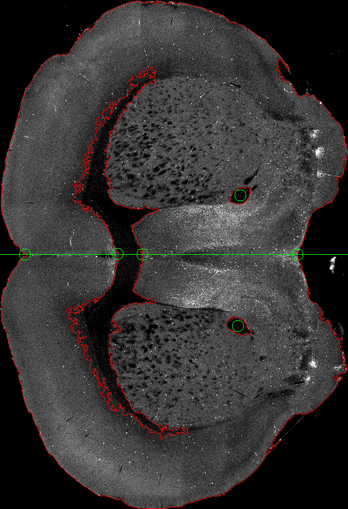

# 特征点寻找算法

这两周研究了自动特征点寻找的算法，对整个照片集进行了测试。

上图为比较有代表性的五副图，算法自动可以在这几个图中找出需要的特征点。

主要利用的是鼠脑中黑色的区域，基本可以找准我们需要的点。

但还有两个问题没有解决：

1.第一副图中，鼠脑上下部分不够对称，上大下小所以将鼠脑crop出来后，取整副图片的中线，并不能准确地分割出上下两部分，这会导致寻找特征点不准，有待解决。

2.最后一副图中，出现了轻微地轮廓粘连情况，两个轮廓在某一个位置相切，导致算法将其判断成一个轮廓，所以有一个特征点判断失误。

下周会着重解决这两个问题。