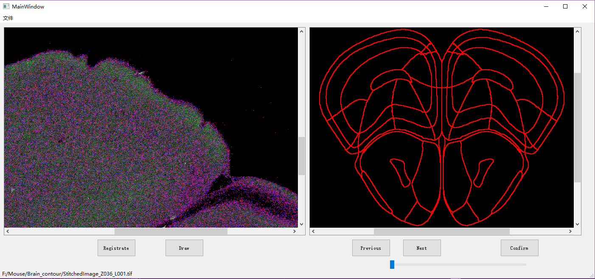

# 小鼠界面编写

这两周主要是在学习界面的编写。

尝试了awt等一些其他库，发现不太好用，选择使用pyQt5进行界面开发。

这是目前设计的界面雏形，左侧显示鼠脑切片图，右侧显示图谱。

左侧下方有两个按钮，一个是配准按钮，一个是画点按钮，目前还未编写相应功能。

右侧下方三个按钮分别是，向前翻页，向后翻页，确认按钮。

菜单栏里目前只有“文件”，在这里可以选择需要打开的鼠脑图片。

存在的问题：

​	1.tiff格式图片读取显示出错

​	2.还未实现图片缩放功能

后续计划：

​	1.修好bug，使tif图片能正常显示

​	2.加入滚轮缩放鼠脑图片的功能

​	3.尝试实现打点标注功能，并将标注输出为文件