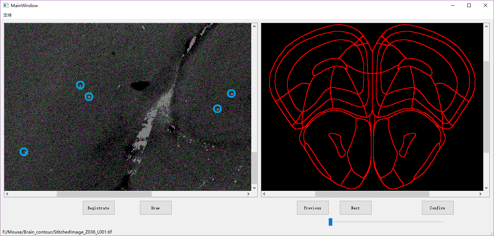
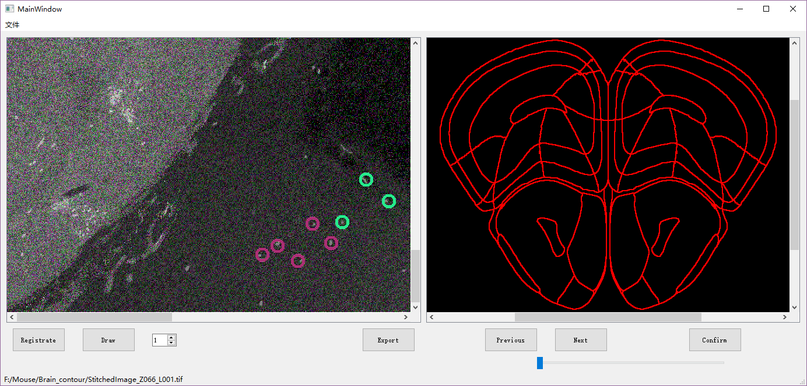

## 已完成的功能

### 1.打点

上图是目前实现的打点功能，在进入Draw模式后，可以在图片上进行点击，点击后照片上就会用如图所示的蓝色圆圈圈出点击的位置，同时该位置会被写入数据库，进行存储。

### 2.分组打点

进一步实现分组打点的功能，在图片下方有一个SpinBox，可以通过选择数字，来进行分组打点，SpinBox内的数字即为当前打点的组号。并且自动给每组点分配一个特定颜色，在图中显示。

### 3.导出打点文件

增加Export按钮，点击即可导出目前打的点，导出为csv。

导出的文件如下所示，第一栏为打点的组别，第二栏为x坐标，第三栏为y坐标，该坐标为tif图像中的实际位置。

# 目前存在的问题

​	但目前Tif文件的显示问题还未解决，显示时会产生彩色噪点。待后续解决。

​	Tif文件显示不全，只能显示一半左右，待解决。