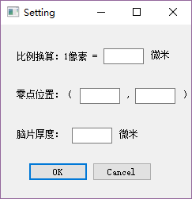
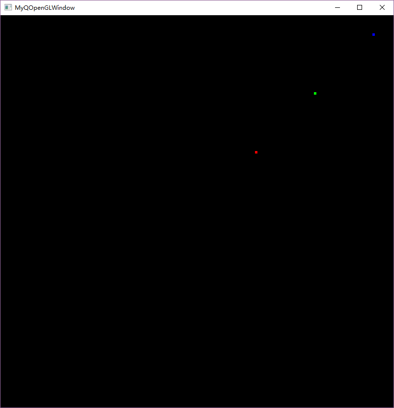

# 1. 主要完成的功能

1.输入换算比例功能，输入像素=X微米。

2.输入Z轴脑片厚度。

3.修改零点。

4.加入Z轴信息，如脑片编号。

5.追踪功能调研，寻找连接一系列点的算法。

6.优化图片和图谱显示。

# 2. 效果演示

主界面如下图所示，增加Setting按钮和ShowCells按钮，点击进入设置界面和细胞显示界面。

### 2.1 Setting按钮

设置页面如下所示。

进行设置以后，导出的打点数据则为需要的格式。

### 2.2 ShowCells按钮

细胞显示界面没有完全做好，还在研究如何使用Qt调用OpenGL进行3维文件的调用并显示。

目前实现了2维显示的界面，下周研究如何将其拓展为三维显示，并实现鼠标拖拽旋转。如下图，在二维空间中显示三个点。

追踪算法经过一番调研，决定借鉴多目标跟踪中的数据关联算法。多目标跟踪中常用匈牙利算法和KM算法进行数据关联，使用该算法进行细胞追踪预计可以实现比较好的效果。

具体而言，将相邻两脑片中的细胞作为顶点，相邻两脑片中两细胞的欧氏距离作为边权重，构建二分图，之后使用匈牙利算法和KM算法，求解全局最大匹配。
