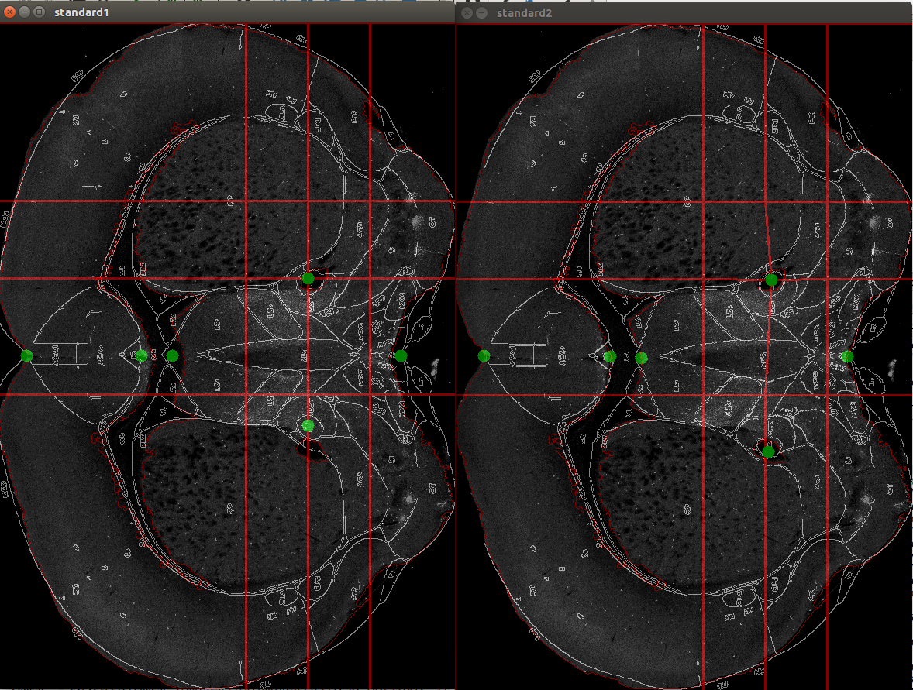
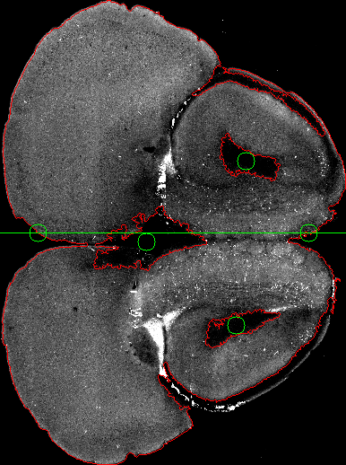
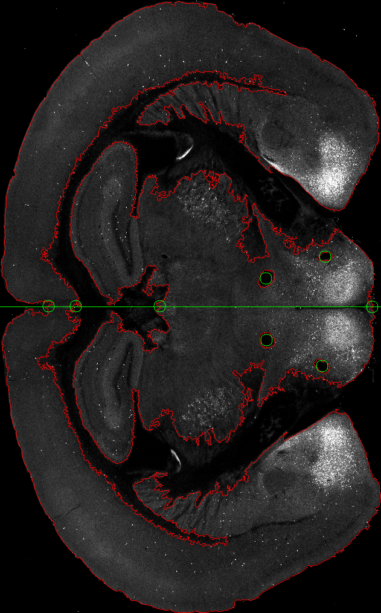
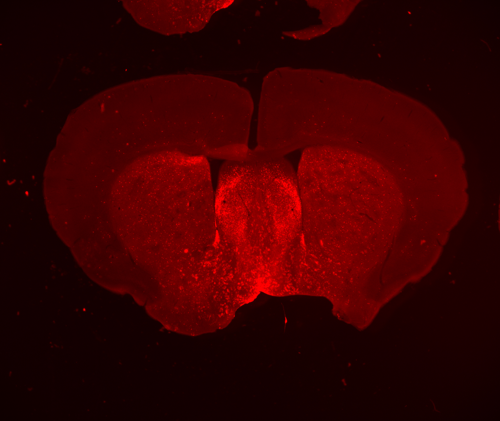
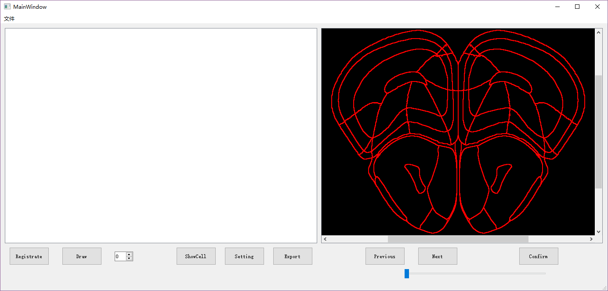

# 2018.10.24

总体上需要做的工作步骤：

1.**UI界面**

基本功能选择，如：打开图片、保存数据结果

可以进行功能上的选择，如：胞体通道选择、标准脑切片模板选择、胞体数量计数、分区统计胞体数、自动绘制直方图

2.映射算法（鼠脑切片图片映射到标准脑切片模板）

3.**匹配算法**（自动匹配标准脑模板）

4.拼接算法（原始局部切片拼接成全局切片）

5.**目标识别**（自动识别出胞体数目）

6.三维重建 （得到映射到标准脑的三维模型）

7.连接算法（将三维模型的截断处进行连接）

8.不规则立体展开算法（将三维模型的皮层展开成平面）

# 2018.10.24 - 2018.11.21

### 1.自动微调算法

自动微调算法效果如下图。左边为微调前，右边为微调后。我们设计了基于内部特征轮廓的算法来提取特征点。对于这幅图，使用的是如下图位置的6个绿点，这6个特征点是人为设计的，其坐标采用轮廓算法进行自动提取。针对不同位置的图谱，需要选取其他特征点。

### 2.爬取allen图谱

alanbrain网站上提供了图谱的下载链接，但只是提供了jpg图片的下载，没有提供关于分区的具体数据。

但可以从网站源码中使用爬虫获取我们需要的分区数据。下图为alan-brain atlas中的精确分区信息。atlas中每张图谱大小均为11400×8000，structure为脑区索引，因为一个脑区会分为多个轮廓绘制，所以一个structure会对应多个contour，contour中存储的就是该脑区的轮廓。

# 2018.11.21 - 2018.12.19

在不同图谱位置测试变形算法与特征点自动寻找算法。

# 2018.12.19 - 2018.1.9

开始探索软件界面编写。

### WholeBrain工具初探

> wholebrain software软件包使用教程：http://www.wholebrainsoftware.org/cms/tutorials/   
>
> https://github.com/tractatus/wholebrain

WholeBrain Software提供了一整套软件包，可以实现从图像拼接、图像配准、胞体识别再到三维重建的一系列步骤。这篇论文介了绍这一套工具的功能以及一些基本的原理，未涉及太深的细节。不过在github上开放了源码，可以研究源码。

我们仔细研究了一下作者提供的这一套工具。总的来说，感觉是把我们之前设想的功能都实现了，而且思路也基本一致。通过提取特征点进行图像配准和自动分区，然后手动设置一些参数进行胞体识别，最后统计各个脑区的胞体数目。论文中还提到了三维重建的一些内容，不过在软件包的使用教程中并没有提及，不知是不是因为暂未开源。

# 2018.1.9 - 2018.3.20

完成了特征点寻找算法和匹配算法后，何苗老师提供了他们的照片。我们之前研究的特征点寻找和轮廓匹配算法基本失效，开始新的算法探索。

发现开源项目不好用，不适合何苗老师提供的图谱。

之后进行UI界面开发。首先采用了何苗老师说的imagej方案，但不支持python，只有java接口，无法进行算法移植。

# 2019.3.20 - 2019.4.16

学习界面的编写。

尝试了awt等一些其他库，发现不太好用，选择使用pyQt5进行界面开发。

我改用pyQT进行界面编写。

同时陈佳禹进行算法的继续研究。

界面雏形，左侧显示鼠脑切片图，右侧显示图谱。

左侧下方有两个按钮，一个是配准按钮，一个是画点按钮，目前还未编写相应功能。

右侧下方三个按钮分别是，向前翻页，向后翻页，确认按钮。

菜单栏里目前只有“文件”，在这里可以选择需要打开的鼠脑图片。

存在的问题：

​	1.tiff格式图片读取显示出错

​	2.还未实现图片缩放功能

后续计划：

​	1.修好bug，使tif图片能正常显示

​	2.加入滚轮缩放鼠脑图片的功能

​	3.尝试实现打点标注功能，并将标注输出为文件

# 2019.4.16 - 2019.5.15

#### 主要完成的功能

1.输入换算比例功能，输入像素=X微米。

2.输入Z轴脑片厚度。

3.修改零点。

4.加入Z轴信息，如脑片编号。

5.追踪功能调研，寻找连接一系列点的算法。

6.优化图片和图谱显示。

# 

### 2. 效果演示

主界面如下图所示，增加Setting按钮和ShowCells按钮，点击进入设置界面和细胞显示界面。

追踪算法经过一番调研，决定借鉴多目标跟踪中的数据关联算法。多目标跟踪中常用匈牙利算法和KM算法进行数据关联，使用该算法进行细胞追踪预计可以实现比较好的效果。

具体而言，将相邻两脑片中的细胞作为顶点，相邻两脑片中两细胞的欧氏距离作为边权重，构建二分图，之后使用匈牙利算法和KM算法，求解全局最大匹配。

# 2019.5.15 - 2019.7.7

关键点寻找算法未成功，改为手动打点匹配，界面各项功能基本实现，包括图片的基本操作/配准/打点/输出打点文件。

# 2019.7.7至今

1.三维显示及扭曲切片。

2.根据何苗老师所提需求继续优化。

