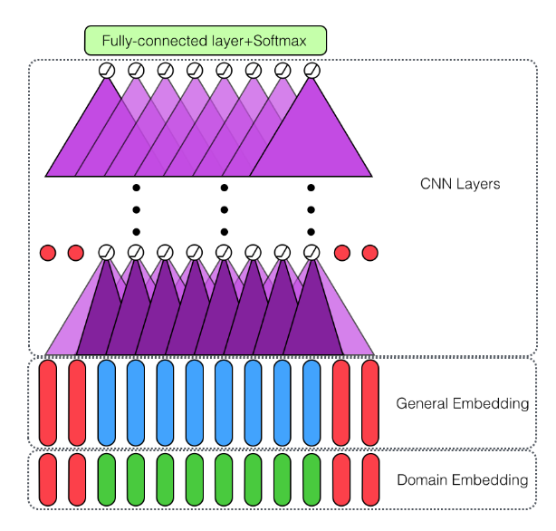

**项目进展**

微博数据的处理结果的保存进行了优化，处理速度提升了很多。每处理一条数据，就会保存结果到ｒｅｄｉｓ中。处理结束５００条数据，会保存到ｍｏｎｇｏｄｂ。速度提高原因可能是因为五百条数据可能只是几条微博的数据，这样保存数据只需要保存几次就可以，不用原来那样保存５００次。

**论文阅读**

**Deep Learning for Sentiment Analysis: A Survey**

先介绍了nn,　cnn,　rnn,　attention.　memory network（不是很了解）,recursive network

情感分析分为三类：document level,sentence level,aspect level,越来越细致，aspect level 首先抽取客体以及客体的aspect，然后判断情感。

一些重要的方向：

词向量：结合语义以及情感信息

aspect抽取分类：抽取出句子中的aspect短语，以及对这些短语进行分类。

**Double Embeddings and CNN-based Sequence Labelingfor Aspect Extraction**

general-purpose embedding and domain-specific embedding.

使用cnn,为了速度。

　　　　　　　　　　　　　　　　　　　　　　　　　　　　　　　　　　　　

使用fastTEXT进行domain-specific向量训练.

**Aspect Term Extraction with History Attention and Selective Transformation**

这篇论文也是aspect term extraction.考虑了aspect-opinion relation。同时也考虑aspect detection history.

