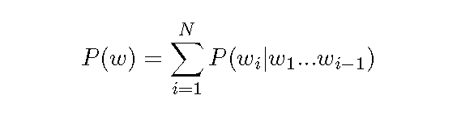
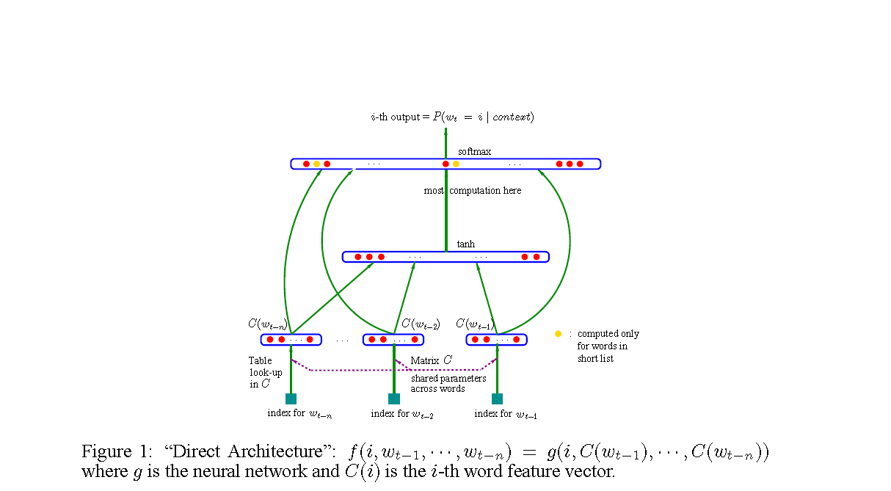
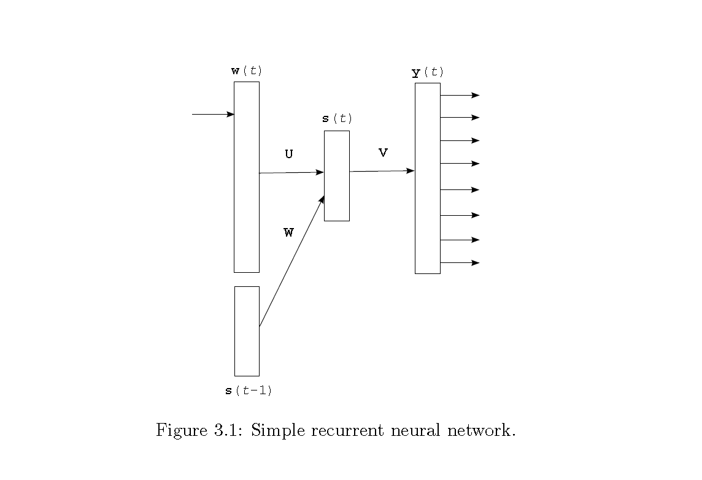
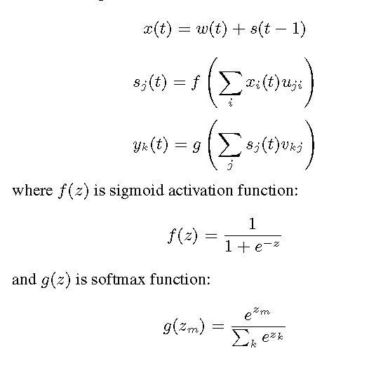

# Language Model

参考论文

A Neural Probabilistic Language Model

Recurrent neural network based language model

EXTENSIONS OF RECURRENT NEURAL NETWORK LANGUAGE MODEL

## N-gram Model

一个语言模型通常构建为字符串w的概率分布p(w)，这里的p(w)实际上反映的是s作为一个句子出现的概率。

这里的概率指的是组成字符串的这个组合，在训练语料中出现的似然，与句子是否合乎语法无关。假设训练语料来自于人类的语言，那么可以认为这个概率是的是一句话是否是人话的概率

The maximum likelihood estimate of probability of word A in context H is then computed as

where C(HA) is the number of times that the HA sequence of words has occurred in the
training data. The context H can consist of several words, for the usual trigram models
jHj = 2. For H = ;, the model is called unigram, and it does not take into account history.
As many of these probability estimates are going to be zero (for all words that were not
seen in the training data in a particular context H), smoothing needs to be applied. 

### 缺点

参数指数级指数级增长

考虑的词比较少

没有考虑词之间的相似性

## NN Model

1. associate with each word in the vocabulary a distributed “feature vector” (a realvalued
  vector in Rm), thereby creating a notion of similarity between words,
2. express the joint probability function of word sequences in terms of the feature
  vectors of these words in the sequence, and
3. learn simultaneously the word feature vectors and the parameters of that function

## RNN Model

RNN for one epoch is performed as follows:
1. Set time counter t = 0, initialize state of the neurons in the hidden layer s(t) to 1
2. Increase time counter t by 1
3. Present at the input layer w(t) the current word wt
4. Copy the state of the hidden layer s(t􀀀1) to the input layer
5. Perform forward pass as described in the previous section to obtain s(t) and y(t)
6. Compute gradient of error e(t) in the output layer
7. Propagate error back through the neural network and change weights accordingly
8. If not all training examples were processed, go to step 2

