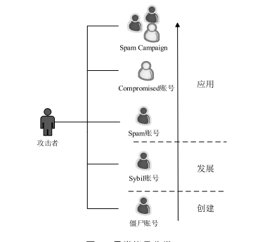

## 异常账号检测内容

（1） 异常帐号的表现。

（2）检测方案的设计。

（3）检测方案的验证。

## 异常账号发展阶段及分类

## 异常帐号检测主要挑战

（1）异常帐号的多种表现形式

（2）异常帐号特征的动态变化

（3）社交网络巨大的用户数据

（4）网络空间的复杂性

## 社交网络中异常帐号检测方法

### 基于行为特征的检测方案

### 基于内容的检测方案

（1） 利用单个帐号内容特征。

（2） 利用群体帐号内容特征。

### 基于图的检测方案

（1)   随机游走

（2)   社区发现

（3）马尔科夫随机场及其他

### 无监督学习的检测方案

（1）基于聚类

（2）基于模型

## 数据获取方式

（1)  爬虫获取

（2）公开数据集

（3）与社交网站合作

## 数据标识

（1）人工标识

（2）url黑名单检测工具

（3）蜜罐系统

（4）地下市场购买

（5）社交网络自身功能

## 结果验证方式

（1）人工验证

（2）与社交网站合作

（3)   社交网站自身功能

## 研究展望

（1） 发现并检测新的攻击方式

（2） 结合多特征多维度的检测模型

（3） 高效的轻量级、分布式并行检测算法
