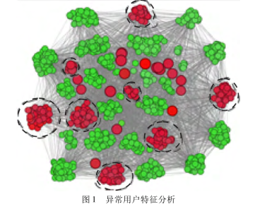
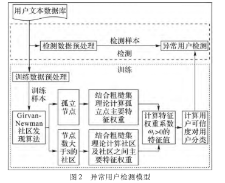
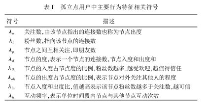
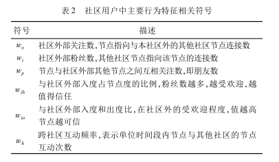

# 异常用户分析

基于用户基本特征的异常用户检测方法，利用 Girvan-Newman 社区发现算法将用户划分成离群的 孤立点和社区两类分类后，少数孤立点按个检测，其他的以社区为单位 结合粗糙集的理论求得特性权重，根据特征权重计算对检测 异常用户有意义的特征信任值，最后综合起来计算用户可信 度，根据可信度判断用户是否异常。

图1 中: 大圆圈代表孤立的异常节点，虚线圈起来的是异常社区; 小圆圈代表正常节点，抱团在一起的属于一个社区。从图1 中可以看出无论正常节点还是异常节点都喜欢抱团在一起，且孤立节点是异常节点的概率比较大。

# 检测模型

1) 利用 Girvan-Newman 社区发现算法将社交网络中用户划分成孤立节点和社区两部分; 

2) 提取孤立节点用户的特征和社区特征; 

3) 结合粗糙集的理论计算孤立点和社区特性权重; 

4) 根据特征权重确定对异常用户检测有意义特征，计算相应的特征信任值; 

5) 综合用户特征权重和特征值计算用户可信度，根据可信度判断孤立点用户是否是异常用户，将社区划分为正常用户社区和未知信任社区，对未知信任社区内部节点按照孤立节点判定方法再进行判定。

# 用户特征属性权重

## 用户的相关特征

## 粗糙集理论

粗糙集的属性约简，在确保决策信息系统自身的含义下，去掉多余或者重复的属性，留下起决定性作用的重要属性

粗糙集的理论是将条件特征集合C和决策特征D构成的决策表表示知识，通过属性约简后，计算各个条件特征C对决策影响的大小，也就是计算用户特征属性权重的大小。用户的特征看作决策表的条件属性集合，用户的类别看 作决策表的决策属性

SGF( cj，，D) = γ( C，D) － γ( C － { cj } ，D)

γ( C，D) =POSc （D）/U

# 用户特征信任值

1) 遍历正常用户样本集U0中用户ui 的特征 cj ，ui ∈Uo ， 找到用户特征值 vij 中的最大值和最小值。 

2) 统计不同大小数据集中的特征值，发现正常用户特征值无论数据集大小都大概可以分成 6 个区间集合，将用户特征值vij按照值大小等距离划分6个区间，并统计每个区间内正常用户数量。 

3) 将第2) 步得到的特征值区间按照用户数量大小递增排序。

4) 将排序后的区间赋值，从小到大划分成六段值分别为{ 1，2，3，4，5，6} 。 

5) 将前4 步得到的6 个区间值作为衡量用户特征信任值的标准，若 vij 值在第一个子区间，对应的特征信任值为 1，否则随着所在区间递增排序特征信任值增大。

# 用户可信度计算

1) 孤立节点用户可信度。

一个孤立点用户的可信度即为该用户所有特征的特征权重系数ωj 和特征信任值λij 的乘积之和

2) 社区用户可信度。

一个社区的可信度即为该社区所有特征的特征权重系数 ωj和社区内各个用户的特征信任值 λsij平均值乘积之和

# 问题
目前找不到相关的代码，看的论文也没有分享代码。
