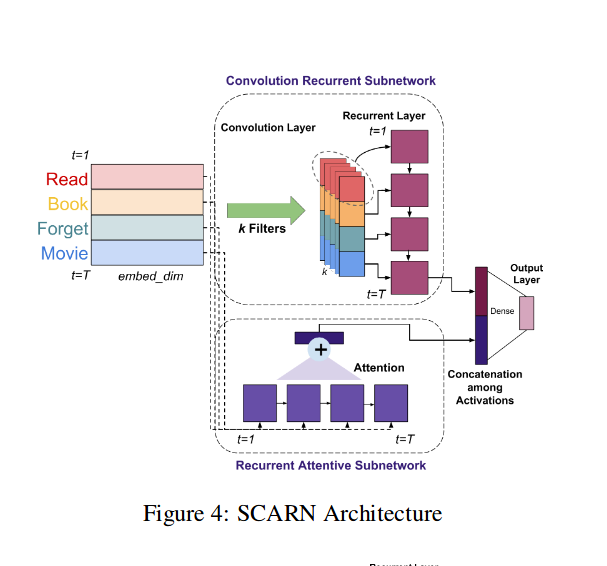
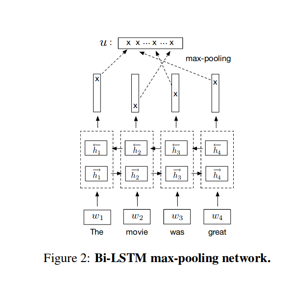

**项目进展：**

修改了热门微博的代码，提高数据的处理速度。

**论文阅读：**

**Sequential Learning of Convolutional Featuresfor Effective Text Classification**

结合cnn rnn 进行文本分类。

With the above points in mind, we observe thatconvolution  operation  does  not  fully  exploit  se-quential information, especially on larger windowsizes.   However  we  do  see  their  effectiveness  inconforming  the  input  embeddings  to  a  represen-tation specifically meaningful to the task.  Hence,for sequential learning instead of relying on con-volution, we use recurrent architectures in our pro-posed SCARN model.

max pooling 没有想象中的那么大的作用，本文采用的是简单的cnn rnn加上注意力机制。

**Supervised Learning of Universal Sentence Representations from Natural Language Inference Data**

如何得到句向量，用来表示句子语义以及词之间的关系。

非监督方法：

skip thought

fastsent

本文是监督学习：利用双向lstm加最大池化。利用自然语言推断任务进行训练。

**思考：**

如何找到更好的表示方式，来表示语义语法信息。

简单的连接是否真的可以结合两部分信息，是否有更好的方法来结合两部分信息。

**Deep neural network-based classification model for Sentiment Analysis**

提到implicit sentiment classification,创新点没看到。

**Shallow Domain Adaptive Embeddings for Sentiment Analysis**

情感分析根据上下文判断情感，领域适应就是改变向量空间的位置。第一篇论文利用长度为一的卷积也可以改变向量空间位置。

这篇论文提出了通用领域适应层。这是论文核心创新点。不同于其他论文，可以应用于数据少的领域。

Section  3.1  we  provide  a  simple  yet  effective demonstration of how techniques such as KCCA,that  are  used  to  capture  domain  semantics,  can　capture  relevant  semantics  in  the  learned  word　embeddings. 

提出了一个方法测试domain semantics

