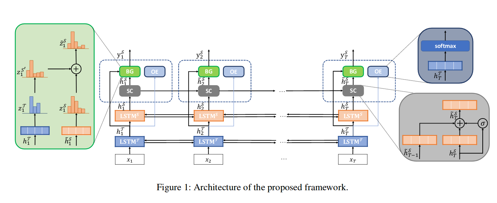
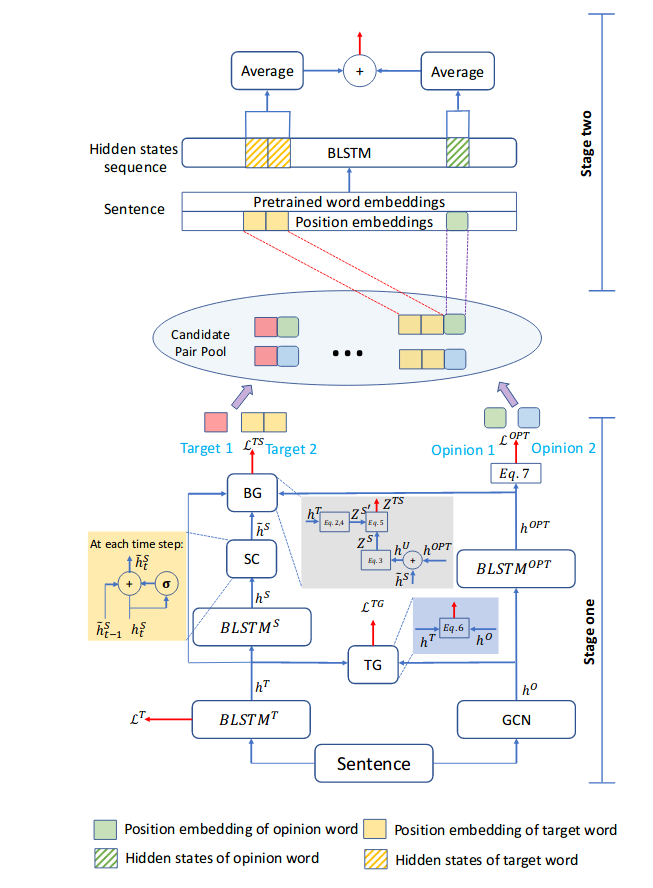

**论文阅读**

**A Unified Model for Opinion Target Extraction and Target Sentiment Prediction**

**Knowing What, How and Why: A Near Complete Solution for Aspect-based Sentiment Analysis**

**实验进展**

方向：End-to-End Aspect-based Sentiment Analysis

数据集：

**rest_total** consist of the reviews from the SemEval-2014, SemEval-2015, SemEval-2016 restaurant datasets.

**laptop14** is identical to the SemEval-2014 laptop dataset.

**twitter** is built by [Mitchell et al.](https://www.aclweb.org/anthology/D13-1171) (EMNLP 2013).

计划：先搭建一个简单的网络，将整个流程运行一次。
