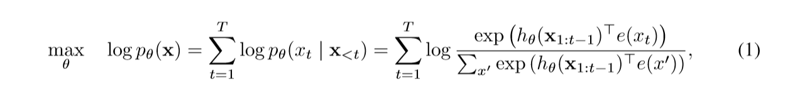
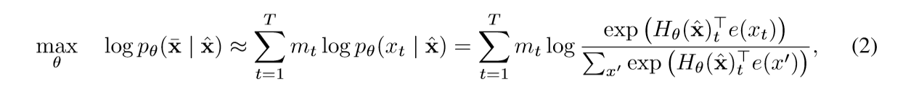
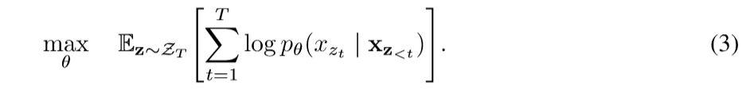
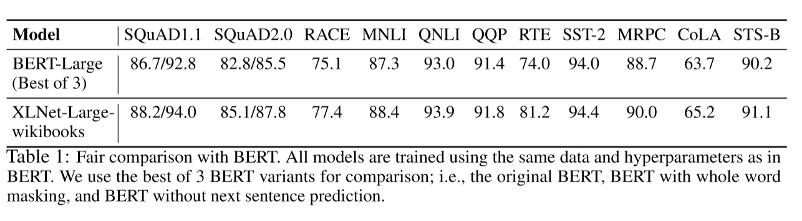
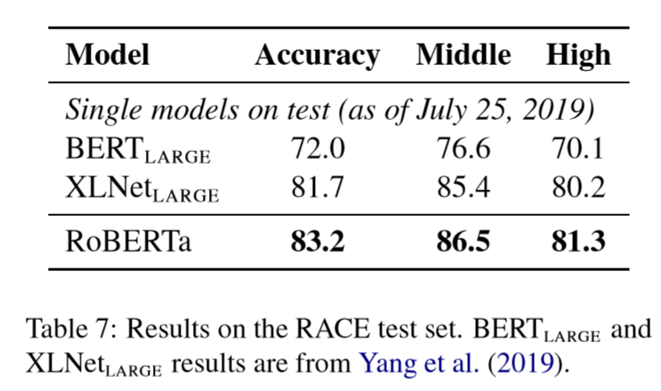
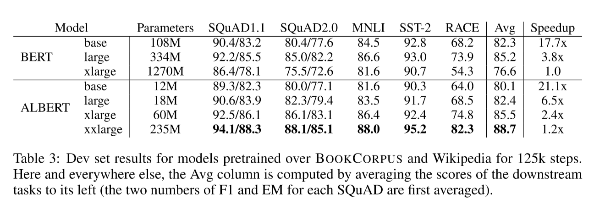

**XLNet      RoBERTa      ALBERT**

XLNet: Generalized Autoregressive Pretraining for Language Understanding

RoBERTa: A Robustly Optimized BERT Pretraining Approach

ALBERT: A LITE BERT FOR SELF-SUPERVISED LEARNING OF LANGUAGE REPRESENTATIONS

**XLNet** 

 autoregressive (AR) language modeling and autoencoding (AE)  language modeling

AR: it is not effective at modeling deep bidirectional contexts

AE:  pretrain-finetune discrepancy,   Independence Assumption

XLNet：

**result**

**RoBERTa**

a replication study of BERT pretraining

 (1) training the model longer, with bigger batches, over more data; 

(2) removing the next sentence prediction objective;

 (3) training on longer sequences; 

(4) dynamically changing the masking pattern applied to the training data.

it also used  byte-level BPE instead of  character-level BPE,

**result**

**ALBERT**

introduce two parameter-reduction techniques to lower memory consumption and increase the training speed of BERT 

 **factorized embedding parameterization.**

 **cross-layer parameter sharing**

it also introduce a self-supervised loss for sentence-order prediction (SOP) instead of  next-sentence prediction (NSP). 

NSP conflates **topic prediction** and **coherence prediction** in a single task. However,topic prediction is easier to learn compared to coherence prediction,and also overlaps more with what is learned using the MLM loss. 

**result**

