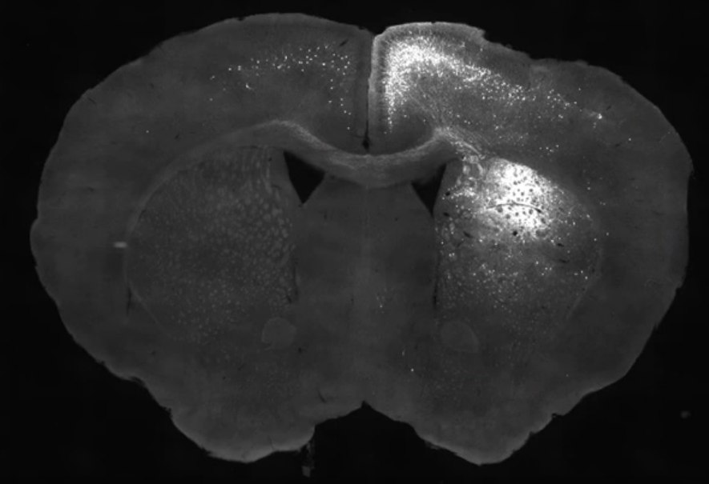
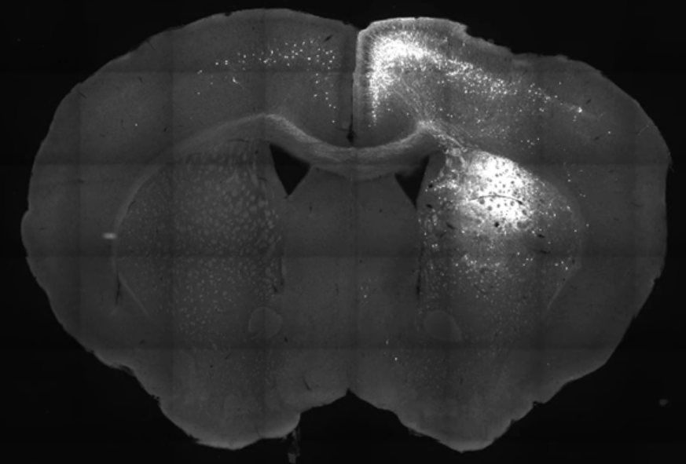

# 1 系统简介

本系统主要用于辅助进行鼠脑连接图谱的研究，使用Alan Brain的鼠脑图谱数据与实验取得的鼠脑切片照片，实现图谱配准，胞体标定，胞体追踪等功能。目前支持的主要功能如下。

1.同屏显示鼠脑图片与图谱图片，通过手工关键点标定与自动轮廓识别进行图谱配准。

2.通过点击的方式进行胞体标定，支持分组标定。

3.胞体标定的打点文件可导出为Excel文件，也可在界面中查看三维显示结果。

4.使用胞体位置特征与胞体图像特征进行胞体追踪，并在界面中进行三维显示。


# 2 安装方法

本系统使python语言编写，主要使用QT进行图形界面设计，使用OpenCV进行图片处理，其他用到的库包括OpenGL、PIL等。

安装步骤如下。

首先安装Anaconda，新建虚拟环境MouseBrain，选择Python版本为3.6。

之后使用如下pip命令安装需要的库。

```
conda create -n mouse python=3.5
activate mouse

conda install spyder
conda install -c menpo opencv3
conda install pillow
conda install scikit-learn
conda install matplotlib
```


# 3 使用方法

1.选择菜单栏->文件->打开，打开需要处理的鼠脑照片，系统会自动识别出与其相似度最高的图谱。之后通过翻页按钮进行手工校准，调整到最合适的图谱，完成后点击确认按键进入下一步。


2.系统会自动依据鼠脑照片的轮廓，将切片照片与鼠脑图谱进行配准。之后手工选取照片与图谱上的对应点，进行手工精细配准，配准完成后点击确认进入下一步。



3.此时可以在鼠脑照片上进行胞体标定，通过下方的组号选择胞体分组。标定完成后可以点击Export按键导出打点文件。



4.标定完一副照片后，点击保存。当完成多副图后，可以进入胞体追踪界面，查看胞体追踪结果。


